# Relational Databases on Kubernetes. Database DevOps
- [Stateful and Stateless Applications](#stateful-and-stateless-applications)
- [Databases on Kubernetes](#databases-on-kubernetes)
- [Database DevOps](#database-devops)
- [KubeDB Cloud Native Database](#kubedb-cloud-native-database)
- [Cockroach Cloud Native Database](#cockroach-cloud-native-database)
- [Operator Lifecycle Manager (OLM)](#operator-lifecycle-manager-olm)
- [Spilo PostgreSQL Operator](#spilo-postgresql-operator)
- [Crunchy Data PostgreSQL Operator](#crunchy-data-postgresql-operator)
    - [Crunchy Data Postgres Operator in OpenShift 4. Overview & Proof of Concept](#crunchy-data-postgres-operator-in-openshift-4-overview--proof-of-concept)
        - [Crunchydata Postgres Operator 3.5](#crunchydata-postgres-operator-35)
        - [Crunchydata Postgres Operator 4.0.1](#crunchydata-postgres-operator-401)
        - [Crunchydata Postgres Operator 4.0.1 Community Edition](#crunchydata-postgres-operator-401-community-edition)
            - [Service Accounts](#service-accounts)
            - [Service Accounts. Roles](#service-accounts-roles)
            - [Security Context Constraints (SCC)](#security-context-constraints-scc)
            - [Add a SCC to a Project](#add-a-scc-to-a-project)
                - [Add a SCC to a Project. Workflow1 without custom Service Account and without DeploymentConfig](#add-a-scc-to-a-project-workflow1-without-custom-service-account-and-without-deploymentconfig)
                - [Add a SCC to a Project. Workflow2 with custom Service Account and without DeploymentConfig](#add-a-scc-to-a-project-workflow2-with-custom-service-account-and-without-deploymentconfig)
                - [Add a SCC to a Project. Workflow3 with custom service Account and DeploymentConfig](#add-a-scc-to-a-project-workflow3-with-custom-service-account-and-deploymentconfig)
            - [Environment setup. Port Forward and WSL](#environment-setup-port-forward-and-wsl)
            - [Cluster Deployment and Operation with pgo](#cluster-deployment-and-operation-with-pgo)
            - [psql access from postgres-operator POD](#psql-access-from-postgres-operator-pod)
            - [psql: list databases](#psql-list-databases)
            - [Access from another POD within the cluster with psql client](#access-from-another-pod-within-the-cluster-with-psql-client)
            - [Access from another POD within the cluster with Pgadmin4 of Crunchy containers Community Edition](#access-from-another-pod-within-the-cluster-with-pgadmin4-of-crunchy-containers-community-edition)
            - [Debugging Crunchydata Postgres Operator 4.0.1 Community Edition](#debugging-crunchydata-postgres-operator-401-community-edition)
        - [Certified Crunchydata Postgres Operator (OLM/OperatorHub). Manual Setup](#certified-crunchydata-postgres-operator-olmoperatorhub-manual-setup)

## Stateful and Stateless Applications
* [xenonstack.com: Stateful and Stateless Applications Best Practices and Advantages](https://www.xenonstack.com/insights/stateful-and-stateless-applications/)

[](https://www.xenonstack.com/insights/stateful-and-stateless-applications/)

## Databases on Kubernetes
* [cloud.google.com: To run or not to run a database on Kubernetes - What to consider](https://cloud.google.com/blog/products/databases/to-run-or-not-to-run-a-database-on-kubernetes-what-to-consider)
* [reddit.com: What's the best, proper way of running a database cluster on top of Kubernetes?](https://www.reddit.com/r/kubernetes/comments/9d8on5/whats_the_best_proper_way_of_running_a_database/)
* [caylent.com: The Pros and Cons of Running Production Databases as Containers](https://caylent.com/the-pros-and-cons-of-running-production-databases-as-containers)
* [learnk8s.io: Provisioning cloud resources (AWS, GCP, Azure) in Kubernetes](https://learnk8s.io/cloud-resources-kubernetes)

## Database DevOps
- [informationweek.com: Can Enterprises Benefit From Adopting Database DevOps?](https://www.informationweek.com/devops/can-enterprises-benefit-from-adopting-database-devops/a/d-id/1337238)

## KubeDB Cloud Native Database
* [kubedb.com](https://kubedb.com/) Run production-grade databases easily on Kubernetes

## Cockroach Cloud Native Database
* [Cockroach](https://www.cockroachlabs.com/docs/stable/orchestration.html)

## Operator Lifecycle Manager (OLM)
- [itnext.io: Operator Lifecycle Manager](https://itnext.io/wth-is-a-operator-lifecycle-manager-873cf1661b04)

## Spilo PostgreSQL Operator
* [Spilo: HA PostgreSQL Clusters with Docker](https://github.com/zalando/spilo) Spilo is a Docker image that provides PostgreSQL and Patroni bundled together. Patroni is a template for PostgreSQL HA. 
* [Patroni](https://github.com/zalando/patroni)
* [How I've Set Up HA PostgreSQL on Kubernetes (powered by Patroni, a template for PostgreSQL HA)](https://disaev.me/p/how-i-have-set-up-ha-postgresql-on-kubernetes/)

## Crunchy Data PostgreSQL Operator
* [crunchydata.com](https://www.crunchydata.com/)
* [learn.crunchydata.com](https://learn.crunchydata.com/)
* [github.com/CrunchyData](https://github.com/CrunchyData)
* [github.com/CrunchyData/postgres-operator](https://github.com/CrunchyData/postgres-operator)
* [crunchydata blog: Deploying Active-Active PostgreSQL on Kubernetes](https://info.crunchydata.com/blog/active-active-on-kubernetes)
* [crunchydata blog: What's New in Crunchy PostgreSQL Operator 4.0](https://info.crunchydata.com/blog/crunchy-postgres-kubernetes-operator-4.0)
* [slideshare.net: Deploying PostgreSQL on Kubernetes](https://www.slideshare.net/vyruss000/deploying-postgresql-on-kubernetes)
* [slideshare.net: Operating PostgreSQL at Scale with Kubernetes](https://www.slideshare.net/jkatz05/operating-postgresql-at-scale-with-kubernetes-137132067)
* [Youtube: Demo of Crunchy Data Postgres Operator v1.0.0 (2017)](https://www.youtube.com/watch?v=HX10WWTRiTY)
* [Youtube: Crunchy PostgreSQL Operator for Kubernetes 3.4 Overview (2018)](https://www.youtube.com/watch?v=gaXlrlz7GVc)
* [Youtube: OpenShift Meetup Tokyo #05 - Operator and Operator Lifecycle Manager on OpenShift (2019, openshift 4.1)](https://www.youtube.com/watch?v=X4vuktlK0Tg)
* [info.crunchydata.com: Monitoring PostgreSQL clusters in kubernetes](https://info.crunchydata.com/blog/monitoring-postgresql-clusters-in-kubernetes)
* [thenewstack.io: Advanced Kubernetes Namespace Management with the PostgreSQL Operator](https://thenewstack.io/advanced-kubernetes-namespace-management-with-the-postgresql-operator/)
* [info.crunchydata.com: Deploy High-Availability PostgreSQL Clusters on Kubernetes by Example](https://info.crunchydata.com/blog/deploy-high-availability-postgresql-on-kubernetes)
* [info.crunchydata.com: Migrating from Oracle to PostgreSQL: Tips and Tricks](https://info.crunchydata.com/blog/migrating-from-oracle-to-postgresql-questions-and-considerations)
* [info.crunchydata.com: Scheduled PostgreSQL Backups and Retention Policies with Kubernetes](https://info.crunchydata.com/blog/schedule-postgresql-backups-and-retention-with-kubernetes)
* [info.crunchydata.com: Guard Against Transaction Loss with PostgreSQL Synchronous Replication](https://info.crunchydata.com/blog/synchronous-replication-in-the-postgresql-operator-for-kubernetes-guarding-against-transactions-loss)
* [info.crunchydata.com: Crunchy PostgreSQL for Kubernetes 4.3 Released](https://info.crunchydata.com/news/crunchy-postgresql-for-kuberenetes-4.3) Crunchy #PostgreSQL for #Kubernetes 4.3 released! Now supports multi-Kubernetes deployments, easier customization + installation, TLS, pgAdmin 4, improved pgBouncer support, and much more!
* [info.crunchydata.com: Deploy pgAdmin4 with PostgreSQL on Kubernetes](https://info.crunchydata.com/blog/deploy-pgadmin4-with-postgresql-on-kubernetes)
* [info.crunchydata.com: Multi-Kubernetes Cluster PostgreSQL Deployments](https://info.crunchydata.com/blog/multi-kubernetes-cluster-postgresql-deployments)
* [info.crunchydata.com: Quickly Document Your Postgres Database Using psql Meta-Commands](https://info.crunchydata.com/blog/d-meta)
* [info.crunchydata.com: Fast CSV and JSON Ingestion in PostgreSQL with COPY](https://info.crunchydata.com/blog/fast-csv-and-json-ingestion-in-postgresql-with-copy)

### Crunchy Data Postgres Operator in OpenShift 4. Overview & Proof of Concept
- In earlier days, Red Hat recommended running PostgreSQL database outside the Kubernetes cluster. Now, with [Kubernetes Operator](https://kubernetes.io/docs/concepts/extend-kubernetes/operator/) technology, you can run stateful database applications on Kubernetes.
- [Crunchy PostgreSQL Operator](https://github.com/CrunchyData/postgres-operator) extends Kubernetes to give you the power to easily  create, configure and manage PostgreSQL clusters at scale.  When combined with the [Crunchy PostgreSQL Container Suite](https://github.com/CrunchyData/crunchy-containers), the Crunchy PostgreSQL Operator provides an open source software solution for PostgreSQL scaling, high-availability, disaster recovery, monitoring, and more.  All of this capability comes with the repeatability and automation that comes from Operators on Kubernetes.
- Crunchy PostgreSQL Operator is open source and developed in close collaboration with users to support enterprise deployments of cloud agnostic PostgreSQL-as-a-Service capability. This release comes after extensive feedback from our customers and the community to ensure the scalability and security that sysadmins, DBAs, and developers have come to rely on.
- [Crunchy PostgreSQL and Openshift](https://www.openshift.com/blog/leveraging-the-crunchy-postgresql)
- Crunchy Postgres Solutions: 
    1. **[Postgres Operator Community Edition](https://github.com/CrunchyData/postgres-operator):**
        - ‘pgo’ CLI tool
        - Not certified by Red Hat
        - The Operator can be deployed by multiple methods including:
            - [The PostgreSQL Operator Installer with kubectl](https://access.crunchydata.com/documentation/postgres-operator/4.3.0/installation/postgres-operator/)
            - [Install Operator Using Bash (the one used in this overview)](https://access.crunchydata.com/documentation/postgres-operator/4.3.0/installation/other/bash/)
            - [Ansible playbook installation](https://access.crunchydata.com/documentation/postgres-operator/4.3.0/installation/other/ansible/)
            - CLI installation using OLM **(Deprecated)**: new CatalogSource added via “pgo.catalogsource.yaml”.
            - Openshift Console installation using OLM (OperatorHub):
                - New CatalogSource requirement. 
                - CLI settings required.
    2. **Certified Crunchydata Postgres Operator (OLM/OperatorHub):**
        - Openshift Console installation using OLM (OperatorHub): One-click deployment and Web based operation
        - **No ‘pgo’ CLI tool?** (compatibility issues: unable to find in github the version that matches the server API - Sept 2019)
        - Certified by Red Hat
        - Provided by CrunchyData
    3. Other non-certified installations (unsupported by Red Hat): with or without OLM, CLI, etc.
- **[Crunchy Containers Community Edition](https://github.com/CrunchyData/crunchy-containers):**
    - Installation:
        1. [Installation guide](https://access.crunchydata.com/documentation/crunchy-postgres-containers/latest/installation-guide/installation-guide/)
        2. [Pgadmin4 install](https://access.crunchydata.com/documentation/crunchy-postgres-containers/latest/examples/administration/pgadmin4/) (easy)
    - Not certified by Red Hat

<center>
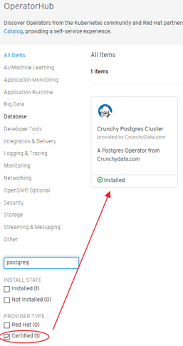
</center>

#### Crunchydata Postgres Operator 3.5
- Release date: Januay 2019
- pgBackRest Architecture Enhancements
- pgBackRest Point-In-Time-Recovery
- Fast Failover
- Archive Storage Configuration
- Preferred Failover Node Label
- pgo-scheduler

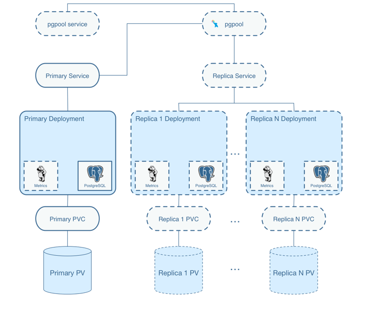

#### Crunchydata Postgres Operator 4.0.1
- Release date: June 2019
- **Namespace Deployment Options:** Ability to deploy the operator its own namespace but manage PostgreSQL clusters in multiple namespace. The new namespace management features lets users create multi-tenant PostgreSQL environments that add further isolation and security to their deployments. 
- **Further Enhancements to pgBackRest Integration:** Perform pgBackRest backups to **Amazon S3**. This allows  users to create an automated, geographically distributed, and hybrid cloud disaster recovery strategy.
- Integrated PostgreSQL **Benchmarking**
- **Ansible** Playbook Based Installation
- **Operator Lifecycle Management (OLM):** The OLM project is a component of the Operator Framework, an open source toolkit to manage Operators, in an effective, automated, and scalable way. OLM concepts were included into Crunchy PostgreSQL Operator to assist in the deployment on Kubernetes using OLM integration.


#### Crunchydata Postgres Operator 4.0.1 Community Edition 
##### Service Accounts
- Service accounts give us flexibility to control access to API without sharing user’s credentials. 
- Service Accounts are also used by pods and other non-human actors to perform various actions and are a central vehicle by which their access to resources is managed. **By default, three service accounts are created in each project:**
    1. **Builder:** Used by build pods and assigned the **system:image-builder** role, which grants push capability into the internal registry to any image stream in the project.
    2. **Deployer:** Used by deploy pods and assigned the **system:deployer role**, which allows modifying replication controllers in the project.
    3. **Default:** Used by all other pods by default.
- You can see them by running the following command: 

    ```
    oc get serviceaccounts
    oc get sa
    ```

- **Running a Pod with a Different Service Account.** You can run a pod with a service account other than the default:
    - Edit the deployment configuration:  ```$ oc edit dc/<deployment_config>```
    - Add the serviceAccount and serviceAccountName parameters to the spec field, and specify the service account you want to use:

    ```
    spec:
        securityContext: {}
        serviceAccount: <service_account>
        serviceAccountName: <service_account>
    ```

- Refs:
    - [ref1](https://docs.openshift.com/container-platform/4.1/authentication/using-service-accounts-in-applications.html)
    - [ref2](https://docs.okd.io/latest/dev_guide/deployments/basic_deployment_operations.html#run-pod-with-different-service-account) 
    - [ref3](https://dzone.com/articles/understanding-openshift-security-context-constrain) 

- Each service account is represented by the ServiceAccount resource and is associated with two additional secrets for access to the OpenShift API and the internal registry:

```
$ oc describe serviceaccounts/default
Name:                default
Namespace:           pgouser1
Labels:              <none>
Annotations:         <none>
Image pull secrets:  default-dockercfg-nrhwt
Mountable secrets:   default-token-vm8b5
                     default-dockercfg-nrhwt
Tokens:              default-token-p6rhz
                     default-token-vm8b5
Events:              <none>

```

- The service account can be created and deleted with a simple command: 
    - ```oc create sa myserviceaccount```
    - ```oc delete sa/myserviceaccount```  
- Every service account is also a member of two groups:
    - **system:serviceaccounts**, which includes all service accounts in the cluster
    - **system:serviceaccounts:<project\>**, which includes all service accounts in the project

##### Service Accounts. Roles
- When you create a pod, if you do not specify a service account, it is automatically assigned the **default service account** in the same namespace. If you get the raw json or yaml for a pod you have created (e.g. ```oc get pods/podname -o yaml```), you can see the **spec.serviceAccountName** field has been automatically set.
- You can grant privileges to groups of service accounts, which will effectively grant those privileges to all accounts in the group:
  
```
$ oc adm policy add-role-to-group view system:serviceaccounts -n myproject
role "view" added: "system:serviceaccounts" 
```

- For example, to grant view privileges to all service accounts in the cluster in the project myproject:

```
$ oc adm policy remove-role-from-group view system:serviceaccounts –n myproject
role "view" removed: "system:serviceaccounts" 
```

##### Security Context Constraints (SCC)
- **Security Context Constraints (SCCs)** control what actions pods can perform and what resources they can access. 
- SCCs combine a set of security configurations into a single policy object that can be applied to pods. 
- These security configurations include, but are not limited to, Linux Capabilities, Seccomp Profiles, User and Group ID Ranges, and types of mounts. 
- OpenShift ships with several SCCs:
    - The most constrained is the **restricted SCC**, and the least constrained is the **privileged SCC**:
        - ```oc edit scc restricted```
        - ```oc edit scc privileged``` 
    - The other SCCs provide intermediate levels of constraint for various use cases. 
    - **The restricted SCC is granted to all authenticated users by default.**
    - **The default SCC for most pods should be the restricted SCC.**
- If required, a cluster administrator may **allow certain pods to run with different SCCs**. Pods should be run with the most restrictive SCC possible. **Pods inherit their SCC from the Service Account used to run the pod**. With the default project template, new projects get a **Service Account named default** that is used to run pods. This default service account is only granted the ability to run the restricted SCC.

|
:---:|:---:

- Recommendations: 
    - Use OpenShift's Security Context Constraint feature, which has been contributed to Kubernetes as Pod Security Policies. PSPs are still beta in Kubernetes 1.10, 1.11, 1.12, 1.13, 1.14, 1.15 .
    - Use the restricted SCC as the default 
    - For pods that require additional access, use the SCC that grants the least amount of additional privileges or create a custom SCC 
    - Audit: 
        - To show all available SCCs: ```oc describe scc``` 
        - To audit a single pod:  
  
            ```
            oc describe pod <POD> | grep openshift.io\/scc
            openshift.io/scc: restricted             
            ``` 

    - Remediation: Apply the SCC with the least privilege required

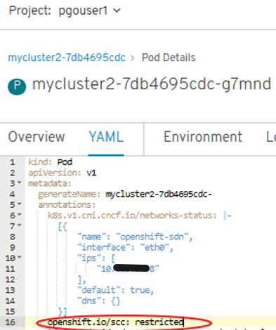

- **Problem:** Default SCC is “restricted” SCC -> Crunchydata Postgres Cluster PODs are not rolled out
    - ```oc get rs```: 

    

    - ```oc describe rs mycluster5-lgyb-84b58f5dd9```: Warning **FailedCreate** 3m24s (x17 over 7m30s) **replicaset-controller Error creating: pods "mycluster5-lgyb-84b58f5dd9-" is forbidden: unable to validate against any security context constraint: [fsGroup: Invalid value: []int64{26}: 26 is not an allowed group]**

##### Add a SCC to a Project
- SCCs are not granted directly to a project. Instead, you add a service account to an SCC and either specify the service account name on your pod or, when unspecified, run as the **default** service account.
- **To add a SCC to a user:**  ```oc adm policy add-scc-to-group <scc_name> <group_name>```
- **To add a SCC to all service accounts in a namespace:**  
  ```oc adm policy add-scc-to-group <scc_name>  system:serviceaccounts:<serviceaccount_namespace>```
- If you are currently in the project to which the service account belongs, you can use the -z flag and just specify the **serviceaccount_name**:  
  ```oc adm policy add-scc-to-user <scc_name> -z <serviceaccount_name>```
- Examples:
    - ```oc adm policy add-scc-to-group anyuid system:serviceaccounts:pgouser1```
    - ‘default’ serviceAccount: 
        ```oc adm policy add-scc-to-user anyuid system:serviceaccounts:pgouser1:default``` 
    - User registered in Identity Provider: 
        ```oc adm policy add-scc-to-user anyuid myuser```    
    - Custom serviceAccount: 
        ```oc adm policy add-scc-to-user anyuid system:serviceaccounts:pgouser1:my-sa```    
    - ```oc describe scc anyuid```
- Refs:
    - [ref1](https://docs.openshift.com/container-platform/3.6/admin_guide/manage_scc.html)
    - [ref2](https://docs.openshift.com/container-platform/3.6/admin_guide/manage_scc.html#add-scc-to-user-group-project)
    - [ref3 🌟](https://dzone.com/articles/understanding-openshift-security-context-constrain)

###### Add a SCC to a Project. Workflow1 without custom Service Account and without DeploymentConfig

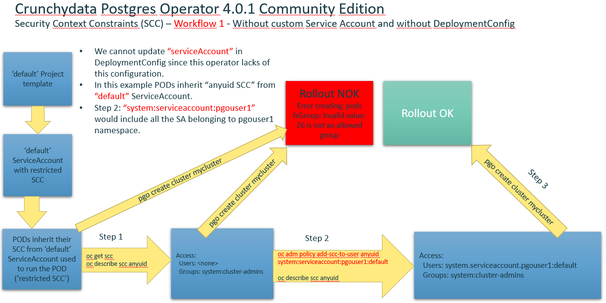

###### Add a SCC to a Project. Workflow2 with custom Service Account and without DeploymentConfig


- Create a custom ServiceAccount and add a role to it within a Project:
    1. ```oc project pgouser1```
    2. ```oc get scc```
    3. ```oc create serviceaccount my-sa –n pgouser1```
    4. ```oc describe sa my-sa```
    5. ```oc get scc```
    6. ```oc adm policy add-scc-to-user anyuid system:serviceaccount:pgouser1:my-sa```
    7. ```oc policy add-role-to-user edit system:serviceaccount:pgouser1:my-sa```
    8. Alternative to step #6:
   
```
oc edit scc anyuid 
```

```    
users:
- system:serviceaccount:pgouser1:my-sa
```

- Other commands of interest:
    - ```oc get role```
    - ```oc describe role pgo-role```
    - ```oc edit role pgo-role``` 

- References:
    - [ref1](https://blog.openshift.com/understanding-service-accounts-sccs/)
    - [ref2](https://docs.openshift.com/container-platform/4.1/authentication/understanding-and-creating-service-accounts.html)
    - [ref3](https://docs.openshift.com/container-platform/4.1/authentication/managing-security-context-constraints.html#role-based-access-to-ssc_configuring-internal-oauth)

###### Add a SCC to a Project. Workflow3 with custom service Account and DeploymentConfig


##### Environment setup. Port Forward and WSL
- Deployment method used in this presentation: [Install Operator Using Bash](https://access.crunchydata.com/documentation/postgres-operator/4.3.0/installation/other/bash/)
- Config files setup by installer are saved in:
    - “pgo” Project -> Deployments
    - “pgo” Project -> Deployment Configs (empty, openshift feature not provided by CrunchyData)
    - “pgo” Project -> Secrets
    - “pgo” Project -> Config Maps
- References:
    - [ref1](https://access.crunchydata.com/documentation/postgres-operator/latest/operatorcli/pgo-overview/)
    - [ref2](https://crunchydata.github.io/postgres-operator/latest/operatorcli/common-pgo-cli-operations/)
- WSL (Windows Subystem for Linux): **alog/olog/clog** functions must be adapted to be run in WSL's Ubuntu:
 
```
vim $HOME/.bashrc
```

```
# ~/.bashrc: executed by bash(1) for non-login shells.
# see /usr/share/doc/bash/examples/startup-files (in the package bash-doc)
# for examples
# If not running interactively, don't do anything
case $- in
    *i*) ;;
    *) return;;
esac
# don't put duplicate lines or lines starting with space in the history.
# See bash(1) for more options
HISTCONTROL=ignoreboth
# append to the history file, don't overwrite it
shopt -s histappend
# for setting history length see HISTSIZE and HISTFILESIZE in bash(1)
HISTSIZE=1000
HISTFILESIZE=2000
# check the window size after each command and, if necessary,
# update the values of LINES and COLUMNS.
shopt -s checkwinsize
# If set, the pattern "**" used in a pathname expansion context will
# match all files and zero or more directories and subdirectories.
#shopt -s globstar
# make less more friendly for non-text input files, see lesspipe(1)
[ -x /usr/bin/lesspipe ] && eval "$(SHELL=/bin/sh lesspipe)"
# set variable identifying the chroot you work in (used in the prompt below)
if [ -z "${debian_chroot:-}" ] && [ -r /etc/debian_chroot ]; then
    debian_chroot=$(cat /etc/debian_chroot)
fi
# set a fancy prompt (non-color, unless we know we "want" color)
case "$TERM" in
    xterm-color|*-256color) color_prompt=yes;;
esac
# uncomment for a colored prompt, if the terminal has the capability; turned
# off by default to not distract the user: the focus in a terminal window
# should be on the output of commands, not on the prompt
#force_color_prompt=yes
if [ -n "$force_color_prompt" ]; then
    if [ -x /usr/bin/tput ] && tput setaf 1 >&/dev/null; then
    # We have color support; assume it's compliant with Ecma-48
    # (ISO/IEC-6429). (Lack of such support is extremely rare, and such
    # a case would tend to support setf rather than setaf.)
    color_prompt=yes
    else
    color_prompt=
    fi
fi
if [ "$color_prompt" = yes ]; then
    PS1='${debian_chroot:+($debian_chroot)}\[\033[01;32m\]\u@\h\[\033[00m\]:\[\033[01;34m\]\w\[\033[00m\]\$ '
else
    PS1='${debian_chroot:+($debian_chroot)}\u@\h:\w\$ '
fi
unset color_prompt force_color_prompt
# If this is an xterm set the title to user@host:dir
case "$TERM" in
xterm*|rxvt*)
    PS1="\[\e]0;${debian_chroot:+($debian_chroot)}\u@\h: \w\a\]$PS1"
    ;;
*)
    ;;
esac
# enable color support of ls and also add handy aliases
if [ -x /usr/bin/dircolors ]; then
    test -r ~/.dircolors && eval "$(dircolors -b ~/.dircolors)" || eval "$(dircolors -b)"
    alias ls='ls --color=auto'
    #alias dir='dir --color=auto'
    #alias vdir='vdir --color=auto'
    alias grep='grep --color=auto'
    alias fgrep='fgrep --color=auto'
    alias egrep='egrep --color=auto'
fi
# colored GCC warnings and errors
#export GCC_COLORS='error=01;31:warning=01;35:note=01;36:caret=01;32:locus=01:quote=01'
# some more ls aliases
alias ll='ls -alF'
alias la='ls -A'
alias l='ls -CF'
# Add an "alert" alias for long running commands.  Use like so:
#   sleep 10; alert
alias alert='notify-send --urgency=low -i "$([ $? = 0 ] && echo terminal || echo error)" "$(history|tail -n1|sed -e '\''s/^\s*[0-9]\+\s*//;s/[;&|]\s*alert$//'\'')"'
# Alias definitions.
# You may want to put all your additions into a separate file like
# ~/.bash_aliases, instead of adding them here directly.
# See /usr/share/doc/bash-doc/examples in the bash-doc package.
if [ -f ~/.bash_aliases ]; then
    . ~/.bash_aliases
fi
# enable programmable completion features (you don't need to enable
# this, if it's already enabled in /etc/bash.bashrc and /etc/profile
# sources /etc/bash.bashrc).
if ! shopt -oq posix; then
if [ -f /usr/share/bash-completion/bash_completion ]; then
    . /usr/share/bash-completion/bash_completion
elif [ -f /etc/bash_completion ]; then
    . /etc/bash_completion
fi
fi
#########################################
# CRUNCHYDATA POSTGRES OPERATOR SETTINGS:
#########################################
# operator env vars
export PATH=$PATH:$HOME/odev/bin
export PGO_APISERVER_URL=https://127.0.0.1:18443
#export PGO_APISERVER_URL=https://172.25.212.138:8443
export PGO_CA_CERT=$HOME/odev/src/github.com/crunchydata/postgres-operator/conf/postgres-operator/server.crt
export PGO_CLIENT_CERT=$HOME/odev/src/github.com/crunchydata/postgres-operator/conf/postgres-operator/server.crt
export PGO_CLIENT_KEY=$HOME/odev/src/github.com/crunchydata/postgres-operator/conf/postgres-operator/server.key
#alias setip='export PGO_APISERVER_URL=https://`kubectl get service postgres-operator -o=jsonpath="{.spec.clusterIP}"`:18443'
#alias alog='kubectl logs `kubectl get pod --selector=name=postgres-operator -o jsonpath="{.items[0].metadata.name}"` -c apiserver'
#alias olog='kubectl logs `kubectl get pod --selector=name=postgres-operator -o jsonpath="{.items[0].metadata.name}"` -c operator'
#
export CCP_IMAGE_TAG=rhel7-11.1-2.3.0
export CCP_IMAGE_PREFIX=registry.connect.redhat.com/crunchydata
export PGO_CMD=oc
export PGO_BASEOS=rhel7
export PGO_VERSION=4.0.1
export PGO_NAMESPACE=pgo
export PGO_IMAGE_TAG=rhel7-4.0.1
export PGO_IMAGE_PREFIX=registry.connect.redhat.com/crunchydata
export GOPATH=$HOME/odev
export GOBIN=$GOPATH/bin
export PATH=$PATH:$GOBIN
# NAMESPACE is the list of namespaces the Operator will watch
export NAMESPACE=pgouser1,pgouser2
# PGO_OPERATOR_NAMESPACE is the namespace the Operator is deployed into
export PGO_OPERATOR_NAMESPACE=pgo
# PGO_CMD values are either kubectl or oc, use oc if Openshift
export PGO_CMD=kubectl
# the directory location of the Operator scripts
export PGOROOT=$GOPATH/src/github.com/crunchydata/postgres-operator
# the version of the Operator you run is set by these vars
export PGO_IMAGE_PREFIX=crunchydata
export PGO_BASEOS=centos7
export PGO_VERSION=4.0.1
export PGO_IMAGE_TAG=$PGO_BASEOS-$PGO_VERSION
# for the pgo CLI to authenticate with using TLS
export PGO_CA_CERT=$PGOROOT/conf/postgres-operator/server.crt
export PGO_CLIENT_CERT=$PGOROOT/conf/postgres-operator/server.crt
export PGO_CLIENT_KEY=$PGOROOT/conf/postgres-operator/server.key
# common bash functions for working with the Operator
function setip() { 
export PGO_APISERVER_URL=https://`$PGO_CMD -n "$PGO_OPERATOR_NAMESPACE" get service postgres-operator -o=jsonpath="{.spec.clusterIP}"`:18443 
export CO_APISERVER_URL=https://`$PGO_CMD -n "$PGO_OPERATOR_NAMESPACE" get service postgres-operator -o=jsonpath="{.spec.clusterIP}"`:18443 
}
function alog() {
$PGO_CMD  -n "$PGO_OPERATOR_NAMESPACE" logs `$PGO_CMD  -n "$PGO_OPERATOR_NAMESPACE" get pod --selector=name=postgres-operator -o jsonpath="{.items[0].metadata.name}"` -c apiserver
}
function olog () {
$PGO_CMD  -n "$PGO_OPERATOR_NAMESPACE" logs `$PGO_CMD  -n "$PGO_OPERATOR_NAMESPACE" get pod --selector=name=postgres-operator -o jsonpath="{.items[0].metadata.name}"` -c operator
}
function slog () {
$PGO_CMD  -n "$PGO_OPERATOR_NAMESPACE" logs `$PGO_CMD  -n "$PGO_OPERATOR_NAMESPACE" get pod --selector=name=postgres-operator -o jsonpath="{.items[0].metadata.name}"` -c scheduler
}
#export DOCKER_HOST=tcp://localhost:2375
# crunchy containers: https://github.com/CrunchyData/crunchy-containers/tree/2.4.1
export GOPATH=$HOME/cdev        # set path to your new Go workspace
export GOBIN=$GOPATH/bin        # set bin path 
export PATH=$PATH:$GOBIN        # add Go bin path to your overall path
export CCP_BASEOS=centos7       # centos7 for Centos, rhel7 for Redhat
export CCP_PGVERSION=10         # The PostgreSQL major version
export CCP_PG_FULLVERSION=10.9
export CCP_VERSION=2.4.1
export CCP_IMAGE_PREFIX=crunchydata # Prefix to put before all the container image names
export CCP_IMAGE_TAG=$CCP_BASEOS-$CCP_PG_FULLVERSION-$CCP_VERSION   # Used to tag the images
export CCPROOT=$GOPATH/src/github.com/crunchydata/crunchy-containers    # The base of the clone github repo
export CCP_SECURITY_CONTEXT=""
export CCP_CLI=oc          # kubectl for K8s, oc for OpenShift
export CCP_NAMESPACE=crunchy-containers       # Change this to whatever namespace/openshift project name you want to use
export CCP_SECURITY_CONTEXT='"fsGroup":26'
export CCP_STORAGE_CLASS=gp2
export CCP_STORAGE_MODE=ReadWriteOnce
export CCP_STORAGE_CAPACITY=400M
```

- **port-forward** to reach postgres-operator POD with ‘pgo’ tool (18443 port defined in previous .bashrc): 

```
oc project pgo
oc get pod 
oc port-forward postgres-operator-844d8f9777-8d5k5 -n pgo 18443:8443
```

##### Cluster Deployment and Operation with pgo

```
pgo create cluster mycluster --pgpool -n pgouser1 --resources-config=small --replica-count=1
pgo show cluster --all -n pgouser1
pgo backup mycluster --backup-type=pgbackrest –n pgouser1
pgo failover mycluster --query –n pgouser1
pgo failover mycluster --target=mycluster-olvhy –n pgouser1
pgo test mycluster -n pgouser1
pgo create cluster somefastpg -n pgouser1 --node-label=speed=fast
pgo create cluster abouncer --pgbouncer  (sidecar pgbouncer added to this PG cluster)
pgo create cluster apgpool --pgpool 
pgo status cluster mycluster –n pgouser1
pgo ls mycluster –n pgouser1
pgo reload mycluster –n pgouser1
pgo scale mycluster –n pgouser1
```

PGO USER allows you to manage users and passwords across a set of clusters:

```
pgo user –-selector=name=mycluster --expired=300 –-update-password –n pgouser1
pgo user –-change-password=bob –n pgouser1 --selector=name=mycluster --password=newpass
```

##### psql access from postgres-operator POD

```
oc project pgo
oc get pods
oc rsh postgres-operator-844d8f9777-ppjv9
export PGPASSWORD=password
psql -h mycluster-pgpool.pgouser1 -U testuser -l
psql -h mycluster-pgpool.pgouser1 -U postgres -c "CREATE DATABASE testdb"
psql -h mycluster-pgpool.pgouser1 -U postgres testdb -c "CREATE TABLE test (ID CHAR(4) NOT NULL, name TEXT NOT NULL, PRIMARY KEY (id))"
psql -h mycluster-pgpool.pgouser1 -U postgres testdb -c "INSERT INTO test (id,name) VALUES (1, 'user01')"
psql -h mycluster-pgpool.pgouser1 -U postgres testdb -c "select * from test"
```

##### psql: list databases

```
postgres=# \l
                                 List of databases
   Name    |  Owner   | Encoding |  Collate   |   Ctype    |   Access privileges
-----------+----------+----------+------------+------------+-----------------------
 postgres  | postgres | UTF8     | en_US.UTF8 | en_US.UTF8 |
 template0 | postgres | UTF8     | en_US.UTF8 | en_US.UTF8 | =c/postgres          +
           |          |          |            |            | postgres=CTc/postgres
 template1 | postgres | UTF8     | en_US.UTF8 | en_US.UTF8 | =c/postgres          +
           |          |          |            |            | postgres=CTc/postgres
 userdb    | postgres | UTF8     | en_US.UTF8 | en_US.UTF8 | =Tc/postgres         +
           |          |          |            |            | postgres=CTc/postgres+
           |          |          |            |            | testuser=CTc/postgres+
           |          |          |            |            | user1=CTc/postgres
(4 rows)
```

##### Access from another POD within the cluster with psql client
For example with [this psql client](https://hub.docker.com/r/centos/postgresql-10-centos7)

```
oc rsh postgresql-10-centos7-1-pjh46
sh-4.2$ psql -p 5432 -h mycluster-pgpool.pgouser1 -U postgres postgres
psql (10.6, server 11.3)
WARNING: psql major version 10, server major version 11.
         Some psql features might not work.
Type "help" for help.

postgres=#
```

##### Access from another POD within the cluster with Pgadmin4 of Crunchy containers Community Edition

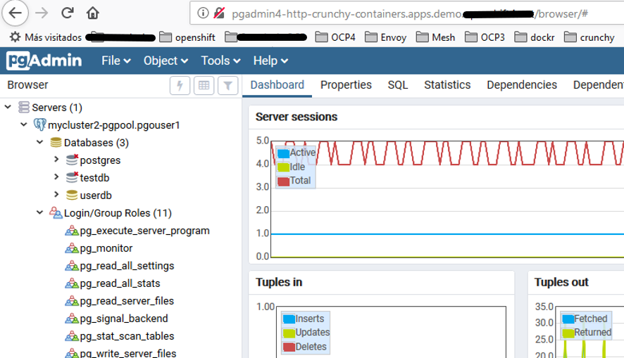

##### Debugging Crunchydata Postgres Operator 4.0.1 Community Edition
- Debug level logging in turned on by default when deploying the Operator.
- Sample bash functions are supplied in examples/envs.sh to view the Operator logs.
- You can view the Operator REST API logs with the **alog** bash function.
- You can view the Operator core logic logs with the **olog** bash function.
- You can view the Scheduler logs with the **slog** bash function.
- You can enable the pgo CLI debugging with the following flag:
    ```
    $ pgo version --debug
    ```
- You can set the REST API URL as follows after a deployment if you are developing on your local host by executing the **setip** bash function.
- “alog”, “olog”, “slog” and “setip” are defined in $HOME/.bashrc


#### Certified Crunchydata Postgres Operator (OLM/OperatorHub). Manual Setup
-  We will set this up manually:
    - StorageClass changed to “gp2” in YAML file (AWS)
    - ‘pgo’ tool compatibility issues

<center>
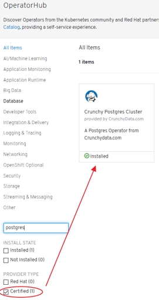
</center>


- NO PODs are deployed -> configuration needed:


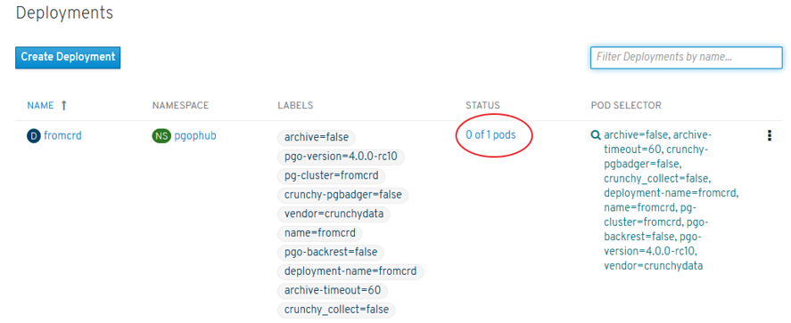

- Replica Sets: where PODs should be launched


- ReplicaSets (environment) and Deployment:


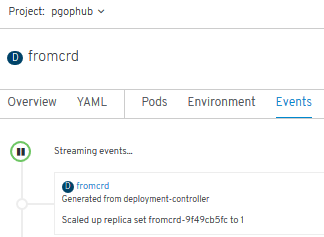

- Error detected. Solution: 

```
oc adm policy add-scc-to-user anyuid system:serviceaccount:pgophub:default
```

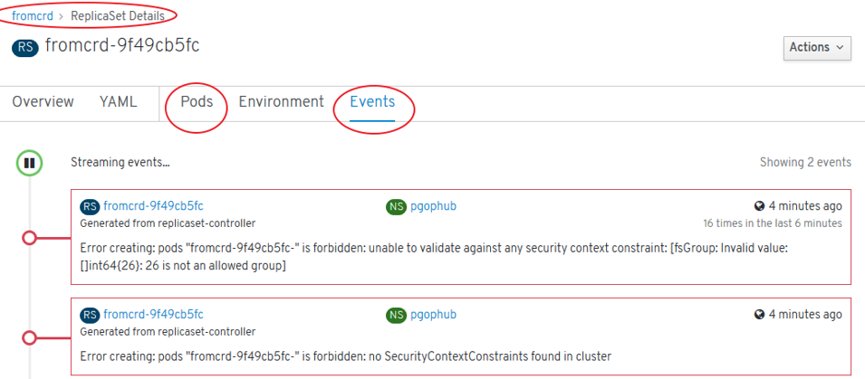

- We see now a new POD being created:

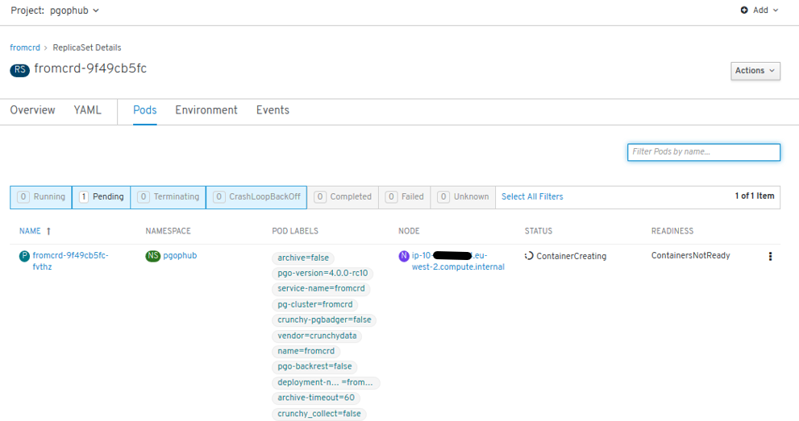

- New errors: “secrets” need to be setup:

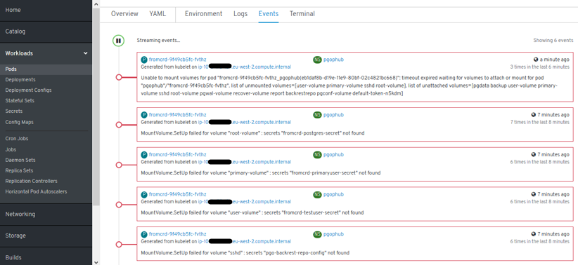


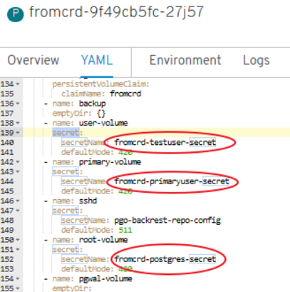

- New errors: 3 “secrets” need to be setup manually -> POD is started successfully and we have psql access.

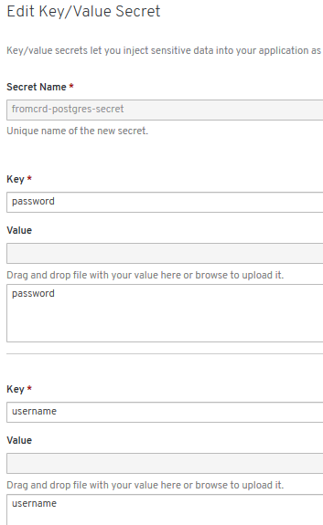


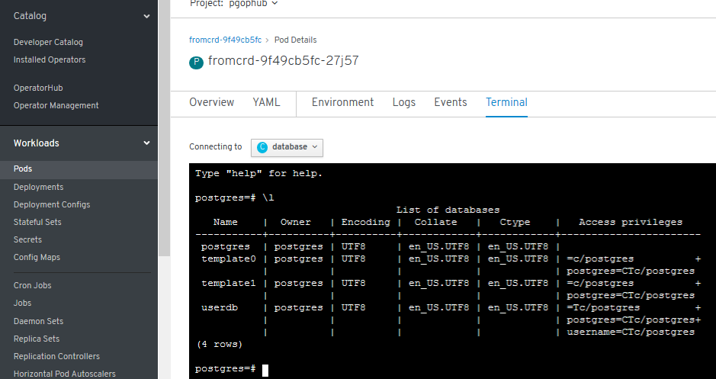


