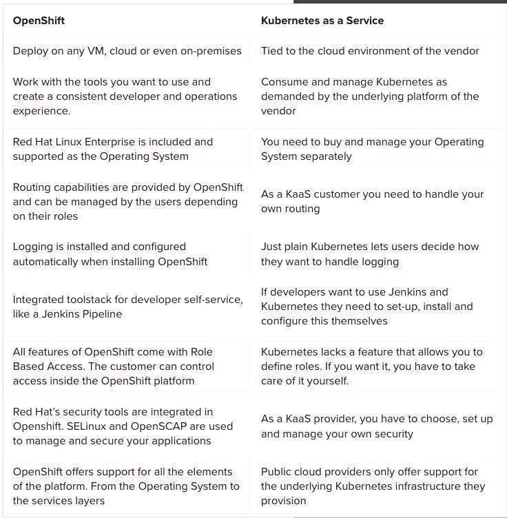
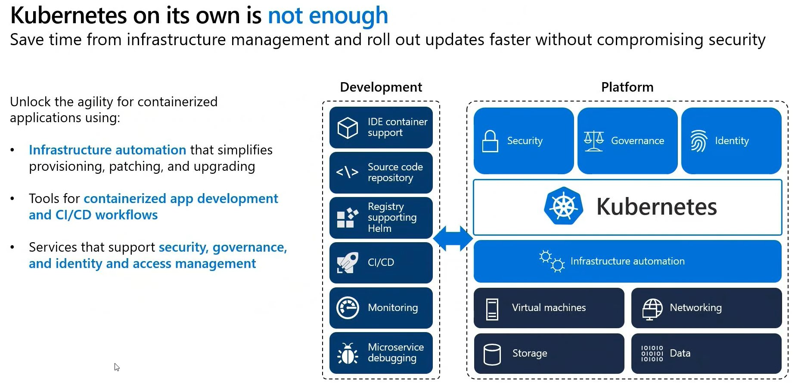

# From Java EE To Cloud Native. Openshift VS Kubernetes
- [Introduction](#introduction)
- [From SysAdmin to Architect](#from-sysadmin-to-architect)
- [Raft Consensus Algorithm](#raft-consensus-algorithm)
- [PaaS](#paas)
- [Modular Monolith](#modular-monolith)
- [From Java EE To Cloud Native](#from-java-ee-to-cloud-native)
- [Monolith to Microservices Using the Strangler Pattern](#monolith-to-microservices-using-the-strangler-pattern)
- [Openshift VS Kubernetes](#openshift-vs-kubernetes)
- [Career Path](#career-path)
- [Full Stack Developer's Roadmap](#full-stack-developers-roadmap)
- [Software Development Models](#software-development-models)
- [Software Development Tools](#software-development-tools)

## Introduction
* [developers.redhat.com: Why Kubernetes is The New Application Server](https://developers.redhat.com/blog/2018/06/28/why-kubernetes-is-the-new-application-server/)
* [Dzone.com: Kubernetes in 10 minutes: A Complete Guide](https://dzone.com/articles/kubernetes-in-10-minutes-a-complete-guide-to-look)
* [redhat.com: Why choose Red Hat for microservices?](https://www.redhat.com/en/topics/microservices/why-choose-red-hat-microservices)
* [Monoliths are the future](https://changelog.com/posts/monoliths-are-the-future)
* [weave.works: Going Cloud Native: 6 essential things you need to know](https://www.weave.works/technologies/going-cloud-native-6-essential-things-you-need-to-know/)
* [Operators and Sidecars Are the New Model for Software Delivery](https://thenewstack.io/operators-and-sidecars-are-the-new-model-for-software-delivery/)
* [Dzone: What Is Kubernetes?](https://dzone.com/articles/what-is-kubernetes-in-devops) 
* [jaxenter.com: Practical Implications for Adopting a Multi-Cluster, Multi-Cloud Kubernetes Strategy](https://jaxenter.com/kubernetes-practical-implications-171647.html)
* [jaxenter.com: Six Essential Kubernetes Extensions to Add to Your Toolkit 🌟](https://jaxenter.com/kubernetes-extensions-172215.html)
* [thoughtworks.com: Kubernetes](https://www.thoughtworks.com/radar/platforms/kubernetes)
* [addwebsolution.com: How Kubernetes helps businesses manage their IT infrastructure?](https://addwebsolution.com/blog/how-kubernetes-helps-businesses-manage-their-it-infrastructure)
* [Dzone: How to Kill Your Developer Productivity](https://dzone.com/articles/how-to-kill-your-developer-productivity-humanitec)
* [loves.cloud: Kubernetes: An Introduction](https://loves.cloud/kubernetes-an-introduction/)
* [thenewstack.io: Microservices vs. Monoliths: An Operational Comparison](https://thenewstack.io/microservices-vs-monoliths-an-operational-comparison/)
* [weave.works: 6 Business Benefits of Kubernetes](https://www.weave.works/blog/6-business-benefits-of-kubernetes)
* [ituser.es: Las principales habilidades que un arquitecto cloud necesita para triunfar](https://www.ituser.es/opinion/2020/07/las-principales-habilidades-que-un-arquitecto-cloud-necesita-para-triunfar)
* [Introducing Domain-Oriented Microservice Architecture 🌟](https://eng.uber.com/microservice-architecture/)
* [Monolithic versus Microservice architecture](https://www.enterprisetimes.co.uk/2020/07/23/monolithic-versus-microservice-architecture)
* [Modernize legacy applications with containers, microservices](https://searchcloudcomputing.techtarget.com/feature/Modernize-legacy-applications-with-containers-microservices) To break down monolithic apps and modernize them for cloud deployment, enterprise development teams continue to turn to containers and microservices.
* [blog.heroku.com: Deconstructing Monolithic Applications into Services](https://blog.heroku.com/monolithic-applications-into-services)
* [vmware.com: How to Deconstruct a Monolith using Microservices – Getting Ready for Cloud-Native](https://blogs.vmware.com/vov/2018/08/06/how-to-deconstruct-a-monolith-using-microservices-getting-ready-for-cloud-native/)
* [thenewstack.io: 7 Best Practices to Build and Maintain Resilient Applications and Infrastructure](https://thenewstack.io/7-best-practices-to-build-and-maintain-resilient-applications-and-infrastructure/)
* [viewnext.com: Front End vs Back End (spanish)](https://www.viewnext.com/front-end-vs-back-end/)
* [thenewstack.io: What is the modern cloud native stack? 🌟🌟](https://thenewstack.io/what-is-the-modern-cloud-native-stack/)
* [thenewstack.io: Do I Really Need Kubernetes? 🌟](https://thenewstack.io/do-i-really-need-kubernetes/)
* [cncf.io: Top 7 challenges to becoming cloud native](https://www.cncf.io/blog/2020/09/15/top-7-challenges-to-becoming-cloud-native/)
* [dewanahmed.com: When to go K8s-native - A tale of CI/CD servers](https://www.dewanahmed.com/post/tekton-k8snative-cicd-pt1/)
* [capstonec.com: You Will Love These Cloud-native App Architecture Patterns 🌟](https://capstonec.com/2020/10/08/cloud-native-app-architecture-patterns)
* [lavanguardia.com: Por qué la transformación digital es mentira 🌟](https://www.lavanguardia.com/economia/20201014/484036217179/transformacion-digital-empresas-foncillas-pf-video-seo-lv.html)
* [devops.com: 6 Advantages of Microservices](https://devops.com/6-advantages-of-microservices/)
* [cloudpundit.com: Don’t boil the ocean to create your cloud 🌟](https://cloudpundit.com/2020/09/22/dont-boil-the-ocean-to-create-your-cloud/)
* [hcltech.com: DevOps Tools and Technologies to Manage Microservices 🌟](https://www.hcltech.com/blogs/devops-tools-and-technologies-manage-microservices) 
* [redhat.com: A sysadmin's guide to containerizing applications](https://www.redhat.com/sysadmin/containerizing-applications) Curious how to containerize your Linux applications? Learn by example, and understand the challenges of various application types and how to overcome them.
* [opensource.com: 6 container concepts you need to understand](https://opensource.com/article/20/12/containers-101) Containers are everywhere, and they've radically changed the IT landscape. What do you need to know about them?
* [devops.com: Why Boring Tech is Best to Avoid a Microservices Mess](https://devops.com/why-boring-tech-is-best-to-avoid-a-microservices-mess/)
* [blog.upbound.io: Managed Services Don’t Always Lead to Vendor Lock-In 🌟](https://blog.upbound.io/managed-services-dont-always-lead-to-vendor-lock-in/)
* [softwareengineeringdaily.com: Kubernetes vs. Serverless with Matt Ward (podcast) 🌟](https://softwareengineeringdaily.com/2020/12/29/kubernetes-vs-serverless-with-matt-ward-repeat/)
* [softwareengineeringdaily.com: The Rise of Platform Engineering 🌟](https://softwareengineeringdaily.com/2020/02/13/setting-the-stage-for-platform-engineering/)
* [thenewstack.io: 3 Reasons Why You Can’t Afford to Ignore Cloud Native Computing 🌟](https://thenewstack.io/3-reasons-why-you-cant-afford-to-ignore-cloud-native-computing/)
* [thenewstack.io: Defining a Different Kubernetes User Interface for the Next Decade](https://thenewstack.io/defining-a-different-kubernetes-user-interface-for-the-next-decade/)
* [thenewstack.io: React in Real-Time with Event-Driven APIs](https://thenewstack.io/react-in-real-time-with-event-driven-apis/)
* [codeopinion.com: Splitting up a Monolith into Microservices 🌟](https://codeopinion.com/splitting-up-a-monolith-into-microservices/)
* [towardsdatascience.com: Learning From Microservices — as a Data Engineer 🌟](https://towardsdatascience.com/learning-from-microservices-as-a-data-engineer-1334ce13876c) Why Software Engineers moved to microservices and how we could learn from their experience 
* [javarevisited.blogspot.com: Why Every Programmer, DevOps Engineer Should learn Docker and Kubernetes in 2020](https://javarevisited.blogspot.com/2020/11/why-devops-engineer-learn-docker-kubernetes.html)

## From SysAdmin to Architect
- [redhat.com: 5 strategies to shift your career from sysadmin to architect](https://www.redhat.com/architect/from-sysadmin-to-architect) Many engineers make the shift from hands-on-keyboard system administration to building architectures as an architect. Here are five ways they make the shift.

## Raft Consensus Algorithm
- [The Raft Consensus Algorithm 🌟](https://raft.github.io/) [etcd](https://github.com/etcd-io/etcd) is a “distributed reliable key-value store for the most critical data of a distributed system”. It uses the Raft consensus algorithm which was designed to be easy to understand, to scale, and to operate. The protocol and the etcd implementation were very quickly adopted by large distributed systems like Kubernetes, large distributed databases or messaging frameworks, where consensus and strong consistency is a must. 

## PaaS
- [What is Platform as a Service Software?](https://www.trustradius.com/platform-as-a-service-paas)

## Modular Monolith
- [kamilgrzybek.com: Modular Monolith: A Primer 🌟](https://www.kamilgrzybek.com/design/modular-monolith-primer/)

## From Java EE To Cloud Native
- [wikipedia: Java Enterprise Edition (Java EE)](https://en.wikipedia.org/wiki/Java_Platform,_Enterprise_Edition)
- [lightbend.com: From Java EE To Cloud Native: The End Of The Heavyweight Era 🌟](https://www.lightbend.com/white-papers-and-reports/java-ee-to-cloud-native-modernization)

## Monolith to Microservices Using the Strangler Pattern
- [dzone: Monolith to Microservices Using the Strangler Pattern 🌟](https://dzone.com/articles/monolith-to-microservices-using-the-strangler-patt) The Strangler Pattern is a popular design pattern to incrementally transform your monolithic application into microservices by replacing a particular functionality with a new service. Once the new functionality is ready, the old component is strangled, the new service is put into use, and the old component is decommissioned altogether.
- [overops.com: Strangler Pattern: How to Deal With Legacy Code During the Container Revolution](https://www.overops.com/blog/strangler-pattern-how-to-keep-sane-with-legacy-monolith-applications/)

## Openshift VS Kubernetes
* [cloudowski.com: 10 most important differences between OpenShift and Kubernetes 🌟](https://cloudowski.com/articles/10-differences-between-openshift-and-kubernetes/)
* [Dzone.com: 4 Cluster Management Tools to Compare](https://dzone.com/articles/4-cluster-management-tools-to-compare)
* [Dzone.com: A Comparison of Kubernetes Distributions](https://dzone.com/articles/kubernetes-distributions-how-do-i-choose-one)
* [thestack.com: OpenShift in a world of KaaS 🌟](https://techerati.com/the-stack-archive/cloud/2018/10/18/openshift-in-a-world-of-kaas/)
* [medium.com: The Differences Between Kubernetes and Openshift](https://medium.com/levvel-consulting/the-differences-between-kubernetes-and-openshift-ae778059a90e)
* [blog.netsil.com: Kubernetes vs Openshift vs Tectonic: Comparing Enterprise Options](https://blog.netsil.com/kubernetes-vs-openshift-vs-tectonic-comparing-enterprise-options-e3a34dc60519)
* [kubedex.com: Kubernetes On-Prem, OpenShift vs PKS vs Rancher](https://kubedex.com/redhat-openshift-vs-pivotal-pks-vs-rancher/)
    * [reddit.com: OpenShift vs PKS vs Rancher 🌟](https://www.reddit.com/r/kubernetes/comments/9qxeuw/openshift_vs_pks_vs_rancher/)
* [elastisys.com: OpenShift Features and Their Kubernetes Counterparts 🌟](https://elastisys.com/2018/11/06/openshift-features-kubernetes-counterparts/)
* [medium.com: Kubernetes — What Is It, What Problems Does It Solve and How Does It Compare With Alternatives?](https://medium.com/@srikanth.k/kubernetes-what-is-it-what-problems-does-it-solve-how-does-it-compare-with-its-alternatives-937fe80b754f)
* [spec-india.com: Kubernetes VS Openshift (July 23rd 2019)](https://www.spec-india.com/blog/kubernetes-vs-openshift)
* [phoenixnap.com: Kubernetes vs OpenShift: Key Differences Compared 🌟](https://phoenixnap.com/blog/kubernetes-vs-openshift)
* [crn.com: Red Hat CEO: We Have A ‘Head Start’ Over VMware, Competitors In Kubernetes](https://www.crn.com/slide-shows/cloud/red-hat-ceo-we-have-a-head-start-over-vmware-competitors-in-kubernetes) Red Hat CEO Paul Cormier speaks with CRN about the role IBM has played in Red Hat’s channel strategy, how the company has preserved its independence under Big Blue, and why Red Hat will win in the ultra-competitive Kubernetes market.
* [redhat.com ebook: Red Hat OpenShift and Kubernetes ... what's the difference? 🌟](https://www.redhat.com/en/resources/openshift-and-kubernetes-whats-the-difference-ebook) 

## Career Path
- [Kelsey Hightower Fireside Chat: An Unconventional Path to IT and Some Life Advice](https://www.hashicorp.com/resources/kelsey-hightower-fireside-chat-an-unconventional-path-to-it-and-some-life-advice/?utm_source=linkedin)

## Full Stack Developer's Roadmap
- [Full Stack Developer's Roadmap 🌟](https://dev.to/ender_minyard/full-stack-developer-s-roadmap-2k12)

## Software Development Models
- [dzone: 7 Software Development Models You Should Know](https://dzone.com/articles/7-software-development-models-you-should-know) Software Development Models are integral to the success (or failure) of a project. Here are 7 models you should know, from Waterfall to the V-Model to Scrum.

## Software Development Tools
- [ubiqum.com: 20 Software Development Tools that will make you more productive](https://ubiqum.com/blog/20-software-development-tools-that-will-make-you-more-productive/)

<iframe src="https://www.youtube.com/embed/Q6i0LK4vHsU" frameborder="0" allow="accelerometer; autoplay; clipboard-write; encrypted-media; gyroscope; picture-in-picture" allowfullscreen></iframe>

