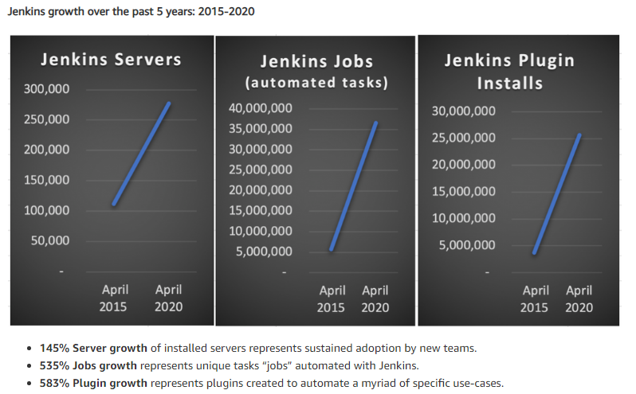
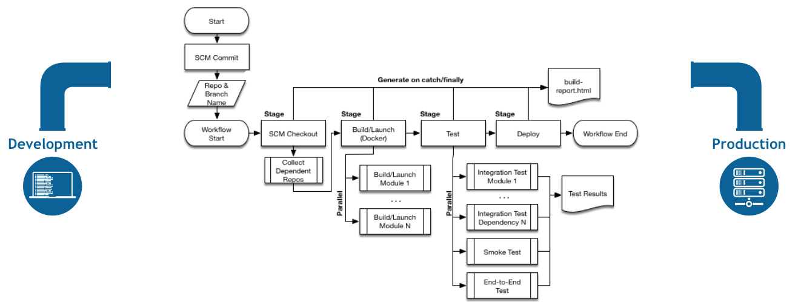
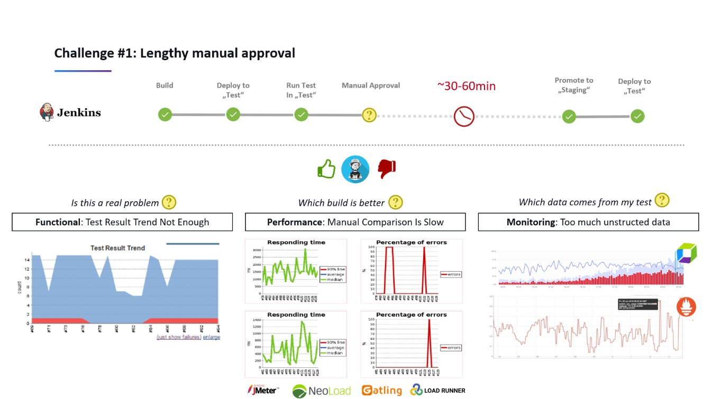
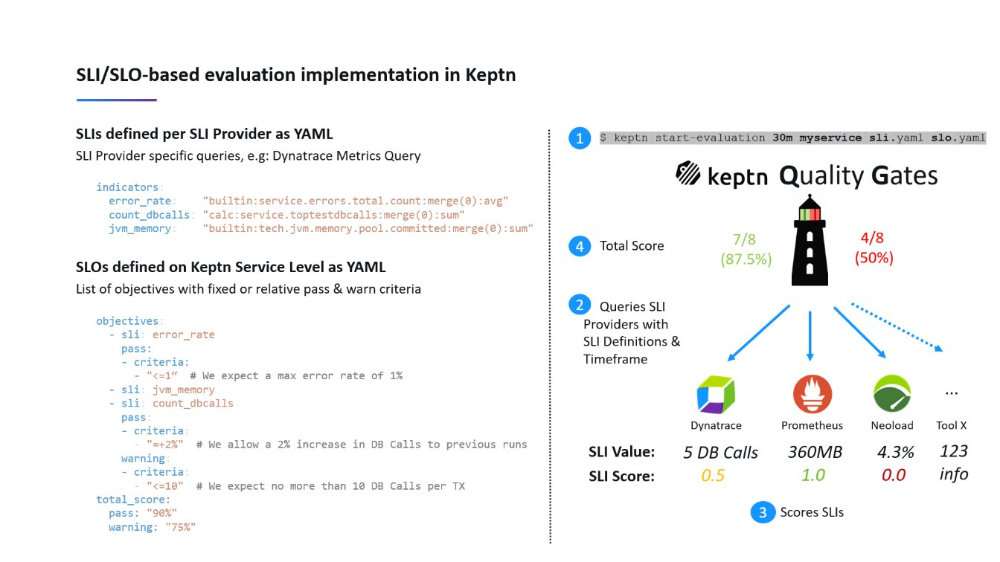
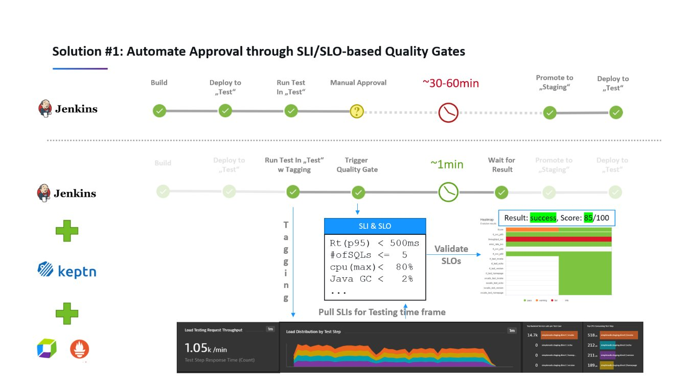

# Jenkins & CloudBees
- [Jenkins](#jenkins)
- [Jenkins on Kubernetes](#jenkins-on-kubernetes)
    - [Kubernetes Native Jenkins Operator](#kubernetes-native-jenkins-operator)
- [Groovy](#groovy)
- [Awesome Jenkins](#awesome-jenkins)
- [Jenkins Cheat Sheet](#jenkins-cheat-sheet)
- [Jenkins Special Interest Groups (SIG)](#jenkins-special-interest-groups-sig)
- [Running Jenkins on Java 11. Use OpenJDK 11](#running-jenkins-on-java-11-use-openjdk-11)
- [Online Learning](#online-learning)
- [Jenkins Configuration as Code Solutions. 3 available DSLs](#jenkins-configuration-as-code-solutions-3-available-dsls)
    - [DSL 1. Job DSL Plugin. From Freestyle jobs to Declarative Pipeline](#dsl-1-job-dsl-plugin-from-freestyle-jobs-to-declarative-pipeline)
    - [DSL 2. Jenkins Pipeline. Pipeline as Code with Jenkins](#dsl-2-jenkins-pipeline-pipeline-as-code-with-jenkins)
        - [Jenkins Pipeline Syntax. Scripted Syntax (Groovy DSL syntax) VS Declarative Syntax](#jenkins-pipeline-syntax-scripted-syntax-groovy-dsl-syntax-vs-declarative-syntax)
        - [Extending with Shared Libraries](#extending-with-shared-libraries)
            - [Automating Service Level Indicators/Service Level Objectives based build validation with Keptn and Jenkins](#automating-service-level-indicatorsservice-level-objectives-based-build-validation-with-keptn-and-jenkins)
        - [Jenkinsfile Runner. Serverless / function-as-a-service build execution](#jenkinsfile-runner-serverless--function-as-a-service-build-execution)
    - [DSL 3. Jenkins Configuration as Code (JCasC)](#dsl-3-jenkins-configuration-as-code-jcasc)
        - [Read-only Jenkins Configuration](#read-only-jenkins-configuration)
- [Jenkins Architecture. Performance and Scalability](#jenkins-architecture-performance-and-scalability)
- [Ansible and Jenkins. Running Ansible Playbooks From Jenkins](#ansible-and-jenkins-running-ansible-playbooks-from-jenkins)
- [Jenkins Tools](#jenkins-tools)
    - [Plugin Installation Manager Tool](#plugin-installation-manager-tool)
    - [Pipeline Development Tools](#pipeline-development-tools)
- [Jenkins Multibranch Pipeline](#jenkins-multibranch-pipeline)
    - [Multibranch Pipelines with Kubernetes](#multibranch-pipelines-with-kubernetes)
- [Jenkins Plugins](#jenkins-plugins)
    - [Selection of Jenkins Plugins](#selection-of-jenkins-plugins)
    - [Plugin Development. Jenkins Plugin Parent POM 4.0](#plugin-development-jenkins-plugin-parent-pom-40)
    - [Jenkins Blue Ocean](#jenkins-blue-ocean)
    - [Cloudbees Flow](#cloudbees-flow)
- [Monitoring jenkins](#monitoring-jenkins)
- [Externalizing Fingerprint Storage for Jenkins](#externalizing-fingerprint-storage-for-jenkins)
- [Jenkins and Spring Boot](#jenkins-and-spring-boot)
- [CloudBees](#cloudbees)
    - [CloudBees Rollout and Feature Flags](#cloudbees-rollout-and-feature-flags)
        - [Feature Flags in CloudBees Enterprise On-Premise](#feature-flags-in-cloudbees-enterprise-on-premise)
    - [CloudBees Accelerator](#cloudbees-accelerator)
- [Jervis: Jenkins as a service](#jervis-jenkins-as-a-service)
- [Jenkins X (Serverless)](#jenkins-x-serverless)
- [Jenkins and SAP](#jenkins-and-sap)

## Jenkins
* [CloudBees](https://www.cloudbees.com/)
* [Wikipedia.org: Jenkins Software](https://en.wikipedia.org/wiki/Jenkins_(software))
* [Jenkins.io (new Jenkins 2.0 site) 🌟](https://jenkins.io/)
* [jenkinsci.github.io 🌟](http://jenkinsci.github.io/)
* [Official Jenkins Docker image](https://github.com/michaelneale/jenkins-ci.org-docker)
* [github.com/jenkinsci 🌟](https://github.com/jenkinsci)
* [reddit.com/r/jenkinsci 🌟](https://www.reddit.com/r/jenkinsci) 
* [dzone: getting started with jenkins the ultimate guide](https://dzone.com/articles/getting-started-with-jenkins-the-ultimate-guide)
* [dzone: jenkins in a nutshell](https://dzone.com/articles/jenkins-in-a-nutshell)
* [opensource.com: running jenkins builds containers 🌟](https://opensource.com/article/18/4/running-jenkins-builds-containers)
* [WebSocket support in now available for Jenkins CLI and agent networking!](https://jenkins.io/blog/2020/02/02/web-socket/)
* [webhookrelay.com: Receive Github webhooks on Jenkins without public IP 🌟](https://webhookrelay.com/blog/2017/11/23/github-jenkins-guide/)
* [Dzone refcard: Jenkins on PaaS](https://dzone.com/refcardz/jenkins-paas) Continuous Integration with Jenkins for Java Projects. Includes a review of the most useful plugins, best practices, security, integration to an enterprise environment, and more.
* [jenkins.io 2020-05-06: Slave to Agent renaming. Renaming of the official Docker images for Jenkins agents](https://www.jenkins.io/blog/2020/05/06/docker-agent-image-renaming/) We would like to announce the renaming of the official Docker images for Jenkins agents. The **"slave" term is widely considered inappropriate in open source communities**. It has been **officially deprecated in Jenkins 2.0 in 2016**, but there are remaining usages in some Jenkins components.
* [Windows Docker Agent Images: General Availability 🌟](https://www.jenkins.io/blog/2020/05/11/docker-windows-agents/)
* [jenkinsistheway.io: Jenkins Is The Way 🌟](https://jenkinsistheway.io/) Jenkins Is The Way is a collection of experiences from all around the world showcasing how users are building, deploying, and automating great stuff with Jenkins. 
* [Jenkins: Shifting Gears 🌟🌟](https://www.jenkins.io/blog/2018/08/31/shifting-gears/) **Evolutionary line from the current Jenkins 2, but with breaking changes in order to gain higher development speed.** This document lays out the key directions and approaches in a broad stroke, which I discussed with a number of you in the past. Hopefully, this gives you the big picture of how I envision where to move Jenkins forward, not just as the creator of Jenkins but as the CTO of CloudBees, who employs a number of key contributors to the Jenkins project.
* [aws.amazon.com/blogs: Why Jenkins still continuously serves developers 🌟](https://aws.amazon.com/blogs/opensource/why-jenkins-still-continuously-serves-developers/) 
* [On Jenkins Terminology Updates](https://www.jenkins.io/blog/2020/06/18/terminology-update/)
* [medium: Deploy your App Using CI/CD Pipeline](https://medium.com/wind-of-change/creating-a-ci-cd-pipeline-6ff9aeb0848c)
* [medium: CI/CD Pipeline of Jenkins Using Groovy Language With Monitoring on the Top of Kubernetes 🌟](https://medium.com/swlh/ci-cd-pipeline-of-jenkins-using-groovy-language-with-monitoring-on-the-top-of-kubernetes-b37f962fb0ac)
* [Cross account ECR push with Jenkins](https://devopsformula.hashnode.dev/cross-account-ecr-push-with-jenkins)
* [dzone.com: Easily Automate Your CI/CD Pipeline With Jenkins, Helm, and Kubernetes 🌟](https://dzone.com/articles/easily-automate-your-cicd-pipeline-with-jenkins-he) Learn how to set up a workflow to automate your CI/CD pipeline for quick and easy deployments using Jenkins, Helm, and Kubernetes.
* [Building Pipeline and Launching Jenkins in Container](https://medium.com/@rishabh1799/building-pipeline-and-launching-jenkins-in-container-d4faf39de173)
* [lambdatest.com: Best Jenkins Pipeline Tutorial For Beginners (Examples) 🌟](https://www.lambdatest.com/blog/jenkins-pipeline-tutorial/)
* [youtube: MSBuild With Jenkins | Jenkins For C# / .NET Applications](https://www.youtube.com/watch?v=uC7vajbnZS4)
* [betsol.com: DevOps Using Jenkins, Docker, and Kubernetes](https://www.betsol.com/blog/devops-using-jenkins-docker-and-kubernetes/)
* [Setup Chained Jenkins Declarative Pipeline Projects with Triggers 🌟](https://medium.com/@rosaniline/setup-chained-jenkins-declarative-pipeline-projects-with-triggers-d3d04f1daf75)
* [devopscurry.com: What makes Jenkins everyone’s favorite in 2020](https://devopscurry.com/what-makes-jenkins-everyones-favorite-in-2020/)
* [linkedin: Jenkins Server setup with dynamic worker nodes](https://www.linkedin.com/pulse/jenkins-server-setup-dynamic-worker-nodes-shishir-khandelwal/)
* [jenkinsistheway.io: Financial Transactions Simplified With Faster Build Cycles 🌟](https://jenkinsistheway.io/user-story/jenkins-is-the-way-to-fintech-excellence/) After integrating Jenkins, this FinTech’s financial transaction product quality is improved and 3X simpler.
* [medium: CI/CD with Dockers and Jenkins](https://medium.com/avmconsulting-blog/ci-cd-with-dockers-and-jenkins-70b6f801f9f7)
* [harness.io: Modernizing Jenkins CI/CD Pipelines](https://harness.io/blog/continuous-delivery/modernizing-jenkins-ci-cd-pipelines-with-harness/)

## Jenkins on Kubernetes
* [jenkins.io: Document Jenkins on Kubernetes: Installing Jenkins on Kubernetes Documentation Release 🌟](https://www.jenkins.io/blog/2020/11/05/installing-jenkins-on-kubernetes/)
* [jenkins.io: Installing Jenkins on Kubernetes 🌟](https://www.jenkins.io/doc/book/installing/kubernetes/)

### Kubernetes Native Jenkins Operator 
* [github.com/jenkinsci/kubernetes-operator: 🌟](https://github.com/jenkinsci/kubernetes-operator) Kubernetes platform was released ten years after the first version of Hudson project. It means Jenkins couldn’t be designed to run on top of it. Jenkins Operator tries to bridge that gap.

## Groovy
* [Wikipedia.org: Groovy](https://en.wikipedia.org/wiki/Apache_Groovy)
* [Dzone: Introduction to Groovy](https://dzone.com/articles/introduction-groovy)
* [Dzone refcard: Groovy, a Rapid-Development JVM Language](https://dzone.com/refcardz/groovy) 

## Awesome Jenkins
* [sahilsk/awesome-jenkins](https://github.com/sahilsk/awesome-jenkins)
* [Hacking jenkins](https://github.com/orangetw/awesome-jenkins-rce-2019)

## Jenkins Cheat Sheet
* [Jenkins Cheat Sheets](cheatsheets.md)

## Jenkins Special Interest Groups (SIG)
* [Jenkins SIG Platform 🌟](https://www.jenkins.io/sigs/platform/) This special interest group offers a venue for all kinds of platform support discussions: Java, Operating Systems, Architectures, Docker, Packaging, Web Containers, etc. The SIG works on defining platform support policies, coordinating platform support efforts with contributors and external communities, and reviewing proposals in the area.
* [Jenkins SIG Cloud Native 🌟](https://www.jenkins.io/sigs/cloud-native/)

## Running Jenkins on Java 11. Use OpenJDK 11
- [Running Jenkins on Java 11 🌟](https://www.jenkins.io/doc/administration/requirements/jenkins-on-java-11/#:~:text=The%20easiest%20way%20to%20run,images%2C%20use%20the%20jdk11%20tag.)
- [Oracle's Java 11 trap - Use OpenJDK instead! 🌟](https://blog.joda.org/2018/09/do-not-fall-into-oracles-java-11-trap.html)
- [It’s time! Migrating to Java 11 🌟](https://medium.com/criciumadev/its-time-migrating-to-java-11-5eb3868354f9)

## Online Learning
* [udemy.com: Master Jenkins CI For DevOps and Developers](https://www.udemy.com/the-complete-jenkins-course-for-developers-and-devops/)
* [udemy.com: Learn DevOps: CI/CD with Jenkins using Pipelines and Docker](https://www.udemy.com/learn-devops-ci-cd-with-jenkins-using-pipelines-and-docker/) Use Jenkins the DevOps way. Automate your Jenkins jobs by using Jenkins Pipelines, Docker, and the Jenkins Job DSL
* [wardviaene/jenkins-course 🌟](https://github.com/wardviaene/jenkins-course) 

## Jenkins Configuration as Code Solutions. 3 available DSLs
* [Job DSL](https://plugins.jenkins.io/job-dsl/) was one of the first popular plugins for Jenkins which allows managing configuration as code and many other plugins dealing with this aspect have been created since then, most notably the [Jenkins Pipeline](https://www.jenkins.io/solutions/pipeline/) and [Configuration as Code](https://www.jenkins.io/projects/jcasc/) plugins. It is important to understand the differences between these plugins and Job DSL for managing Jenkins configuration efficiently.
* In consequence 3 [DSL](https://en.wikipedia.org/wiki/Domain-specific_language)s are available to configure jenkins as code:
    - DSL 1: [Job DSL](https://plugins.jenkins.io/job-dsl/)
    - DSL 2: [Jenkins (Declarative) Pipeline](https://www.jenkins.io/solutions/pipeline/)
    - DSL 3: [Jenkins Configuration as Code (JCasC)](https://www.jenkins.io/projects/jcasc/)
* Tip: Don't stay with manually configured freestyle jobs. Use JobDSL wrapper if you can't use Pipeline.

### DSL 1. Job DSL Plugin. From Freestyle jobs to Declarative Pipeline
* Jenkins Job DSL API used in jenkins declarative pipelines.
* [Job DSL Plugin 🌟](https://plugins.jenkins.io/job-dsl/)
    * [github.com/jenkinsci/job-dsl-plugin](https://github.com/jenkinsci/job-dsl-plugin/wiki)
    * [Jenkins Job DSL Plugin documentation 🌟](https://github.com/jenkinsci/job-dsl-plugin#documentation) A Groovy DSL for Jenkins Jobs - Sweeeeet!
* [Jenkins Job DSL API 🌟](https://jenkinsci.github.io/job-dsl-plugin/)
    * [mavenJob](https://jenkinsci.github.io/job-dsl-plugin/#path/mavenJob)
    * [Continuation Passing Style (CPS)](https://github.com/cloudbees/groovy-cps/blob/master/doc/cps-basics.md) is a style of programming in which the remainder of the program is passed explicitly as a parameter, as opposed to that being handled implicitly represented as call stack.
        * [Jenkins Pipeline execution engine based on Continuation Passing Style (CPS) transformation of Groovy scripts. DSL Methods:](https://jenkinsci.github.io/job-dsl-plugin/#plugin/workflow-cps):
            * [cps](https://jenkinsci.github.io/job-dsl-plugin/#method/javaposse.jobdsl.dsl.helpers.workflow.WorkflowDefinitionContext.cps): WorkflowDefinitionContext
            * [cpsScm](https://jenkinsci.github.io/job-dsl-plugin/#method/javaposse.jobdsl.dsl.helpers.workflow.WorkflowDefinitionContext.cpsScm): WorkflowDefinitionContext
        * [Defines a Groovy CPS DSL definition: pipelineJob definition cps script](https://jenkinsci.github.io/job-dsl-plugin/#path/pipelineJob-definition-cps-script)
    * [Example of a pipeline with parameters](https://github.com/polarpoint-io/groovy-jenkins-pipelines/blob/master/jobs/parameterisedPipelines.groovy)
* [job-dsl **Gradle** Example](https://github.com/sheehan/job-dsl-gradle-example)
* [Jenkins DSL for **Nexus**](https://accenture.github.io/adop-cartridges-cookbook/docs/recipes/archiving-artefact-to-nexus/)
* Jenkins DSL for **Maven**:
    * [ref 1](https://jenkinsci.github.io/job-dsl-plugin/#method/javaposse.jobdsl.dsl.helpers.step.StepContext.maven)
    * [ref 2](https://deors.wordpress.com/2019/04/25/jenkins-ci-pipeline-java-spring-boot-maven-docker/)
* [Pipeline Global Library for ci.jenkins.io](https://github.com/jenkins-infra/pipeline-library) Collection of custom steps and variables for our Jenkins instance(s)
* [medium: Jenkins Jobs as Code with Groovy DSL (Job DSL plugin) 🌟](https://tech.gogoair.com/jenkins-jobs-as-code-with-groovy-dsl-c8143837593a)

### DSL 2. Jenkins Pipeline. Pipeline as Code with Jenkins
* [Pipeline as Code with Jenkins 🌟](https://www.jenkins.io/solutions/pipeline/)
    * [**Why Pipeline?**](https://www.jenkins.io/doc/book/pipeline/#why) Jenkins is, fundamentally, an automation engine which supports a number of automation patterns. Pipeline adds a powerful set of automation tools onto Jenkins, supporting use cases that span from simple continuous integration to comprehensive CD pipelines. By modeling a series of related tasks, users can take advantage of the many features of Pipeline:
        * **Code**: Pipelines are implemented in code and typically checked into source control, giving teams the ability to edit, review, and iterate upon their delivery pipeline.
        * **Durable**: Pipelines can survive both planned and unplanned restarts of the Jenkins master.
        * **Pausable**: Pipelines can optionally stop and wait for human input or approval before continuing the Pipeline run.
        * **Versatile**: Pipelines support complex real-world CD requirements, including the ability to fork/join, loop, and perform work in parallel.
        * **Extensible**: The Pipeline plugin supports custom extensions to its [DSL](https://en.wikipedia.org/wiki/Domain-specific_language) and multiple options for integration with other plugins.
* [jenkins.io - doc/book/pipeline 🌟](https://jenkins.io/doc/book/pipeline/)
* [jenkins.io - **Jenkinsfile** 🌟](https://jenkins.io/doc/book/pipeline/jenkinsfile/) With **version 2** of the Jenkins Continuous Integration/Continuous Delivery (CI/CD) server, **a new job definition file has been introduced, called Jenkinsfile**. The initial Jenkinsfile format was based on Groovy. As groovy knowledge is not that widespread, a new and more straight forward was published in spring 2017. **This format is called Declarative Pipeline**. [This visual studio code extension](https://marketplace.visualstudio.com/items?itemName=jmMeessen.jenkins-declarative-support) is aimed at making the manipulation of this file type easier.  
* [Dzone refcard: **Continuous Delivery with Jenkins Pipeline** 🌟](https://dzone.com/refcardz/continuous-delivery-with-jenkins-pipeline) 
* [GitHub Gist - Faheetah/Jenkinsfile.groovy: **Jenkinsfile idiosynchrasies with escaping and quotes**](https://gist.github.com/Faheetah/e11bd0315c34ed32e681616e41279ef4)
* [jenkins.io: Jenkins CD and Pipelines Microsite](https://jenkins.io/solutions/pipeline/)
* [dzone.com: Jenkins Pipeline - Software Delivery Made Easy](https://dzone.com/articles/jenkins-pipeline-software-delivery-made-easy) Jenkins 2.0 has focused on solving the problem for organizations wanting to continuously deliver software.
* [DZone refcard: declarative pipeline with jenkins 🌟](https://dzone.com/refcardz/declarative-pipeline-with-jenkins)
* [sdtimes.com: CI/CD pipelines are expanding 🌟](https://sdtimes.com/devops/ci-cd-pipelines-are-expanding/) The “basic” CI/CD pipeline includes five processes, which are: merge, build, test, package and deploy. All of these are individually defined so readers have a common reference point. The basic pipeline includes sub-pipelines associated with each step, such as moving artifacts from a build into a repository.
* [magalix.com: Create a CI/CD pipeline with Kubernetes and Jenkins (Ansible, Docker, Golang App) 🌟](https://www.magalix.com/blog/create-a-ci/cd-pipeline-with-kubernetes-and-jenkins)
* [dzone: learn how to setup a cicd pipeline from scratch 🌟](https://dzone.com/articles/learn-how-to-setup-a-cicd-pipeline-from-scratch)
* [dzone: how to use basic jenkins pipelines](https://dzone.com/articles/how-to-use-basic-jenkins-pipelines)
* [opensource.com - building cicd pipelines with jenkins 🌟](https://opensource.com/article/19/9/intro-building-cicd-pipelines-jenkins)
* [opensource.com: Jenkins Pipeline as Code Tutorial For Beginners 🌟](https://devopscube.com/jenkins-pipeline-as-code/)
* [loves.cloud: CI/CD Pipeline Using Docker and Jenkins](https://loves.cloud/ci-cd-pipeline-using-docker-and-jenkins/)
    * [github.com/LovesCloud/java-groovy-docker](https://github.com/LovesCloud/java-groovy-docker/) 
* [medium: jenkins cicd getting started with groovy and docker](https://medium.com/@fvtool/jenkins-cicd-getting-started-with-groovy-and-docker-containers-part-2-b03a1b934a49)
* [Dzone: Top 10 Best Practices for Jenkins Pipeline](https://dzone.com/articles/top-10-best-practices-for-jenkins-pipeline)
* [opensource.com - Introduction to writing pipelines-as-code and implementing DevOps with Jenkins 2](https://opensource.com/article/18/8/devops-jenkins-2)
* [thoughtworks.com: Modernizing your build pipelines 🌟](https://www.thoughtworks.com/es/insights/blog/modernizing-your-build-pipelines)

#### Jenkins Pipeline Syntax. Scripted Syntax (Groovy DSL syntax) VS Declarative Syntax
* [Jenkins Pipeline Syntax: Scripted Syntax (Groovy DSL syntax) & Declarative Syntax 🌟](https://www.jenkins.io/doc/book/pipeline/syntax/):
    * **Version 2.5 of the "Pipeline plugin" released in 2016/05/16 introduces support for Declarative Pipeline syntax**.
    * Declarative Pipeline is a relatively recent addition to Jenkins Pipeline which presents a more simplified and opinionated syntax on top of the Pipeline sub-systems. 
* [Building Declarative Pipelines with OpenShift DSL Plugin](https://www.openshift.com/blog/building-declarative-pipelines-openshift-dsl-plugin):
    * **Jenkinsfiles have only become an integral part of Jenkins since version 2** but they have quickly become the de-facto standard for building continuous delivery pipelines with Jenkins. **Jenkinsfile allows defining pipelines as code using a Groovy DSL syntax** and checking it into source version control which allows you to track, review, audit, and manage the lifecycle of changes to the continuous delivery pipelines the same way that you manage the source code of your application. 
    * Although the **Groovy DSL syntax which is referred to as the scripted syntax** is the more well-known and established syntax for building Jenkins pipelines and **was the default when Jenkins 2 was released**, support for a **newer declarative syntax is also added since Jenkins 2.5** in order to offer a simplified way for controlling all aspects of the pipeline. Although the scripted and declarative syntax provides two ways to define your pipeline, they both translate to the same execution blocks in Jenkins and achieve the same result. 
    * The declarative syntax in its simplest form is composed of an agent which defines the Jenkins slave to be used for executing the pipeline and a number of stages and each stage with a number of steps to be performed. 

#### Extending with Shared Libraries
- Shared-libraries with **scripted pipeline syntax** are not recommended since more coding involves more maintenance issues. Use **Declarative Pipeline Syntax** as much as possible.
- [Extending with Shared Libraries 🌟](https://www.jenkins.io/doc/book/pipeline/shared-libraries/)
- [A sustainable pattern with shared library 🌟](https://www.jenkins.io/blog/2020/10/21/a-sustainable-pattern-with-shared-library/)
- [tomd.xyz: Jenkins shared library: tutorial with examples 🌟](https://tomd.xyz/jenkins-shared-library/) How to use a shared library in Jenkins, to allow you to share common code and steps across multiple pipelines. Includes a demo Git repo that you can fork.
- [jjba.dev: Jenkins Shared Library with Unit tests](https://jjba.dev/posts/jenkins-shared-library/) Tired of un-testable, un-reliable, repetitive and tedious scripts to deploy your applications with Jenkins? Look no further, here is your solution.

##### Automating Service Level Indicators/Service Level Objectives based build validation with Keptn and Jenkins
- [Keptn](https://www.keptn.sh) provides **automated SLI/SLO-based quality gates**
- [tutorials.keptn.sh](https://tutorials.keptn.sh/)
- [github.com/keptn/keptn](https://github.com/keptn/keptn)
- [Keptn Jenkins Shared Library](https://github.com/keptn-sandbox/keptn-jenkins-library) **integrates Jenkins and Keptn** with just a couple of function calls.
- [Jenkins Online Meetup](https://www.meetup.com/Jenkins-online-meetup/events/270861119/) Andreas Grabner from Dynatrace will talk about **automating Service Level Indicators/Service Level Objectives based build validation with Keptn and Jenkins.** 
    - In many organizations up to 80% of pipeline execution time is spent in manual build validation steps. How can we reduce that? One option is applying Google's SRE (Site Reliability Engineering) practices by **automating SLI (Service Level Indicators) & SLO (Service Level Objectives) based build validation**. This method has proven to detect problematic issues in production and also allows us to automatically approve or reject builds being pushed through our pipelines.
    - In this session you learn the basics of picking good **SLIs & SLOs** and how to extract them from your monitoring tools. After this session you will be able to start implementing this integration yourself with Jenkins. To give you a jump start you will be introduced to the open source project [Keptn](https://www.keptn.sh) which provides **automated SLI/SLO-based quality gates**. Then we'll talk about [Keptn Jenkins Shared Library](https://github.com/keptn-sandbox/keptn-jenkins-library) which **integrates Jenkins and Keptn** with just a couple of function calls.
- [youtube: Level-Up your Jenkins-based Delivery with Keptn](https://www.youtube.com/watch?v=VYRdirdjOAg&t=5s)
- [thenewstack.io: How Keptn Automatically Configures Prometheus Ecosystems](https://thenewstack.io/how-keptn-automatically-configures-prometheus-ecosystems/)

<iframe src="https://www.youtube.com/embed/GhEZLvc8B70" frameborder="0" allow="accelerometer; autoplay; encrypted-media; gyroscope; picture-in-picture" allowfullscreen></iframe>

#### Jenkinsfile Runner. Serverless / function-as-a-service build execution
- [Jenkinsfile Runner](https://github.com/jenkinsci/jenkinsfile-runner) Jenkinsfile Runner is an experiment to package Jenkins pipeline execution as a command line tool. The intend use cases include:
    - Use Jenkins in Function-as-a-Service context
    - Assist editing Jenkinsfile locally
    - Integration test shared libraries

### DSL 3. Jenkins Configuration as Code (JCasC) 
* [Jenkins Configuration as Code Plugin](https://www.jenkins.io/projects/jcasc/)
    * [plugins.jenkins.io/configuration-as-code](https://plugins.jenkins.io/configuration-as-code/)
    * [github.com/jenkinsci/configuration-as-code-plugin](https://github.com/jenkinsci/configuration-as-code-plugin)
* [devops.com: Using jenkins configuration as code](https://devops.com/using-jenkins-configuration-as-code/)
* [opensource.com: Getting started with Jenkins Configuration as Code 🌟](https://opensource.com/article/20/4/getting-started-jcasc-jenkins) JCasC uses YAML formats to set up Jenkins configurations.
* [dzone.com: Jenkins Configuration as Code: Need for Speed! 🌟](https://dzone.com/articles/jenkins-configuration-as-code-need-for-speed)
      * [https://github.com/jenkinsci/configuration-as-code-plugin](https://github.com/jenkinsci/configuration-as-code-plugin)
* [Dzone: Running Jenkins Server With Configuration-as-Code 🌟](https://dzone.com/articles/running-jenkins-server-with-configuration-as-code) Take a look at the new plugin for Jenkins that allows you to to create pipelines using YAML! Let's check out the details and examples.
* [docs.cloudbees.com: Configuration as Code for CloudBees Core on modern cloud platforms](https://docs.cloudbees.com/docs/cloudbees-core/latest/cloud-admin-guide/core-casc-modern)
* [cloudbees.com: CloudBees Core Configuration as Code](https://www.previous.cloudbees.com/blog/cloudbees-core-configuration-code-preview)
* [Visual Studio Code JCasC-Plugin 🌟](https://marketplace.visualstudio.com/items?itemName=jcasc-developers.jcasc-plugin) This extension is used to integrate a live jenkins instance configuration with your editor. It can be used to edit and validate YAML files.
* [Example of Configuration as Code of Jenkins (for Kubernetes) 🌟](https://github.com/figaw/configuration-as-code-jenkins-k8s)
* [JEP-224: System Read permission: Improve experience of Jenkins Configuration-as-Code users](https://www.jenkins.io/events/online-hackfest/2020-uiux/) It improves the modifying Web UI configuration controls to support the read-only mode.
* [cloudbees.com: All Tier 1 Plugins Support Configuration as Code 🌟🌟](https://www.cloudbees.com/blog/configuration-as-code-plugin-support)
* [Example of JCasC](https://github.com/halkeye-docker/docker-jenkins)

#### Read-only Jenkins Configuration
- [Read-only Jenkins Configuration 🌟](https://www.jenkins.io/blog/2020/05/25/read-only-jenkins-announcement/) This feature allows restricting configuration UIs and APIs while providing access to essential Jenkins system configuration, diagnostics, and self-monitoring tools through Web UI. Such mode is critical for instances managed as code, e.g. with Jenkins [Configuration-as-Code plugin](https://plugins.jenkins.io/configuration-as-code). It is delivered as a part of the [JEP-224: Read-only system configuration](https://github.com/jenkinsci/jep/blob/master/jep/224/README.adoc) effort.

## Jenkins Architecture. Performance and Scalability
* [devopscube.com: Jenkins Architecture Explained – Beginners Guide](https://devopscube.com/jenkins-architecture-explained/)
* [dzone: how to setup scalable jenkins on top of a kubernetes cluster](https://dzone.com/articles/how-to-setup-scalable-jenkins-on-top-of-a-kubernet)
* [devops.com: kubernetes jenkins master slave scalability](https://devops.com/kubernetes-jenkins-master-slave-scaling-the-scalability-issue/)
* [rancher.com: scaling jenkins](https://rancher.com/blog/2018/2018-11-27-scaling-jenkins/)
* [rancher.com: Deploying and Scaling Jenkins on Kubernetes 🌟](https://rancher.com/blog/2018/2018-11-27-scaling-jenkins/)
* [jenkins.io - Tuning Jenkins GC For Responsiveness and Stability with Large Instances 🌟](https://jenkins.io/blog/2016/11/21/gc-tuning/)
* [dzone.com: How to Set Up Scalable Jenkins on Top of a Kubernetes Cluster 🌟](https://dzone.com/articles/how-to-setup-scalable-jenkins-on-top-of-a-kubernet)
* [devops.com: Kubernetes Jenkins Master-Slave: Scaling the Scalability Issue](https://devops.com/kubernetes-jenkins-master-slave-scaling-the-scalability-issue/)
* [7 Ways to Optimize Jenkins](https://www.sitepoint.com/7-ways-optimize-jenkins/)
* [devopscube.com: How to Setup Docker containers as Build Slaves for Jenkins](https://devopscube.com/docker-containers-as-build-slaves-jenkins/)
* [cloudbees.com: Troubleshooting Jenkins Performance: Kubernetes Edition - Part 1 (2020) 🌟](https://www.cloudbees.com/blog/apm-tools-jenkins-performance)
* [cloudbees.com: Troubleshooting Jenkins Performance: Kubernetes Edition - Part 2 (2020) 🌟](https://www.cloudbees.com/blog/application-performance-monitoring-tools)

## Ansible and Jenkins. Running Ansible Playbooks From Jenkins
* [Dzone: Running Ansible Playbooks From Jenkins](https://dzone.com/articles/running-ansible-playbooks-from-jenkins)
* [itnext.io: Ansible and Jenkins — automate your scritps 🌟](https://itnext.io/ansible-and-jenkins-automate-your-scritps-8dff99ef653)
* [ansible-role-jenkins](https://github.com/geerlingguy/ansible-role-jenkins) Installs Jenkins CI on RHEL/CentOS and Debian/Ubuntu servers.

## Jenkins Tools
* [Jenkins CLI](https://www.jenkins.io/doc/book/managing/cli/)
* [How to create initial "seed" job](https://github.com/jenkinsci/configuration-as-code-plugin/blob/master/docs/seed-jobs.md)
* [Jenkinsfile Runner Test Framework](https://github.com/jenkinsci/jenkinsfile-runner-test-framework)
* [Jenkins Pipeline Unit testing framework](https://github.com/jenkinsci/JenkinsPipelineUnit)
* [Jenkins Custom WAR Packager](https://github.com/jenkinsci/custom-war-packager)

### Plugin Installation Manager Tool
* [Plugin Installation Manager Tool](https://github.com/jenkinsci/plugin-installation-manager-tool) The plugin manager downloads plugins and their dependencies into a folder so that they can easily be imported into an instance of Jenkins. The goal of this tool is to replace the [Docker install-plugins.sh script](https://github.com/jenkinsci/docker/blob/master/install-plugins.sh) and the many other implementations of plugin management that have been recreated across Jenkins. The tool also allows users to see more information about the plugins they are downloading such as available updates and security warnings. By default, plugins will be downloaded; the user can specify not to download plugins using the --no-download option.
* [Jenkins Plugin Manager CLI v1.1.0](https://github.com/jenkinsci/plugin-installation-manager-tool/releases/tag/plugin-management-parent-pom-1.1.0) is now released: caching of update site data and downloaded plugins, retry on download, and dependency resolution fixes.

### Pipeline Development Tools 
- [Pipeline Development Tools (Command-line Pipeline Linter)](https://www.jenkins.io/doc/book/pipeline/development/#linter)
- [Validating Jenkinsfile in Vim and/or using CLI / terminal](https://gist.github.com/MorganGeek/2958ba47630a176733e0136b42557284)

## Jenkins Multibranch Pipeline
- The [Multibranch Pipeline 🌟](https://www.jenkins.io/doc/book/pipeline/multibranch/) enable developer to implement different Jenkinsfiles for different branches of the same project. It’s can discover branches and execute pipeline automatically with Jenkinsfiles in version control for better management pipeline.

### Multibranch Pipelines with Kubernetes
- [Build CI/CD Multibranch Pipeline with Jenkins and Kubernetes 🌟](https://medium.com/@peiruwang/build-ci-cd-multibranch-pipeline-with-jenkins-and-kubernetes-637de560d55a)

## Jenkins Plugins
* [dev.to: 8 Jenkins plugins I can't live without (2019)](https://dev.to/jcoelho/8-jenkins-plugins-i-cant-live-without-3bin)
* [caylent: 20 Jenkins Plugins You Can’t Live Without (2018) 🌟](https://caylent.com/jenkins-plugins)
* [blazemeter.com: Top Jenkins Plugins You Can’t Miss in 2018](https://www.blazemeter.com/blog/top-jenkins-plugins-you-cant-miss-in-2018/)
* [dzone: Top 5 Jenkins Plugins (2017)](https://dzone.com/articles/5-best-jenkins-plugins-recommended-by-our-team)
* [devops.com: 15 must have Jenkins plugins to increase productivity](https://devops.com/15-must-jenkins-plugins-increase-productivity/)
* [jrebel.com: Top 10 Jenkins Plugins and Features (2014)](https://www.jrebel.com/blog/top-10-jenkins-plugins-and-features)
* [devteam.space: 10 Best Jenkins Plugins For DevOps](https://www.devteam.space/blog/10-best-jenkins-plugins-for-devops/)
* [devops.com: Top 10 Best Practices for Jenkins Pipeline Plugin 🌟](https://devops.com/top-10-best-practices-for-jenkins-pipeline-plugin/)

### Selection of Jenkins Plugins
* [Job DSL Plugin 🌟](https://plugins.jenkins.io/job-dsl/)
    * [Jenkins Job DSL API 🌟](https://jenkinsci.github.io/job-dsl-plugin/)
    * [Jenkins Job DSL Plugin documentation](https://github.com/jenkinsci/job-dsl-plugin#documentation) A Groovy DSL for Jenkins Jobs - Sweeeeet!
* [Jenkins Configuration as Code](https://www.jenkins.io/projects/jcasc/)
* [performance-plugin](https://github.com/jenkinsci/performance-plugin)
* [Matrix 🌟](https://jenkins.io/blog/2019/11/22/welcome-to-the-matrix/)
* [Compress-buildlog](https://plugins.jenkins.io/compress-buildlog)
* [syslog-logger](https://plugins.jenkins.io/syslog-logger)
* [openshift-pipeline](https://plugins.jenkins.io/openshift-pipeline)
* [openshift-sync](https://plugins.jenkins.io/openshift-sync)
* [openshift-client](https://plugins.jenkins.io/openshift-client)
* [openshift-login](https://plugins.jenkins.io/openshift-login)
* [openshift-deployer](https://plugins.jenkins.io/openshift-deployer)
* [kubernetes plugin](https://plugins.jenkins.io/kubernetes)
* [Kubernetes Continuous Deploy 🌟](https://plugins.jenkins.io/kubernetes-cd)
* [Kubernetes CLI 🌟](https://plugins.jenkins.io/kubernetes-cli/)
* [Atlassian's new Bitbucket Server integration for Jenkins 🌟](https://jenkins.io/blog/2020/01/08/atlassians-new-bitbucket-server-integration-for-jenkins/)
* [Blue Ocean 🌟](https://plugins.jenkins.io/blueocean/)
* [Cloudbees Flow 🌟](https://plugins.jenkins.io/electricflow)
* [Cloudbees Credentials 🌟](https://plugins.jenkins.io/cloudbees-credentials)
* [CloudBees Health Advisor](https://plugins.jenkins.io/cloudbees-jenkins-advisor)
* [CloudBees Disk Usage Simple](https://plugins.jenkins.io/cloudbees-disk-usage-simple)
* [CloudBees AWS Credentials 🌟](https://plugins.jenkins.io/aws-credentials)
* [CloudBees Docker Custom Build Environment](https://plugins.jenkins.io/docker-custom-build-environment)
* [Code Average API](https://plugins.jenkins.io/code-coverage-api)
* [Fortify](https://plugins.jenkins.io/fortify)
* [SonarQube Scanner 🌟](https://plugins.jenkins.io/sonar/) 
    * [SonarScanner for Jenkins 🌟](https://docs.sonarqube.org/latest/analysis/scan/sonarscanner-for-jenkins/) SonarQube plugin for Jenkins with declarative pipeline
* [medium: ECS Jenkins Plugin to create ephemeral Slaves in Fargate](https://medium.com/@jportasa/ecs-jenkins-plugin-to-create-ephemeral-slaves-in-fargate-8cb80b46fb75)
* [Pipeline: SCM Step (workflow-scm-step)](https://www.jenkins.io/doc/pipeline/steps/workflow-scm-step/) The following plugin provides functionality available through Pipeline-compatible steps.
* [Amazon EC2 plugin](https://plugins.jenkins.io/ec2/)
* [Copy Artifact](https://plugins.jenkins.io/copyartifact/)
* [Credentials Binding](https://plugins.jenkins.io/credentials-binding/)
* [CVS plugin](https://plugins.jenkins.io/cvs/)
* [SCM Filter Jervis YAML Plugin](https://plugins.jenkins.io/scm-filter-jervis/) This plugin is intended for Jenkins infrastructure relying on [jervis](https://github.com/samrocketman/jervis/wiki) to deliver software in a self-service manner. This plugin can also be used for Travis CI YAML.
* [Deploy Dashboard by Namecheap](https://plugins.jenkins.io/deploy-dashboard/)
    * [namecheap.com: Visualize Your Deployment Status with Jenkins 🌟](https://www.namecheap.com/blog/visualize-your-deployment-status-with-jenkins/)
* [Plugin Usage](https://plugins.jenkins.io/plugin-usage-plugin/) This plugin gives you the possibility to analyze the usage of your installed plugins.
* [Pipeline as YAML (Incubated) 🌟](https://plugins.jenkins.io/pipeline-as-yaml/)
* [Least Load](https://plugins.jenkins.io/leastload/) This plugin overrides the default Load Balancer behavior and assigns jobs to nodes with the least load
* [Declarative Pipeline Migration Assistant 🌟](https://plugins.jenkins.io/declarative-pipeline-migration-assistant/)
* [Configuration Slicing](https://plugins.jenkins.io/configurationslicing/)
* [Git Plugin Performance Improvement 🌟](https://www.jenkins.io/blog/2020/07/09/git-performance-improvement-phase1/)
    * [Git Plugin Performance Improvement Phase-2 Progress 🌟](https://www.jenkins.io/blog/2020/07/29/git-performance-improvement-phase2/)
    * [Git Plugin Performance Improvement: Final Phase and Release 🌟](https://www.jenkins.io/blog/2020/08/29/git-performance-improvement-phase3/)
* [Parameter Separator](https://plugins.jenkins.io/parameter-separator/)
* [Declarative Pipeline Migration Assistant API 🌟](https://plugins.jenkins.io/declarative-pipeline-migration-assistant-api/) This project includes a plugin that uses details from a Freestyle project to generate a starting Jenkinsfile. The Declarative Pipeline Migration Assistant plugin uses a “best effort” approach during generation, which means supported configurations in Freestyle projects will be automatically converted, and placeholder stages will be created for plugins that are not yet supported.
* [HashiCorp Vault 🌟](https://plugins.jenkins.io/hashicorp-vault-plugin/)
* [Matrix Authorization Strategy 🌟](https://plugins.jenkins.io/matrix-auth/)
* [AWS Secrets Manager Credentials Provider](https://plugins.jenkins.io/aws-secrets-manager-credentials-provider/)
* [QF-Test](https://plugins.jenkins.io/qftest/) is a cross-platform software tool for the GUI test automation specialized on Java and Web applications. 
* [Role-based Authorization Strategy 🌟](https://plugins.jenkins.io/role-strategy/)
* [Extensible Choice Parameter](https://plugins.jenkins.io/extensible-choice-parameter/)
* [devopscurry.com: Best Jenkins Plugin for 2021 🌟](https://devopscurry.com/best-jenkins-plugins-for-2021/)
* [Allure 🌟](https://plugins.jenkins.io/allure-jenkins-plugin/) This plugin allows to automatically generate [Allure Report](http://allure.qatools.ru/) and attach it to build during Jenkins job run.
* [Amazon Web Services SDK](https://plugins.jenkins.io/aws-java-sdk/)
* [Metrics](https://plugins.jenkins.io/metrics/) This plugin exposes the Metrics API to Jenkins plugins.

### Plugin Development. Jenkins Plugin Parent POM 4.0
- [Plugin Development](https://www.jenkins.io/doc/developer/plugin-development/)
- [Plugin Development: Dependency Management](https://www.jenkins.io/doc/developer/plugin-development/dependency-management/)
- [Parent POM for Jenkins Plugins. Plugin POM 4.0](https://github.com/jenkinsci/plugin-pom) This new parent POM is decoupled from the core Jenkins project, both from the Maven and repository perspectives.
- [4.0 changelog](https://github.com/jenkinsci/plugin-pom/releases/tag/plugin-4.0)
- Maven is widely used for Jenkins plugin development, more than 90% of plugins use it. In order to simplify plugin development, the Jenkins project offers a standard Parent POM which defines the recommended build, verification and release flow. Such parent POM helps us to ensure quality of the Jenkins plugins. In April 2020 we released a new major release of the parent POM which includes a number of important and sometimes incompatible changes: Jenkins core Bill of materials, full migration to SpotBugs, etc.
- [In this presentation](https://www.meetup.com/Jenkins-online-meetup/events/270630108/) James Nord will talk about the changes introduced in Plugin POM 4.0. What do plugin developers and users get by upgrading? How to upgrade? What obstacles to expect, and how to resolve them?

### Jenkins Blue Ocean
* [Jenkins BlueOcean 🌟](https://www.jenkins.io/doc/book/blueocean/getting-started/)
* [Blue Ocean plugin](https://plugins.jenkins.io/blueocean/)

<iframe src="https://www.youtube.com/embed/NVicei-Ew4A" frameborder="0" allow="accelerometer; autoplay; encrypted-media; gyroscope; picture-in-picture" allowfullscreen></iframe>

<iframe src="https://www.youtube.com/embed/ZJZW0j2eTQY" frameborder="0" allow="accelerometer; autoplay; encrypted-media; gyroscope; picture-in-picture" allowfullscreen></iframe>

### Cloudbees Flow
* [**Cloudbees Flow** 🌟](https://www.cloudbees.com/products/flow/overview)
* [CloudBees Flow plugin](https://plugins.jenkins.io/electricflow/)

<iframe src="https://www.youtube.com/embed/tuhGzaQx8gY" frameborder="0" allow="accelerometer; autoplay; encrypted-media; gyroscope; picture-in-picture" allowfullscreen></iframe>

<iframe src="https://www.youtube.com/embed/4RFlwU9klQ8" frameborder="0" allow="accelerometer; autoplay; encrypted-media; gyroscope; picture-in-picture" allowfullscreen></iframe>

## Monitoring jenkins
* [Performance plugin](https://github.com/jenkinsci/performance-plugin)
* [Splunk Plugins](https://plugins.jenkins.io/splunk-devops)
    * [Splunk App for Jenkins](https://splunkbase.splunk.com/app/3332/)
* [Logstash](https://plugins.jenkins.io/logstash)
* [Build Monitor Plugin](https://wiki.jenkins.io/display/JENKINS/Build+Monitor+Plugin)
    * [Monitor CI nodes with Jenkins](http://www.ampelofilosofies.gr/software/2017/03/04/monitor-ci-nodes-with-jenkins#sthash.eLP0PanT.dpbs)
    * [youtube: How to create Build Monitor View](https://www.youtube.com/watch?v=WnQK6-puXSM)
    * [youtube: monitoring jenkins job with build monitor view](https://www.youtube.com/watch?v=y6RNLNvnYIw)
    * [tatiyants.com: jenkins build monitor](http://tatiyants.com/jenkins-build-monitor/)
* [Monitor Pro Plugin](https://wiki.jenkins.io/display/JENKINS/Monitor+Pro+Plugin)
* [ALM Performance: Continuously Monitor Performance and Vitality of your Jenkins Deployment](https://www.almtoolbox.com/jenkins-monitoring.php)
* [Monitoring jenkins using instana](https://www.instana.com/blog/monitoring-jenkins-using-instana/)
* [medium: prometheus and grafana dashboard](https://medium.com/@gangsta_black/grafana-cool-dashboard-for-monitoring-jenkins-with-prometheus-c7ba4f1c6297)
* [youtube: Monitoring Jenkins with Grafana and Prometheus](https://www.youtube.com/watch?v=EWFJem7GUAc)
* [youtube: Jenkins Prometheus Grafana Dashboard | Prometheus Jenkins Monitoring | Prometheus.yml | Thetips4you](https://www.youtube.com/watch?v=N8P9ZLMA2xY)
* [dynatrace.com: optimizing jenkins to ensure fast build times with dynatrace](https://www.dynatrace.com/news/blog/optimizing-jenkins-to-ensure-fast-build-times-with-dynatrace/)
* [opsview.com: opspack](https://www.opsview.com/product/system-monitoring/application/jenkins-monitoring)
* [Chrome Extension](https://chrome.google.com/webstore/detail/monitor-me-jenkins/jhbokpimjgedmpcmfoghhiokhpihlkgc)
* [Jenkins plugin to provide automatic status for multibranch jobs (Grafana)](https://plugins.jenkins.io/github-autostatus)
    * [github.com/jenkinsci/github-autostatus-plugin](https://github.com/jenkinsci/github-autostatus-plugin)
* [20 Jenkins Plugins You Can’t Live Without](https://caylent.com/jenkins-plugins)
* [youtube - CloudBeesTV: Jenkins Performance: Avoiding Pitfalls, Diagnosing Issues & Scaling for Growth](https://www.youtube.com/watch?v=yTafQ-e84eY)

## Externalizing Fingerprint Storage for Jenkins 
- New FingerprintStorage API to build external fingerprint storage plugins.
- [External Fingerprint Storage Phase-1 Updates](https://www.jenkins.io/blog/2020/06/27/external-fingerprint-storage/) Externalizing fingerprint storage for Jenkins is a Google Summer of Code 2020 project. Fingerprinting is a way to track which version of a file is being used by a job/build, making dependency tracking easy. The fingerprint engine of Jenkins can track usages of artifacts, credentials, files, images, etc. within the system. Currently, it does this by maintaining a local XML-based database. Advantages of using external storage drivers:
    - Remove dependence on Jenkins master disk storage
    - Support for configure pay-as-you-use cloud storages
    - Easy Backup Management
    - Better Reliability and Availability
    - Fingerprints can be tracked across Jenkins instances
- [Redis Fingerprint Storage Plugin](https://github.com/jenkinsci/redis-fingerprint-storage-plugin)

## Jenkins and Spring Boot
* [jaxenter.com - CI/CD for Spring Boot Microservices](https://jaxenter.com/cicd-microservices-docker-162408.html)
* [piotrminkowski.wordpress.com: Kotlin microservice with spring boot](https://piotrminkowski.wordpress.com/2019/01/15/kotlin-microservice-with-spring-boot/)

## CloudBees 
### CloudBees Rollout and Feature Flags
* [CloudBees Rollout 🌟](https://app.rollout.io/)
* [rollout.io: CloudBees Rollout Tutorial: Feature Flagging in your React Native App in 5 minutes](https://rollout.io/blog/rollout-tutorial-feature-flagging-in-your-react-native-app-in-5-minutes/)
* [How to Disable Code: The Developer's Production Kill Switch 🌟](https://www.cloudbees.com/blog/how-disable-code-developers-production-kill-switch)

#### Feature Flags in CloudBees Enterprise On-Premise
* [CloudBees Releases Another Industry First: Feature Flagging for On-Premise Use 🌟](https://www.previous.cloudbees.com/press/cloudbees-releases-another-industry-first-feature-flagging-premise-use)
    * SAN JOSE, CA. – May 5, 2020 – CloudBees, Inc., the enterprise software delivery company, today announced a new release of CloudBees Feature Flags that enables developers to manage production deployments of new functionality in a controlled manner with an on-premise feature manager. The new offering strengthens CloudBees’ leadership in the continuous integration/continuous delivery (CI/CD) space by extending users’ ability to leverage feature flag technology in both on-premise and cloud environments. CloudBees Feature Flags is from the company and application formerly known as Rollout, [acquired last year by CloudBees](https://www.previous.cloudbees.com/press/cloudbees-acquires-rollout-adding-feature-flag-system).
    * Feature flags have emerged as popular tools for deploying new features with the added advantage of enabling risk-free experimentation and fast results. As organizations enhance applications with rich new capabilities, many use feature flags to preview features for select audiences, with the ability to pull them back quickly if the functionality is not successful. [In a recent survey](https://rollout.io/wp-content/uploads/2018/11/Rising.The_.Flag_.Rollout-1.pdf), 97% of respondents say that it is important for their organization to implement new application features quickly, yet 65% say it is difficult for their organization to do so safely. CloudBees Feature Flags enables developers to easily release new features with confidence, reduce risk in doing so and manage large numbers of feature flags at scale.
    * “Very soon, all features will be released behind a feature flag. It’s a natural evolution in continuous delivery. CloudBees has led the way in feature flag technology, making it a core part of our overall offering,” said Sacha Labourey, CEO and co-founder, CloudBees. “With this release, we are providing the same functionality for on-premise environments that previously had only been available as a cloud-based service. We are committed to the ongoing integration, automation and governance of feature flags within the software delivery lifecycle and giving users choice in selecting the best environment for their project – on-premise or cloud.” 
    * CloudBees Feature Flags integrates with the company’s deep CI/CD capabilities, giving organizations the most comprehensive feature management capabilities in the software development life cycle (SDLC). The ability to use feature flagging in an on-premise environment also opens up new avenues for usage in industries, such as government, finance, pharmaceuticals, utilities and healthcare, where there can be a mix of on-premise and cloud environments.
    * “We recognize that many companies are realizing the benefits of feature flags,” said Moritz Plassnig, senior vice president and general manager, Software Delivery Management and Software Delivery Automation Cloud at CloudBees. “By flagging features, they no longer have to sacrifice innovation to lower risk. We felt that it was critical to offer this technology to any company working in on-premise or hybrid environments.”

### CloudBees Accelerator
- [CloudBees Accelerator](https://www.cloudbees.com/products/accelerator/overview) Shorten Build and Test Times
- [How to Speed Up Software Development with Build and Test Acceleration Tools](https://www.cloudbees.com/blog/how-speed-software-development-build-test-acceleration-tools)

## Jervis: Jenkins as a service
* [Jervis](https://github.com/samrocketman/jervis/wiki) is [Sam Gleske](https://github.com/samrocketman)'s vision of a good way to roll out Jenkins as a service in very large organizations.
* [SCM Filter Jervis YAML Plugin](https://plugins.jenkins.io/scm-filter-jervis/) This plugin is intended for Jenkins infrastructure relying on [jervis](https://github.com/samrocketman/jervis/wiki) to deliver software in a self-service manner. This plugin can also be used for Travis CI YAML.

## Jenkins X (Serverless)
[Jenkins X](https://jenkins-x.io) is a specialized Jenkins for Kubernetes: This is how it works from a bird eye the CI/CD:  a developer creates a branch, then Jenkins X creates a ephemeral namespace with that branch. The developer tests it and once it is ok, a PR is created, then, the branch is deployed in staging.  When I merge it, it goes to QA, and with a manual command "jx promote" it goes to production.  Jenkins X deletes automatically after N hours the branch namespace.

[Why Do We Need Jenkins X To Be Serverless?](https://jenkins-x.io/blog/2019/07/23/serverless-deployments/#:~:text=Initially%2C%20Jenkins%20X%20had%20a,a%20modern%20Kubernetes%2Dbased%20solution.) Initially, Jenkins X had a stripped-down version of Jenkins but, since the release 2, not a single line of the traditional Jenkins is left in Jenkins X. **Now it is fully serverless thanks to Tekton** and a lot of custom code written from scratch to support the need for a modern Kubernetes-based solution.

* [jenkins-x.io](https://jenkins-x.io/)
* [itnext.io/tagged/jenkins-x](https://itnext.io/tagged/jenkins-x)
* [itnext.io: Jenkins X — Managing Jenkins](https://itnext.io/jenkins-x-managing-jenkins-926f0e0f8bcf)
* Video Tutorials:
    * [Youtube: Jenkins X: Continuous Delivery for Kubernetes with James Strachan](https://www.youtube.com/watch?v=BF3MhFjvBTU)
    * [Youtube: Kubernetes Package Management with Helm and CI/CD with Jenkins X - Webinar by Neependra Khare](https://www.youtube.com/watch?v=oZOZiL6XIfA&feature=emb_title)
    * [go.digitalocean.com/cicd-on-k8s](https://go.digitalocean.com/cicd-on-k8s)

## Jenkins and SAP
- [blogs.sap.com: Continuous quality using plugins and Jenkins (ABAP & UI5)](https://blogs.sap.com/2020/10/18/continuous-quality-using-plugins-and-jenkins-abap-ui5/)
- [blogs.sap.com: CI/CD Tools for SAP Cloud Platform ABAP Environment](https://blogs.sap.com/2020/10/22/ci-cd-tools-for-sap-cloud-platform-abap-environment/)

