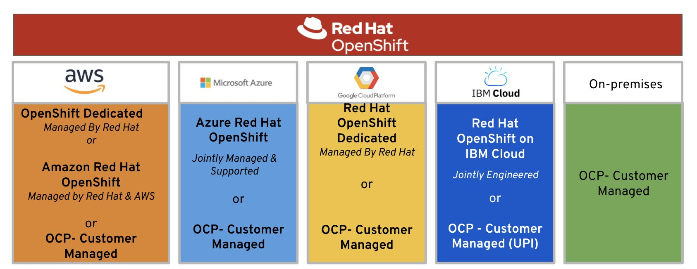
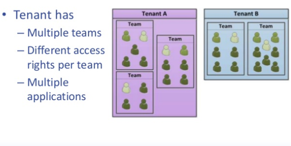
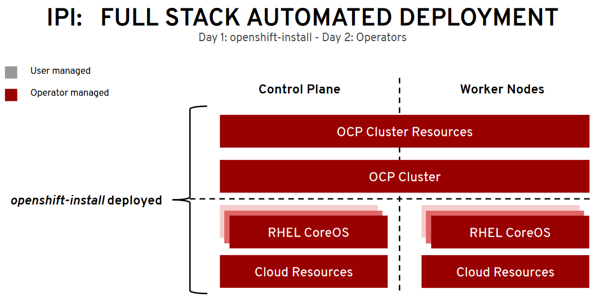
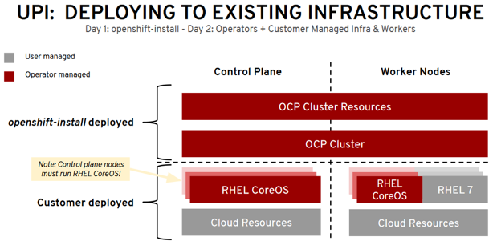
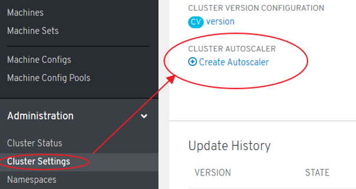
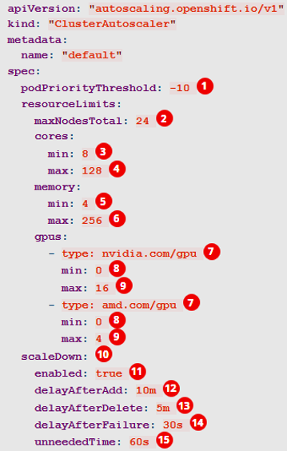
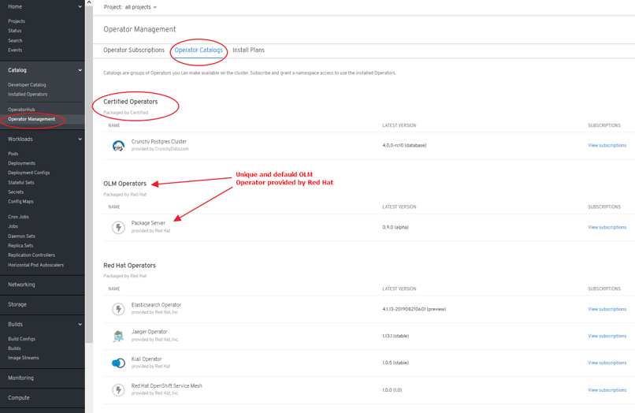
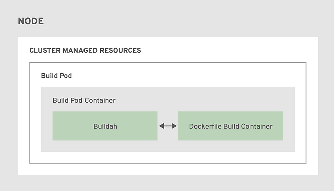
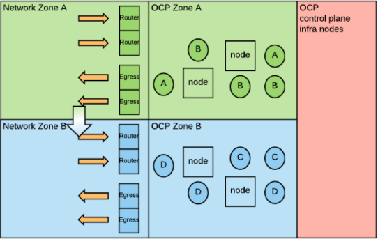

# OpenShift Container Platform
- [OpenShift](#openshift)
- [Red Hat's approach to Kubernetes. Standardization](#red-hats-approach-to-kubernetes-standardization)
- [OpenShift Container Platform 3 (OCP 3)](#openshift-container-platform-3-ocp-3)
    - [OpenShift Cheat Sheets](#openshift-cheat-sheets)
    - [Helm Charts and OpenShift 3](#helm-charts-and-openshift-3)
    - [Chaos Monkey for kubernetes/Openshift](#chaos-monkey-for-kubernetesopenshift)
    - [OpenShift GitOps](#openshift-gitops)
    - [Debugging apps](#debugging-apps)
    - [Capacity Management](#capacity-management)
    - [OpenShift High Availability](#openshift-high-availability)
    - [Troubleshooting Java applications on Openshift](#troubleshooting-java-applications-on-openshift)
    - [Red Hat Communities of Practice. Uncontained.io Project](#red-hat-communities-of-practice-uncontainedio-project)
    - [Identity Management](#identity-management)
    - [Quota Management](#quota-management)
- [OpenShift Container Platform 4 (OCP 4)](#openshift-container-platform-4-ocp-4)
    - [OCP 4 Overview](#ocp-4-overview)
        - [Three New Functionalities](#three-new-functionalities)
        - [New Technical Components](#new-technical-components)
        - [Installation & Cluster Autoscaler](#installation--cluster-autoscaler)
            - [IPI & UPI](#ipi--upi)
        - [Cluster Autoscaler Operator](#cluster-autoscaler-operator)
        - [Operators](#operators)
            - [Introduction](#introduction)
            - [Catalog](#catalog)
            - [Certified Opeators, OLM Operators and Red Hat Operators](#certified-opeators-olm-operators-and-red-hat-operators)
            - [OpenShift Container Storage Operator (OCS)](#openshift-container-storage-operator-ocs)
                - [OCS 3 (OpenShift 3)](#ocs-3-openshift-3)
                - [OCS 4 (OpenShift 4)](#ocs-4-openshift-4)
            - [Cluster Network Operator (CNO) & Routers](#cluster-network-operator-cno--routers)
            - [ServiceMesh Operator](#servicemesh-operator)
            - [Serverless Operator (Knative)](#serverless-operator-knative)
            - [Monitoring & Observability](#monitoring--observability)
                - [Grafana](#grafana)
                - [Prometheus](#prometheus)
                - [Alerts & Silences](#alerts--silences)
                - [Cluster Logging (EFK)](#cluster-logging-efk)
            - [Build Images. Next-Generation Container Image Building Tools](#build-images-next-generation-container-image-building-tools)
            - [Registry & Quay](#registry--quay)
            - [Local Development Environment](#local-development-environment)
    - [OpenShift Youtube](#openshift-youtube)
    - [OpenShift 4 Training](#openshift-4-training)
    - [OpenShift 4 roadmap](#openshift-4-roadmap)
    - [Kubevirt Virtual Machine Management on Kubernetes](#kubevirt-virtual-machine-management-on-kubernetes)
    - [Storage in OCP 4. OpenShift Container Storage (OCS)](#storage-in-ocp-4-openshift-container-storage-ocs)
    - [Red Hat Advanced Cluster Management for Kubernetes](#red-hat-advanced-cluster-management-for-kubernetes)
    - [OpenShift Kubernetes Engine (OKE)](#openshift-kubernetes-engine-oke)
    - [Red Hat CodeReady Containers. OpenShift 4 on your laptop](#red-hat-codeready-containers-openshift-4-on-your-laptop)
    - [OpenShift Hive: Cluster-as-a-Service. Easily provision new PaaS environments for developers](#openshift-hive-cluster-as-a-service-easily-provision-new-paas-environments-for-developers)
    - [OpenShift 4 Master API Protection in Public Cloud](#openshift-4-master-api-protection-in-public-cloud)
    - [Backup and Migrate to OpenShift 4](#backup-and-migrate-to-openshift-4)
    - [OKD4. OpenShift 4 without enterprise-level support](#okd4-openshift-4-without-enterprise-level-support)
    - [OpenShift Serverless with Knative](#openshift-serverless-with-knative)
    - [Helm Charts and OpenShift 4](#helm-charts-and-openshift-4)
    - [Red Hat Marketplace](#red-hat-marketplace)
    - [Kubestone. Benchmarking Operator for K8s and OpenShift](#kubestone-benchmarking-operator-for-k8s-and-openshift)
    - [OpenShift Cost Management](#openshift-cost-management)
    - [Operators in OCP 4](#operators-in-ocp-4)
    - [Quay Container Registry](#quay-container-registry)
- [OpenShift.io online IDE](#openshiftio-online-ide)
- [Cluster Autoscaler in OpenShift](#cluster-autoscaler-in-openshift)
- [e-Books](#e-books)
    - [Kubernetes e-Books](#kubernetes-e-books)
- [Online Learning](#online-learning)
- [Local Installers](#local-installers)
- [Cluster Installers](#cluster-installers)
    - [OKD 3](#okd-3)
    - [OpenShift 3](#openshift-3)
    - [OpenShift 4](#openshift-4)
        - [OpenShift 4 deployment on vSphere](#openshift-4-deployment-on-vsphere)
- [Networking (OCP 3 and OCP 4)](#networking-ocp-3-and-ocp-4)
- [Security](#security)
    - [How is OpenShift Container Platform Secured?](#how-is-openshift-container-platform-secured)
    - [Security Context Constraints](#security-context-constraints)
        - [Review Security Context Constraints](#review-security-context-constraints)
    - [OpenShift Network Model & Network Policy](#openshift-network-model--network-policy)
        - [Network Security Zones](#network-security-zones)
- [Openshift Compliant Docker Images](#openshift-compliant-docker-images)
    - [Gitlab](#gitlab)
    - [Atlassian Confluence6](#atlassian-confluence6)
    - [Sonatype Nexus 3](#sonatype-nexus-3)
    - [Rocket Chat](#rocket-chat)
- [OpenShift on AWS](#openshift-on-aws)
- [Other Awesome Lists](#other-awesome-lists)
- [Videos](#videos)
- [Slides](#slides)

## OpenShift  
* [Wikipedia.org: OpenShift](https://en.wikipedia.org/wiki/OpenShift)
* [OpenShift.com](https://www.openshift.com/)
* [OpenShift blog 🌟](https://www.openshift.com/blog)
* [docs.openshift.com 🌟](https://docs.openshift.com/)
* [developers.redhat.com 🌟](https://developers.redhat.com/)
* [github.com/openshift/origin 🌟](https://github.com/openshift/origin) Images for OpenShift 3 and 4 - see openshift/okd for more 
* [try.openshift.com 🌟](https://try.openshift.com/) Create an OCP (OpenShift Container Platform) Cluster or OSD (OpenShift Dedicated) Cluster.
* [okd.io](https://www.okd.io/) The Community Distribution of Kubernetes that powers Red Hat OpenShift.
* [OpenShift Commons](https://commons.openshift.org/) Where users, partners, customers, and contributors come together to collaborate and work together on OpenShift. Commons builds connections and collaboration across OpenShift communities, projects and stakeholders.
* [twitter.com/openshift](https://twitter.com/openshift) 
* [OpenShift in DockerHub](https://hub.docker.com/u/openshift/)
* [reddit.com/r/openshift](https://www.reddit.com/r/openshift)
* [reddit.com/r/redhat](https://www.reddit.com/r/redhat)

## Red Hat's approach to Kubernetes. Standardization
* [Red Hat's approach to Kubernetes 🌟](https://www.redhat.com/en/topics/containers/kubernetes-approach)

Reference | Author | URL
:---------|:-------------|:-------------
"Given the difficulty of navigating the cloud-native ecosystem, especially the one around Kubernetes, **there is a high demand for easy-to-administer development platforms** that deliver applications in Kubernetes-managed containers."| OMDIA|[Red Hat's approach to Kubernetes](https://www.redhat.com/en/topics/containers/kubernetes-approach)
Industry momentum has aligned behind Kubernetes as the orchestration platform for Linux® containers. Choosing Kubernetes means you’ll be running the de facto standard regardless of which cloud environments and providers are in your future.|CNCF Survey 2019|[Red Hat's approach to Kubernetes](https://www.redhat.com/en/topics/containers/kubernetes-approach)
“It's not just enough to do Kubernetes. **You do need to do CI/CD.** You need to use alerting. You need to understand how the security model of the cloud and your applications interplay.”|Clayton Coleman,Senior Distinguished Engineer, Red Hat|[Red Hat's approach to Kubernetes](https://www.redhat.com/en/topics/containers/kubernetes-approach)
“Kubernetes is scalable. It helps develop applications faster. It does hybrid and multicloud. These are not just technology buzzwords, they're real, legitimate business problems.”|Brian Gracely,Director, Product Strategy, Red Hat OpenShift|[Red Hat's approach to Kubernetes](https://www.redhat.com/en/topics/containers/kubernetes-approach)
“Our job is to **make it easier and easier to use**, either from an ops point of view or a developer point of view—while acknowledging it is complex, because we're solving a complex problem.”|Chris Wright,Chief Technology Officer, Red Hat|[Red Hat's approach to Kubernetes](https://www.redhat.com/en/topics/containers/kubernetes-approach)

<center>
[](https://www.zdnet.com/article/amazon-red-hat-openshift-announced-for-public-cloud-kubernetes-users/)
</center>
  
## OpenShift Container Platform 3 (OCP 3)
* [Dzone.com: OpenShift Quick Start 🌟](https://dzone.com/articles/openshift-quick-start)
* [claydesk.com: Google Cloud App Engine Vs Red Hat OpenShift](https://www.claydesk.com/ecampus/google-cloud-app-engine-vs-red-hat/)
* [certdepot.net: OpenShift Free available resources 🌟](https://www.certdepot.net/openshift-free-available-resources/)
* [blog.openshift.com: Using OpenShift 3 on your **local environment** 🌟](https://blog.openshift.com/using-openshift-3-on-your-local-environment/)
* [developers.redhat.com: Securing .NET Core on OpenShift using HTTPS](https://developers.redhat.com/blog/2018/10/12/securing-net-core-on-openshift-using-https/)
* [blog.openshift.com - Kubernetes: A Pod’s Life 🌟](https://blog.openshift.com/kubernetes-pods-life/)
* [Container-native virtualization allows to run and manage virtual machine workloads alongside container workloads](https://access.redhat.com/documentation/en-us/openshift_container_platform/4.2/html/container-native_virtualization/container-native-virtualization-2-1-release-notes)
* [developers.redhat.com: Handling Angular environments in continuous delivery with Red Hat OpenShift](https://developers.redhat.com/blog/2019/11/27/handling-angular-environments-in-continuous-delivery-with-red-hat-openshift/)
* [developers.redhat.com: Customizing OpenShift project creation 🌟](https://developers.redhat.com/blog/2020/02/05/customizing-openshift-project-creation/)
* [developers.redhat.com: Testing memory-based horizontal pod autoscaling on OpenShift 🌟](https://developers.redhat.com/blog/2020/03/19/testing-memory-based-horizontal-pod-autoscaling-on-openshift/)
- [How to Run HA Elasticsearch (ELK) on Red Hat OpenShift](https://portworx.com/run-ha-elasticsearch-elk-red-hat-openshift/)

### OpenShift Cheat Sheets
* [OpenShift Cheat Sheets](cheatsheets.md)
  
### Helm Charts and OpenShift 3
* [blog.openshift.com: From Templates to Openshift Helm Charts](https://blog.openshift.com/from-templates-to-openshift-helm-charts/)
* [Templating on OpenShift: should I use Helm templates or OpenShift templates? 🌟](https://www.padok.fr/en/blog/templating-openshift-helm-templates)

### Chaos Monkey for kubernetes/Openshift
* [reddit: Help with Kube Monkey setup](https://www.reddit.com/r/openshift/comments/e1j5qzrbac_for_container_access_to_destroy_other/)
* [GitHub: kube-monkey](https://github.com/asobti/kube-monkey)
* [GitHub: monkey-ops, Openshift compliant, no cluster-admin required](https://github.comjoshmsmith/monkey-ops)
* [chaoskube periodically kills random pods in your Kubernetes cluster](https://github.com/linkichaoskube)
* [Chaos Mesh](https://github.com/pingcap/chaos-mesh)

### OpenShift GitOps
* [blog.openshift.com: Introduction to GitOps with OpenShift](https://blog.openshift.comintroduction-to-gitops-with-openshift/)
* [learn.openshift.com: GitOps introduction](https://learn.openshift.com/introduction/gitops-introduction/ )
* [blog.openshift.com: is it too late to integrate GitOps?](https://blog.openshift.comis-it-too-late-to-integrate-gitops/)
* [blog.openshift.com: OpenShift Authentication Integration with **ArgoCD**](https://blogopenshift.com/openshift-authentication-integration-with-argocd/)
* [openshift.com: From Code to Production with GitOps, Tekton and ArgoCD 🌟](https://www.openshift.com/blog/from-code-to-production-with-gitops)

### Debugging apps
* [developers.redhat.com: Installing debugging tools into a Red Hat OpenShift container with **oc-inject**](https://developers.redhat.com/blog/2020/01/15installing-debugging-tools-into-a-red-hat-openshift-container-with-oc-inject/)
* [developers.redhat.com: **Debugging applications** within Red Hat OpenShift containers](https:/developers.redhat.com/blog/2020/01/09debugging-applications-within-red-hat-openshift-containers/)

### Capacity Management
* [blog.openshift.com/full-cluster-capacity-management-monitoring-openshift](https://blogopenshift.com/full-cluster-capacity-management-monitoring-openshift/)
* [blog.openshift.com/full-cluster-part-2-protecting-nodes](https://blog.openshift.comfull-cluster-part-2-protecting-nodes/)
* [full-cluster-part-3-capacity-management](https://blog.openshift.comfull-cluster-part-3-capacity-management/)
* [blog.openshift.comhow-full-is-my-cluster-part-4-right-sizing-pods-with-vertical-pod-autoscaler](https://blogopenshift.com/how-full-is-my-cluster-part-4-right-sizing-pods-with-vertical-pod-autoscaler/)
* [blog.openshift.com/how-full-is-my-cluster-part-5-a-capacity-management-dashboard](https:/blog.openshift.com/how-full-is-my-cluster-part-5-a-capacity-management-dashboard/)

### OpenShift High Availability
* [blog.openshift.com/tag/multi-datacenter](https://blog.openshift.com/tag/multi-datacenter/)
* [blog.openshift.com: How to survive an outage and live to tell about it!](https://www.openshift.com/blog/metro-area-openshift-stretch-cluster-how-to-survive-an-outage-and-live-to-tell-about-it)
* [blog.openshift.com: Stateful Workloads and the Two Data Center Conundrum](https://www.openshift.com/blog/stateful-workloads-and-the-two-data-center-conundrum)
* [OpenShift 3.11 Multi-cluster Federation](https://blog.openshift.comkubernetes-federation-v2-on-openshift-3-11/)
* [Multi-cluster Federation in OpenShift 4 is called **KubeFed**](https://blog.openshift.comfederation-v2-is-now-kubefed/)
* [Katacoda e-learning platform – Federated Clusters](https://www.katacoda.com/openshift/coursesintroduction/federated-clusters)
* [**KubeFed Operator**](https://operatorhub.io/operator/kubefed-operator)

### Troubleshooting Java applications on Openshift
* [developers.redhat.com: Troubleshooting java applications on openshift](https://developers.redhat.com/blog/2017/08/16/troubleshooting-java-applications-on-openshift/)
* [dzone: 8 Options for Capturing Thread Dumps](https://dzone.com/articles/how-to-take-thread-dumps-7-options)

### Red Hat Communities of Practice. Uncontained.io Project
* [Red Hat Communities of Practice](https://github.com/redhat-cop)
    * [OpenShift Toolkit 🌟](https://github.com/redhat-cop/openshift-toolkit/)
    * [OpenShift Playbooks](https://github.com/redhat-cop/openshift-playbooks)
* [**Uncontained.io**](http://uncontained.io/) began as a project in the Red Hat Container Community of Practice to share knowledge about OpenShift adoption with members of Red Hat’s Consulting organization.
    * [uncontained.io/articles/openshift-ha-installation](http://uncontained.io/articles/openshift-ha-installation/ )
    * [uncontained.io/articles/openshift-and-the-org](http://uncontained.io/articles/openshift-and-the-org/) 
    * [**v1.uncontained.io**: Red Hat Consulting DevOps And OpenShift Playbooks 🌟](http://v1.uncontained.io/) Red Hat Consulting DevOps and OpenShift Playbooks are guides for implementing DevOps technical practices and container automation approaches using Red Hat commercial open source products, including OpenShift Enterprise 3. They are intended to reflect real-world experience delivering solutions through these processes and technologies.

### Identity Management
* [GitHub redhat-cop: Ansible Role 🌟](https://github.com/redhat-cop/infra-ansible/tree/master/roles/identity-management )

### Quota Management
* [GitHub redhat-cop: OpenShift Toolkit - Quota Management 🌟](https://github.com/redhat-cop/openshift-toolkit/tree/master/quota-management)
* [OpenShift 4 Resource Management](https://www.youtube.com/watch?v=JC_PB1yZcIc)
* [techbeatly.com: How to create, increase or decrease project quota](https://www.techbeatly.com/2018/11/how-to-create-increase-or-decrease-project-quota-in-openshift.html/#.Xd5OE9WCGUk)
* [Quotas setting per project](https://docs.openshift.com/container-platform/4.2/applications/quotas/quotas-setting-per-project.html)
* [Quotas setting across multiple projects](https://docs.openshift.com/container-platform/4.2/applications/quotas/quotas-setting-across-multiple-projects.html)

## OpenShift Container Platform 4 (OCP 4)
* [blog.openshift.com: Introducing Red Hat OpenShift 4](https://blog.openshift.com/introducing-red-hat-openshift-4/)
* [nextplatform.com: red hat flexes CoreOS muscle in openshift kubernetes platform](https://www.nextplatform.com/2018/10/15/red-hat-flexes-coreos-muscle-in-openshift-kubernetes-platform/)
* [OpenShift 4 documentation 🌟](https://access.redhat.com/documentation/en-us/openshift_container_platform/)
* [Dzone: What’s in OpenShift 4?](https://dzone.com/articles/whats-in-openshift-4)
* [blog.openshift.com: OpenShift 4 Install Experience](https://blog.openshift.com/openshift-4-install-experience/)
* [operatorhub.io](https://operatorhub.io/) OperatorHub.io is a new home for the Kubernetes community to share Operators. Find an existing Operator or list your own today.
* [cloudowski.com: Honest review of OpenShift 4 🌟](https://cloudowski.com/articles/honest-review-of-openshift-4/)  
* [Enabling OpenShift 4 Clusters to Stop and Resume Cluster VMs](https://blog.openshift.com/enabling-openshift-4-clusters-to-stop-and-resume-cluster-vms/)
* [blog.openshift.com: Simplifying OpenShift Case Information Gathering Workflow: **Must-Gather Operator** (In the context of Red Hat OpenShift 4.x and Kubernetes, it is considered a bad practice to ssh into a node and perform debugging actions) 🌟](https://blog.openshift.com/simplifying-openshift-case-information-gathering-workflow-must-gather-operator/)
* [blog.openshift.com: Configure the OpenShift Image Registry backed by OpenShift Container Storage](https://blog.openshift.com/configure-the-openshift-image-registry-backed-by-openshift-container-storage/)
* [blog.openshift.com: OpenShift Scale: Running 500 Pods Per Node 🌟](https://blog.openshift.com/500_pods_per_node/)
* [blog.openshift.com: Enterprise Kubernetes with OpenShift (Part one) 🌟](https://www.openshift.com/blog/enterprise-kubernetes-with-openshift-part-one)

[](https://www.openshift.com/blog/enterprise-kubernetes-with-openshift-part-one)

### OCP 4 Overview
- Result of RedHat’s (now IBM) acquisition of CoreOS -> [RHCOS](https://docs.openshift.com/container-platform/4.4/architecture/architecture-rhcos.html) (Red Hat Enterprise Linux CoreOS)
- Merge of two leading Kubernetes distributions, Tectonic and OpenShift:
    - **CoreOS Tectonic**:
        - [Operator Framework](https://www.openshift.com/learn/topics/operators)
        - [quay.io](https://quay.io/) container build and registry service
        - Stable tiny Linux distribution with [ignition bootstrap](https://coreos.com/ignition/docs/latest/what-is-ignition.html) and transaction-based update engine.
    - **OpenShift**:
        - [Wide enterprise adoption](https://www.openshift.com/#success-stories-intro)
        - [Security](https://docs.openshift.com/container-platform/4.4/authentication/managing-security-context-constraints.html)
        - [Multi-tenancy features](https://www.slideshare.net/Smals_ICT/20171010-multitenancy-in-openshift) (self-service)
- OpenShift 4 is built on top of Kubernetes 1.13+ 
- [Roadmap](https://assets.openshift.com/hubfs/Commons-London-OpenShift-Container-Platform-4.3-Roadmap.pdf)
- [Release Notes](https://docs.openshift.com/container-platform/4.4/release_notes/ocp-4-4-release-notes.html)



#### Three New Functionalities
1. Self-Managing Platform
2. Application Lifecycle Management ([OLM](https://docs.openshift.com/container-platform/4.4/operators/understanding_olm/olm-understanding-olm.html)):
    - **OLM Operator**:
        - Responsible for deploying applications defined by [ClusterServiceVersion (CSV) manifest](https://docs.openshift.com/container-platform/4.4/operators/understanding_olm/olm-understanding-olm.html#olm-csv_olm-understanding-olm).
        - Not concerned with the creation of the required resources; users can choose to manually create these resources using the CLI, or  users can choose to create these resources using the Catalog Operator.
    - **Catalog Operator**:
        - Responsible for resolving and installing CSVs and the required resources they specify. It is also responsible for watching CatalogSources for updates to packages in channels and upgrading them (optionally automatically) to the latest available versions.
        - A user that wishes to track a package in a channel creates a **Subscription resource** configuring the desired **package, channel, and the CatalogSource** from which to pull updates. When updates are found, an appropriate **InstallPlan** is written into the namespace on behalf of the user.
3. Automated Infrastructure Management ([Over-The-Air Updates](https://access.redhat.com/documentation/en-us/openshift_container_platform/4.1/pdf/updating_clusters/OpenShift_Container_Platform-4.1-Updating_clusters-en-US.pdf))

||
:---:|:---:|:---:

#### New Technical Components
- **[New Installer](https://cloud.redhat.com/openshift/install):**
    - [try.openshift.com](https://try.openshift.com/)
    - [github.com/openshift/installer](https://github.com/openshift/installer)
- **Storage:** Cloud integrated storage capability used by default via [OCS Operator](https://github.com/openshift/ocs-operator) (Red Hat)
    - There are a number of persistent storage options available to you through the OperatorHub / Storage vendors that don’t involve Red Hat, NFS or Gluster.
    - Kubernetes-native persistent storage technologies available (non-RedHat solutions):
        - [Rook-Ceph](https://operatorhub.io/operator/rook-ceph): [Rook-Ceph storage Operator now on OperatorHub.io](https://www.redhat.com/en/blog/rook-ceph-storage-operator-now-operatorhubio)
        - [Robin Storage Operator](https://operatorhub.io/operator/robin-operator): [get.robin.io](https://get.robin.io/)
- **Operators End-To-End!:** responsible for reconciling the system to the desired state
    - Cluster configuration kept as API objects that ease its maintenance (“everything-as-code” approach):
        - Every component is configured with [Custom Resources (CR)](https://docs.openshift.com/container-platform/4.4/operators/crds/crd-managing-resources-from-crds.html) that are processed by operators. 
        - No more painful upgrades and synchronization among multiple nodes and no more configuration drift.
    - List of operators that configure cluster components (API objects):
        - API server
        - Nodes via Machine API
        - Ingress
        - Internal DNS
        - Logging (EFK) and Monitoring (Prometheus)
        - Sample applications
        - Networking
        - Internal Registry
        - Oauth (and authentication in general)
        - etc
- **At the Node Level:**
    - [RHEL CoreOS](https://docs.openshift.com/container-platform/4.4/architecture/architecture-rhcos.html) is the result of merging CoreOS Container Linux and RedHat Atomic host functionality and is currently the only supported OS to host OpenShift 4.
    - Node provisioning with [ignition](https://coreos.com/blog/introducing-ignition.html), which came with CoreOS Container Linux
    - Atomic host updates with [rpm-ostree](https://github.com/coreos/rpm-ostree)
    - [CRI-O](https://cri-o.io/) as a container runtime
    - [SELinux](https://www.slideshare.net/openshift/openshift-18812162) enabled by default
- [Machine API](https://github.com/openshift/machine-api-operator/tree/master): Provisioning of nodes. Abstraction mechanism added (API objects to declaratively manage the cluster):
    - Based on [Kubernetes Cluster API project](https://github.com/kubernetes-sigs/cluster-api)
    - Provides a new set of machine resources: 
        - Machine
        - Machine Deployment
        - MachineSet: 
            - distributes easily your nodes among different Availability Zones
            - manages multiple node pools (e.g. pool for testing, pool for machine learning with GPU attached, etc)
- **Everything “just another pod”**

#### Installation & Cluster Autoscaler
- New installer openshift-install tool, replacement for the old Ansible scripts.  
- 40 min (AWS). Terraform.
- 2 installation patterns:
    1. **Installer Provisioned Infrastructure (IPI)**
    2. **User Provisioned Infrastructure (UPI)**
- The whole process can be done in one command and requires minimal infrastructure knowledge (IPI): ```openshift-install create cluster```


##### IPI & UPI
- 2 installation patterns:
    1. **Installer Provisioned Infrastructure (IPI):** On supported platforms, the installer is capable of provisioning the underlying infrastructure for the cluster. The installer programmatically creates all portions of the networking, machines, and operating systems required to support the cluster. Think of it as best-practice reference architecture implemented in code.  It is recommended that most users make use of this functionality to avoid having to provision their own infrastructure.  The installer will create and destroy the infrastructure components it needs to be successful over the life of the cluster.
    2. **User Provisioned Infrastructure (UPI):** For other platforms or in scenarios where installer provisioned infrastructure would be incompatible, the installer can stop short of creating the infrastructure, and allow the platform administrator to provision their own using the cluster assets generated by the install tool. Once the infrastructure has been created, OpenShift 4 is installed, maintaining its ability to support automated operations and over-the-air platform updates.






#### Cluster Autoscaler Operator
- Adjusts the size of an OpenShift Container Platform cluster to meet its current deployment needs. It uses declarative, Kubernetes-style arguments
- Increases the size of the cluster when there are pods that failed to schedule on any of the current nodes due to insufficient resources or when another node is necessary to meet deployment needs. The ClusterAutoscaler does not increase the cluster resources beyond the limits that you specify.
- A huge improvement over the manual, error-prone process used in the previous version of OpenShift and RHEL nodes.

|
:----:|:----:

#### Operators
##### Introduction
- Core of the platform
- The hierarchy of operators, with clusterversion at the top, is the single door for configuration changes and is responsible for reconciling the system to the desired state.
- For example, if you break a critical cluster resource directly, the system automatically recovers itself. 
- Similarly to cluster maintenance, [operator framework](https://www.redhat.com/en/blog/introducing-operator-framework-building-apps-kubernetes) used for applications. As a user, you get SDK, [OLM](https://docs.openshift.com/container-platform/4.4/operators/understanding_olm/olm-understanding-olm.html) (Lifecycle Manager of all Operators and their associated services running across their clusters) and embedded [operator hub](https://www.redhat.com/en/blog/new-kubernetes-operatorhub-red-hat-openshift-enable-hybrid-cloud-flexibility-enterprises).
- [OLM Arquitecture](https://github.com/operator-framework/operator-lifecycle-manager/blob/master/doc/design/architecture.md)
- [Adding Operators to a Cluster](https://docs.openshift.com/container-platform/4.4/operators/olm-adding-operators-to-cluster.html) (They can be added via **CatalogSource**)
- The supported method of using **Helm charts** with Openshift is via the [Helm Operator](https://www.openshift.com/blog/build-kubernetes-operators-from-helm-charts-in-5-steps)
- [twitter.com/operatorhubio](https://twitter.com/operatorhubio)
- View the list of Operators available to the cluster from the OperatorHub:

```bash
$ oc get packagemanifests -n openshift-marketplace 
NAME AGE 
amq-streams 14h 
packageserver 15h 
couchbase-enterprise 14h 
mongodb-enterprise 14h 
etcd 14h myoperator 14h 
...
```


##### Catalog
- Developer Catalog
- Installed Operators
- OperatorHub (OLM)
- Operator Management:
    - **Operator Catalogs** are groups of Operators you can make available on the cluster. They can be added via **CatalogSource** (i.e. “catalogsource.yaml”). Subscribe and grant a namespace access to use the installed Operators. 
    - **Operator Subscriptions** keep your services up to date by tracking a channel in a package. The approval strategy determines either manual or automatic updates.


##### Certified Opeators, OLM Operators and Red Hat Operators
- **Certified Operators** packaged by Certified:
    - Not provided by Red Hat 
    - Supported by Red Hat
    - Deployed via “Package Server” OLM Operator
- **OLM Operators**:
    - Packaged by Red Hat  
    - **“Package Server”** OLM Operator includes a CatalogSource provided by Red Hat
- **Red Hat Operators**:
    - Packaged by Red Hat  
    - Deployed via “Package Server” OLM Operator
- **Community Edition Operators**:
    - Deployed by any means
    - **Not supported** by Red Hat



##### OpenShift Container Storage Operator (OCS)
###### OCS 3 (OpenShift 3)
- OpenShift Container Storage based on [GlusterFS](https://www.gluster.org/) technology.
- Not OpenShift 4 compliant: Migration tooling will be available to facilitate the move to OCS 4.x (OpenShift Gluster APP Mitration Tool).

###### OCS 4 (OpenShift 4)
- **OCS Operator** based on Rook.io with Operator LifeCycle Manager (OLM).
- Tech Stack:
    - [Rook](https://rook.io) (don't confuse this with non-redhat ["Rook Ceph"](https://operatorhub.io/operator/rook-ceph) -> [RH ref](https://www.redhat.com/en/blog/rook-ceph-storage-operator-now-operatorhubio)).
        - Replaces [Heketi](https://github.com/heketi/heketi)  (OpenShift 3)
        - Uses **Red Hat Ceph Storage** and **Noobaa**.
    - [Red Hat Ceph Storage](https://ceph.io)
    - [Noobaa](https://www.noobaa.io):
        - Red Hat Multi Cloud Gateway (AWS, Azure, GCP, etc)
        - Asynchronous replication of data between my local ceph and my cloud provider
        - Deduplication
        - Compression
        - Encryption
- Backups available in OpenShift 4.2+ (Snapshots + Restore of Volumes)
- OCS Dashboard in OCS Operator


##### Cluster Network Operator (CNO) & Routers
- Cluster Network Operator (CNO): The cluster network is now configured and managed by an Operator. The Operator upgrades and monitors the cluster network.
- [Router plug-ins in OCP3:](https://docs.openshift.com/container-platform/3.11/install_config/router/index.html)
    - A « route » is the external entrypoint to a [Kubernetes Service](https://kubernetes.io/docs/concepts/services-networking/service/). This is one of the biggest differences between [Kubernetes](https://kubernetes.io/) and [OpenShift Enterprise (= OCP)](https://www.openshift.com/) and [origin](https://www.okd.io/). 
    - OpenShift router has the endpoints as targets and therefore the pod of the application.
    - [Shared/Stikcy sessions are enabled by default](https://dzone.com/articles/session-stickiness-in-openshift)
    - [HAProxy template router](https://docs.openshift.com/container-platform/3.11/architecture/networking/assembly_available_router_plugins.html#architecture-haproxy-router) (default router): HTTP(s) & TLS-enabled traffic via SIN.
        - [dzone.com/articles/updating-haproxy-configurations-openshift](https://dzone.com/articles/updating-haproxy-configurations-openshift)
        - [dzone.com/articles/openshift-egress-options](https://dzone.com/articles/openshift-egress-options) 
    - F5 BIG-IP Router plug-in integrates with an existing F5 BIG-IP system in your environment
    - Since the 9th May 2018, [NGINX](https://www.openshift.com/blog/introducing-nginx-and-nginx-plus-routers-for-openshift) is also available as « router ».
- Routers in OCP4: 
    - [Ingress Controller](https://kubernetes.io/docs/concepts/services-networking/ingress-controllers/) is the most common way to allow external access to an OpenShift Container Platform cluster
    - [Configuring Ingress Operator in OCP4](https://docs.openshift.com/container-platform/4.4/networking/ingress-operator.html)
    - Limited to HTTP, HTTPS using SNI, and TLS using SNI (sufficient for web applications and services)
    - Has two replicas by default, which means it should be running on two worker nodes.
    - Can be scaled up to have more replicas on more nodes.
    - The Ingress Operator implements the ingresscontroller API and is the component responsible for enabling external access to OpenShift Container Platform cluster services. 
    - The operator makes this possible by deploying and managing one or more HAProxy-based [Ingress Controllers](https://kubernetes.io/docs/concepts/services-networking/ingress-controllers/) to handle routing.
- [Network Security Zones in Openshift (DMZ)](https://blog.openshift.com/openshift-and-network-security-zones-coexistence-approaches/)

```bash
oc describe clusteroperators/ingress
oc logs --namespace=openshift-ingress-operator deployments/ingress-operator
```

##### ServiceMesh Operator 
- ServiceMesh: [Istio](https://istio.io/) + [kiali](https://kiali.io/) + [Jaeger](https://www.jaegertracing.io/)
- ServiceMesh Community Edition: [github.com/maistra/istio](https://github.com/maistra/istio)
    - Red Hat community installer compliant with OCP 4.1: [maistra.io/docs/getting_started/install](https://maistra.io/docs/getting_started/install)
    - Outcome: publicly known errors in 2 or 3 components.
- **Certified ServiceMesh Operator**
    -  [ServiceMesh](https://access.redhat.com/documentation/en-us/openshift_container_platform/4.4/html-single/service_mesh/index) GA in September 2019 (available in OperatorHub):
        - [blog.openshift.com/red-hat-openshift-service-mesh-is-now-available-what-you-should-know/](https://blog.openshift.com/red-hat-openshift-service-mesh-is-now-available-what-you-should-know/) 
    - Certified & Packaged by Red Hat
    - [“One-click” deployment](https://docs.openshift.com/container-platform/4.4/service_mesh/service_mesh_install/installing-ossm.html)
    - [Preparing to install Red Hat OpenShift Service Mesh](https://docs.openshift.com/container-platform/4.4/service_mesh/service_mesh_install/preparing-ossm-installation.html). To install the Red Hat OpenShift Service Mesh Operator, you must first install these Operators:
        - Elasticsearch
        - Jaeger
        - Kiali
    - Do not install Community versions of the Operators. Community Operators are not supported.

||
:----:|:----:|:----:


##### Serverless Operator (Knative) 
- Operator install on OperatorHub.io
- Knative Eventing (Camel-K, Kafka, Cron, etc)
- Integration with Openshift ServiceMesh, Logging, Monitoring.
- [openshift.com/learn/topics/serverless](https://www.openshift.com/learn/topics/serverless)
- [redhat-developer-demos.github.io/knative-tutorial](https://redhat-developer-demos.github.io/knative-tutorial)  

##### Monitoring & Observability
###### Grafana
- Integrated Grafana v5.4.3 (deployed by default): 
- Monitoring -> Dashboards
- Project “openshift-monitoring”
- https://grafana.com/docs/v5.4/ 

###### Prometheus
- Integrated Prometheus v2.7.2 (deployed by default): 
- Monitoring -> metrics
- Project “openshift-monitoring”
- https://prometheus.io/docs/prometheus/2.7/getting_started/ 

###### Alerts & Silences
- Integrated Alertmanager 0.16.2 (deployed by default):
    - Monitoring -> Alerts
    - Monitoring -> Silences 
    - Silences temporarily mute alerts based on a set of conditions that you define. Notifications are not sent for alerts that meet the given conditions.
- Project “openshift-monitoring”
- https://prometheus.io/docs/alerting/alertmanager/

###### Cluster Logging (EFK)
- EFK: Elasticsearch + Fluentd + Kibana
- Cluster Logging EFK **not deployed by default**
- As an OpenShift Container Platform cluster administrator, you can deploy cluster logging to aggregate logs for a range of OpenShift Container Platform services.
- The OpenShift Container Platform cluster logging solution requires that you **install both the Cluster Logging Operator and Elasticsearch Operator**. There is no use case in OpenShift Container Platform for installing the operators individually. You must **install the Elasticsearch Operator using the CLI** following the directions below. You can **install the Cluster Logging Operator using the web console or CLI.**
Deployment procedure based on CLI + web console: 
    - [docs.openshift.com/container-platform/4.4/logging/cluster-logging-deploying.html](https://docs.openshift.com/container-platform/4.4/logging/cluster-logging-deploying.html) 
    - **Elasticsearch Operator** must be installed in Project **“openshift-operators-redhat”**
    - **Cluster Logging Operator** must be deployed in Project **“openshift-logging”**
    - **CatalogSourceConfig** added to enable Elasticsearch Operator on the cluster
    - etc.

OCP Release|Elasticsearch|Fluentd|Kibana|EFK deployed by default
:--|:--|:--|:--|:--
OpenShift 3.11| 5.6.13.6|0.12.43|5.6.13|No
OpenShift 4.1|5.6.16|?|5.6.16|No

##### Build Images. Next-Generation Container Image Building Tools
- Redesign of how images are built on the platform.
- Instead of relying on a daemon on the host to manage containers, image creation, and image pushing, we are leveraging [Buildah](https://buildah.io/) running inside our build pods.
- This aligns with the general OpenShift 4 theme of making everything “just another pod”
- A simplified set of build workflows, not dependent on the node host having a specific container runtime available. 
- Dockerfiles that built under OpenShift 3.x will continue to build under OpenShift 4.x and S2I builds will continue to function as well.
- The actual BuildConfig API is unchanged, so a BuildConfig from a v3.x cluster can be imported into a v4.x cluster and work without modification.
- [Podman & Buildah for docker users](https://developers.redhat.com/blog/2019/02/21/podman-and-buildah-for-docker-users/)
- [Openshift ImageStreams](https://cloudowski.com/articles/why-managing-container-images-on-openshift-is-better-than-on-kubernetes/)
- [Openshift 4 image builds](https://www.openshift.com/blog/openshift-4-image-builds)
- [Custom image builds with Buildah](https://docs.openshift.com/container-platform/4.4/builds/custom-builds-buildah.html)
- [Rootless podman and NFS](https://www.redhat.com/sysadmin/rootless-podman-nfs)



##### Registry & Quay
- A Docker registry is a place to store and distribute Docker images.
- It serves as a target for your docker push and docker pull commands.
- [Openshift ImageStreams](https://cloudowski.com/articles/why-managing-container-images-on-openshift-is-better-than-on-kubernetes/)
- The registry is now managed by an Operator instead of ```oc adm``` registry.
- [Quay.io](https://quay.io/) is a hosted Docker registry from CoreOS:
    - Main features:
        - “Powerful build triggers” 
        - “Advanced team permissions”
        - “Secure storage”
    - One of the more enterprise-friendly options out there, offering fine-grained permission controls.
    - They support any git server and let you build advanced workflows by doing things like mapping git branches to Docker tags so that when you commit code it automatically builds a corresponding image.
    - Quay offers unlimited free public repositories. Otherwise, you pay by the number of private repositories. There’s no extra charge for storage or bandwidth.
- [Quay 3.0 released in May 2019](https://www.redhat.com/en/blog/introducing-red-hat-quay-3-registry-your-linux-and-windows-containers): support for multiple architectures, Windows containers, and a [Red Hat Enterprise Linux (RHEL)](https://www.redhat.com/en/technologies/linux-platforms/enterprise-linux)-based image to this container image registry.
- [Quay 3.1 released in September 2019](https://www.redhat.com/en/blog/red-hat-quay-31-now-even-better-across-distributed-environments): The newest Quay feature is repository mirroring, which complements our existing geographic replication features. Repository mirroring reflects content between distinct, different registries. With this, you can synchronize whitelisted repositories or a source registry subset into Quay. This makes it much easier to distribute images and related data through Quay. 
- [Quay Community Edition operator](https://github.com/redhat-cop/quay-operator)
- [Quay 3.1 Certified Operator is not available in Openshift and must be purchased](https://www.openshift.com/products/quay)
- Open Source [ProjectQuay.io](https://www.projectquay.io/) Container Registry: 
    - [Red Hat Introduces open source Project Quay container registry](https://www.redhat.com/en/blog/red-hat-introduces-open-source-project-quay-container-registry) 
    - [github.com/quay](https://github.com/quay]

##### Local Development Environment
- For version 3 we have [Container Development Kit](https://developers.redhat.com/products/cdk/overview) (or its open source equivalent for OKD - [minishift](https://github.com/minishift/minishift/releases)) which launches a single node VM with Openshift and it does it in a few minutes. It’s perfect for testing also as a part of CI/CD pipeline.
- Openshift 4 on your laptop: There is a working solution for single node OpenShift cluster. It is provided by a new project called [CodeReady Containers](https://github.com/code-ready/crc/).
- [Procedure:](https://developers.redhat.com/blog/2019/09/05/red-hat-openshift-4-on-your-laptop-introducing-red-hat-codeready-containers/)

```bash
untar
crc setup
crc start
environment variables
oc login
```

- [Red Hat OpenShift 4.2 on your laptop: Introducing Red Hat CodeReady Containers](https://developers.redhat.com/blog/2019/09/05/red-hat-openshift-4-on-your-laptop-introducing-red-hat-codeready-containers/)


### OpenShift Youtube
* [OpenShift Youtube](https://www.youtube.com/user/rhopenshift/videos)
* [youtube: Installing OpenShift 4 on AWS with operatorhub.io integration 🌟](https://www.youtube.com/watch?v=kQJxGtsqphk)
* [youtube: OpenShift 4 OAuth Identity Providers](https://www.youtube.com/watch?v=eFxFtUpAT9s)
* [youtube: OpenShift on Google Cloud, AWS, Azure and localhost](https://www.youtube.com/watch?v=G-baPg3XhBo)
* [youtube: Getting Started with OpenShift 4 Security 🌟](https://www.redhat.com/en/about/videos/getting-started-openshift-4-security)
* [youtube playlist: London 2020 | OpenShift Commons Gathering 🌟](https://www.youtube.com/playlist?list=PLaR6Rq6Z4Iqcy9rg0JF6SCFst5lyyftQ-) OCP4 Updates & Roadmaps, Customer Stories, OpenShift Hive (case study), Operator Ecosystem. 

### OpenShift 4 Training
* [github.com: Openshift 4 training](https://github.com/openshift/training)
* [learn.openshift.com](https://learn.openshift.com/)
* [learn.crunchydata.com](https://learn.crunchydata.com/)

### OpenShift 4 roadmap
* [blog.openshift.com: OpenShift 4 Roadmap (slides) - this link may change](https://assets.openshift.com/hubfs/Commons-London-OpenShift-Container-Platform-4.3-Roadmap.pdf)
* [blog.openshift.com: OpenShift Container Storage (OCS 3 & 4 slides) - this link is now broken](https://blog.openshift.com/wp-content/uploads/OPENSHIFT-CONTAINER-STORAGE.pdf)
* [blog.openshift.com: OpenShift 4 Roadmap Update (slides) - this link is now broken](https://blog.openshift.com/wp-content/uploads/OpenShift-4-Roadmap-Update-William-Markito-and-Chris-Blum.pdf)

### Kubevirt Virtual Machine Management on Kubernetes
* [kubevirt.io 🌟](https://kubevirt.io/) 
* [Getting Started with KubeVirt Containers and Virtual Machines Together](https://blog.openshift.com/getting-started-with-kubevirt/)

### Storage in OCP 4. OpenShift Container Storage (OCS)
- [Red Hat OpenShift Container Storage 4](https://www.openshift.com/products/container-storage/)
- [State of OpenShift Container Storage](https://www.openshift.com/blog/state-of-openshift-container-storage-eran-tamir-and-duncan-hardie-red-hat)
  
### Red Hat Advanced Cluster Management for Kubernetes
- [Red Hat Advanced Cluster Management for Kubernetes 🌟](https://www.redhat.com/en/technologies/management/advanced-cluster-management)

### OpenShift Kubernetes Engine (OKE)
* [Similarities and differences between OpenShift Kubernetes Engine and OpenShift Container Platform](https://docs.openshift.com/container-platform/4.4/welcome/oke_about.html)

[](https://docs.openshift.com/container-platform/4.4/welcome/oke_about.html)

### Red Hat CodeReady Containers. OpenShift 4 on your laptop
* [developers.redhat.com: Developing applications on Kubernetes 🌟](https://developers.redhat.com/topics/kubernetes/)
* [Red Hat OpenShift 4.2 on your laptop: Introducing **Red Hat CodeReady Containers**](https://developers.redhat.com/blog/2019/09/05/red-hat-openshift-4-on-your-laptop-introducing-red-hat-codeready-containers/)
* [dzone: Code Ready Containers - Decision Management Developer Tools Update](https://dzone.com/articles/code-ready-containers-decision-management-develope)
* [Overview: running crc on a remote server](https://gist.github.com/tmckayus/8e843f90c44ac841d0673434c7de0c6a)
* [dzone: Code Ready Containers: Installing Process Automation](https://dzone.com/articles/code-ready-containers-installing-process-automatio) Learn how to make better use of Red Hat's Code Ready Containers platform by installing process automation from a catalog.

### OpenShift Hive: Cluster-as-a-Service. Easily provision new PaaS environments for developers
* **OpenShift Hive** is an operator which enables operations teams to easily provision new PaaSenvironments for developers improving productivity and reducing process burden due to internalIT regulations.
* [blog.openshift.com: openshift hive cluster as a service](https://blog.openshift.comopenshift-hive-cluster-as-a-service/)
* [youtube: how to deliver OpenShift as a service (just like Red Hat)](https://www.youtube.comwatch?v=b_NOrGxfH5Y)

### OpenShift 4 Master API Protection in Public Cloud
* [blog.openshift.com: Introducing Red Hat OpenShift 4.3 to Enhance Kubernetes Security 🌟](https://blog.openshift.com/introducing-red-hat-openshift-4-3-to-enhance-kubernetes-security/) OpenShift 4.3 adds new capabilities and platforms to the installer, helping customers to embrace their company’s best security practices and gain greater access control across hybrid cloud environments. Customers can deploy OpenShift clusters to customer-managed, pre-existing VPN / VPC (Virtual Private Network / Virtual Private Cloud) and subnets on AWS, Microsoft Azure and Google Cloud Platform. They can also install OpenShift clusters with private facing load balancer endpoints, not publicly accessible from the Internet, on AWS, Azure and GCP.
* [containerjournal.com: Red Hat Delivers Latest Kubernetes Enhancements](https://containerjournal.com/topics/container-management/red-hat-delivers-latest-kubernetes-enhancements/)
* [Create an OpenShift 4.2 Private Cluster in AWS 🌟](https://access.redhat.com/solutions/4363731)
* [cloud.ibm.com: openshift-security](https://cloud.ibm.com/docs/openshift?topic=openshift-security)
* [docs.aporeto.com: OpenShift Master API Protection](https://docs.aporeto.com/docs/main/guides/okd-master-api-protection/)

### Backup and Migrate to OpenShift 4 
* [blog.openshift.com: Migrating your applications to OpenShift 4 🌟](https://blog.openshift.com/migrating-your-applications-to-openshift-4/)
    * [**Velero**](https://github.com/vmware-tanzu/velero) Backup and migrate Kubernetes applications and their persistent volumes 
    * [**Restic**](https://restic.net/) Backups done right!

### OKD4. OpenShift 4 without enterprise-level support
* [OKD.io:](https://www.okd.io/) The Community Distribution of Kubernetes that powers Red Hat OpenShift.
* [docs.okd.io 🌟](https://docs.okd.io/)
* [GitHub: OKD4](https://github.com/openshift/okd/blob/master/README.md)
* [youtube.com: OKD4](https://www.youtube.com/watch?v=_nl-45ulj1s)
* [**OKD4 Roadmap**: The Road To OKD4: Operators, FCOS and K8S 🌟](https://blog.openshift.com/wp-content/uploads/DevConf-CZ-2020_OKD4_FCOS__Mueller.pdf)
* [github.com: OKD 4 Roadmap](https://github.com/openshift/community/blob/master/ROADMAP.md)
* [youtube.com: How To Install OKD4 on GCP - Vadim Rutkovsky (Red Hat)](https://www.youtube.com/watch?v=2UwQD0diUxk)
* [blog.openshift.com: Guide to Installing an OKD 4.4 Cluster on your Home Lab](https://blog.openshift.com/guide-to-installing-an-okd-4-4-cluster-on-your-home-lab/)
* [okd4-upi-lab-setup: Building an OpenShift - OKD 4.X Lab](https://cgruver.github.io/okd4-upi-lab-setup/) Installing OKD4.X with User Provisioned Infrastructure. Libvirt, iPXE, and FCOS
* [redhat.com: How to run a Kubernetes cluster on your laptop 🌟](https://www.redhat.com/sysadmin/kubernetes-cluster-laptop) Want containers? Learn how to set up and run a Kubernetes container cluster on your laptop with OKD.

### OpenShift Serverless with Knative
* [redhat.com: What is knative?](https://www.redhat.com/en/topics/microservices/what-is-knative)
* [developers.redhat.com: **Serverless Architecture**](https://developers.redhat.com/topics/serverless-architecture/)
* [datacenterknowledge.com: Explaining Knative, the Project to Liberate Serverless from Cloud Giants](https://www.datacenterknowledge.com/open-source/explaining-knative-project-liberate-serverless-cloud-giants)
* [Announcing OpenShift Serverless 1.5.0 Tech Preview – A sneak peek of our GA](https://blog.openshift.com/announcing-openshift-serverless-1-5-0-tech-preview-a-sneak-peek-of-our-ga/)
* [Serverless applications made faster and simpler with **OpenShift Serverless GA**](https://developers.redhat.com/blog/2020/04/30/serverless-applications-made-faster-and-simpler-with-openshift-serverless-ga/)

### Helm Charts and OpenShift 4
* [The supported method of using Helm charts with Openshift4 is via the Helm Operator](https://blog.openshift.combuild-kubernetes-operators-from-helm-charts-in-5-steps/)
* [youtube](https://www.youtube.com/watch?v=6NM6sqXIsoA)
* [blog.openshift.com: Helm and Operators on OpenShift, Part 1](https://blog.openshift.comhelm-and-operators-on-openshift-part-1/)
* [blog.openshift.com: Helm and Operators on OpenShift, Part 2](https://blog.openshift.comhelm-and-operators-on-openshift-part-2/)

### Red Hat Marketplace
* [marketplace.redhat.com 🌟](https://marketplace.redhat.com/)
* [developers.redhat.com: Building Kubernetes applications on OpenShift with Red Hat Marketplace](https://developers.redhat.com/blog/2020/04/27/building-kubernetes-applications-on-openshift-with-red-hat-marketplace/)

### Kubestone. Benchmarking Operator for K8s and OpenShift
* [kubestone.io](https://kubestone.io)
* [operatorhub.io: kubestone](https://operatorhub.io/operator/kubestone)

### OpenShift Cost Management 
* [blog.openshift.com: Tech Preview: Get visibility into your OpenShift costs across your hybrid infrastructure 🌟](https://blog.openshift.com/tech-preview-get-visibility-into-your-openshift-costs-across-your-hybrid-infrastructure/)
* [Cost Management and OpenShift - Sergio Ocón-Cárdenas (Red Hat) 🌟](https://www.openshift.com/blog/cost-management-and-openshift-sergio-oc%C3%B3n-c%C3%A1rdenas-red-hat)

### Operators in OCP 4
- [OLM operator lifecycle manager](https://github.com/operator-framework/operator-lifecycle-manager/)
    - [OLM Architecture 🌟](https://github.com/operator-framework/operator-lifecycle-manager/blob/master/doc/design/architecture.md)
    - [OLM Philosophy](https://github.com/operator-framework/operator-lifecycle-manager/blob/master/doc/design/philosophy.md)
- [Top Kubernetes Operators](https://blog.openshift.com/top-kubernetes-operators-advancing-across-the-operator-capability-model/)
- [operatorhub.io](https://operatorhub.io/)
- [learn.crunchydata.com](https://learn.crunchydata.com/) 
- [developers.redhat.com: Operator pattern: REST API for Kubernetes and Red Hat OpenShift 🌟](https://developers.redhat.com/blog/2020/01/22/operator-pattern-rest-api-for-kubernetes-and-red-hat-openshift/)

### Quay Container Registry
* [Red Hat Introduces open source Project Quay container registry](https://www.redhat.com/en/blog/red-hat-introduces-open-source-project-quay-container-registry)
* [Red Hat Quay](https://www.openshift.com/products/quay)
* [projectquay.io](https://www.projectquay.io/)
* [quay.io](https://quay.io/)
* [GitHub Quay (OSS)](https://github.com/quay/quay)
* [blog.openshift.com: Introducing Red Hat Quay](https://blog.openshift.com/introducing-red-hat-quay/)
* [operatorhub.io/operator/quay](https://operatorhub.io/operator/quay)

## OpenShift.io online IDE
* [openshift.io 🌟](https://openshift.io/) an online IDE for building container-based apps, built for team collaboration.

## Cluster Autoscaler in OpenShift
* [OpenShift 3.11: Configuring the cluster auto-scaler in AWS](https://docs.openshift.com/container-platform/3.11/admin_guide/cluster-autoscaler.html)
* [OpenShift 4.4: Applying autoscaling to an OpenShift Container Platform cluster](https://docs.openshift.com/container-platform/4.4/machine_management/applying-autoscaling.html)

## e-Books
* [O'Reilly Free Book: **DevOps with OpenShift**](https://www.openshift.com/devops-with-openshift/)
* [O'Reilly Free Book: **Openshift for developers**](https://www.openshift.com/for-developers/)
* [O’Reilly: Free ebook: **Kubernetes Operators: Automating the Container Orchestration Platform**](https://www.redhat.com/en/resources/oreilly-kubernetes-operators-automation-ebook)
* [Manning: **Openshift in action**](https://www.manning.com/books/openshift-in-action)
* [Packt publishing: **Learn Openshift**](https://www.packtpub.com/application-development/learn-openshift)
* [O’Reilly: Free ebook: **Knative Cookbook**: Building Effective Serverless Applications with Kubernetes and OpenShift](https://developers.redhat.com/books/knative-cookbook/)
* [redhat.com Free ebook: **Container Storage for Dummies**](https://www.redhat.com/en/resources/container-storage-dummies)

### Kubernetes e-Books
* [Kubernetes e-Books](kubernetes.md/#e-Books)

## Online Learning
* [learn.openshift.com 🌟](https://learn.openshift.com) Interactive Learning Portal
* [katacoda.com 🌟](https://www.katacoda.com/) Interactive Learning and Training Platform for Software Engineers 
* [redhatgov.io](http://redhatgov.io/)
* [udemy.com: Red Hat OpenShift With Jenkins: DevOps For Beginners](https://www.udemy.com/red-hat-openshift)
* [udemy.com: OpenShift Enterprise v3.2 Installation and Configuration](https://www.udemy.com/openshift-enterprise-installation-and-configuration/learn/v4/overview)
* [udemy.com: Ultimate Openshift (2018) Bootcamp by School of Devops 🌟](https://www.udemy.com/ultimate-openshift-bootcamp-by-school-of-devops/) With Openshift Origin 3.10 / OKD 2018, Kubernetes, Jenkins Pipelines, Prometheus, Istio, Micro Services, PaaS

## Local Installers
* [developers.redhat.com: **Red Hat Container Development Kit**](https://developers.redhat.com/products/cdk/overview/)
* [Fabric8.io Microservices Development Platform](https://fabric8.io/) It is an open source microservices platform based on Docker, Kubernetes and Jenkins. It is built by the Red Hat guys.The purpose of the project is to make it easy to create microservices, build, test and deploy them via Continuous Delivery pipelines then run and manage them with Continuous Improvement and ChatOps. Fabric8 installs and configures the following things for you automatically: Jenkins, Gogs, Fabric8 registry, Nexus, SonarQube.
* A few other options to use OKD locally include [oc cluster up](https://github.com/openshift/origin/blob/master/docs/cluster_up_down.md) and [minishift](https://www.okd.io/minishift/). These may be a better fit for your use case if you only need a quick throwaway environment.
* [github.com/redhatdemocentral: OpenShift Container Platform Install Demo 🌟](https://github.com/redhatdemocentral/ocp-install-demo)
    * [Dzone.com: Installing OpenShift Container Platform v3.5 in Minutes](https://dzone.com/articles/installing-openshift-container-platform-v35-in-min)
    * [Dzone.com: Install OpenShift Container Platform 3.6 in Minutes](https://dzone.com/articles/cloud-happiness-install-openshift-container-platfo)
    * [Dzone.com: How to Install New OpenShift Container Platform 3.7](https://dzone.com/articles/cloud-happiness-how-to-install-new-openshift-conta-2)
    * [Dzone.com: Install OpenShift Container Platform in Minutes [Video]](https://dzone.com/articles/install-openshift-container-platform-in-minutes-video)

## Cluster Installers
### OKD 3
* [OKD.io:](https://www.okd.io/) The Community Distribution of Kubernetes that powers Red Hat OpenShift.
* [blog.openshift.com: Installing OKD 3.10 on a Single Host 🌟](https://blog.openshift.com/installing-okd-3-10-on-a-single-host/)
* [youtube.com: OpenShift Origin is now OKD. Installation of OKD 3.10 from start to finish](https://www.youtube.com/watch?v=ZkFIozGY0IA)
* [Install RedHat OKD 3.10 on your development box:](https://github.com/gshipley/installcentos) This repository is a set of scripts that will allow you easily install the latest version (3.10) of OKD in a single node fashion. What that means is that all of the services required for OKD to function (master, node, etcd, etc.) will all be installed on a single host. The script supports a custom hostname which you can provide using the interactive mode.]
* [docs.okd.io: Planning your installation](https://docs.okd.io/latest/install/)

### OpenShift 3
* [belgium.devoteam.com: Using Ansible Tower to deploy OpenShift 3 on Azure: a step-by-step guide](https://belgium.devoteam.com/blog/ansible-tower-openshift-azure-tower-installation-prerequisites/)

### OpenShift 4
* [github.com/openshift/installer openshift installer 🌟](https://github.com/openshift/installer)
* [CI/CD Pipeline to deploy OpenShift Container Platform 4.x to AWS 🌟](https://github.com/r3dact3d/rhocp4_aws)
* [blog.openshift.com: 9 steps to awesome with kubernetes openshift](https://blog.openshift.com/9-steps-to-awesome-with-kubernetes-openshift-presented-by-burr-sutter/)
    * [github: burrsutter/9stepsawesome](https://github.com/burrsutter/9stepsawesome) 

#### OpenShift 4 deployment on vSphere
* [reddit](https://www.reddit.com/r/openshift/comments/e1kw48/openshift_42_vsphere_install/)
* [blog.openshift.com: OpenShift 4.2 vSphere Install Quickstart](https://blog.openshift.com/openshift-4-2-vsphere-install-quickstart/) 
* [blog.openshift.com: OpenShift 4.2 vsphere install with static IPs 🌟](https://blog.openshift.com/openshift-4-2-vsphere-install-with-static-ips/)
* [youtube: Deploy OpenShift 4 to vSphere using OpenShift's UPI](https://www.youtube.com/watch?v=DLB9m17aGus)    

## Networking (OCP 3 and OCP 4)
- [Using sidecars to analyze and debug network traffic in OpenShift and Kubernetes pods](https://developers.redhat.com/blog/2019/02/27/sidecars-analyze-debug-network-traffic-kubernetes-pod/)
* [developers.redhat.com: Skupper.io: Let your services communicate across Kubernetes clusters](https://developers.redhat.com/blog/2020/01/01/skupper-io-let-your-services-communicate-across-kubernetes-clusters/)
* [blog.openshift.com: Troubleshooting OpenShift network performance with a netperf DaemonSet](https://blog.openshift.com/troubleshooting-openshift-network-performance-with-a-netperf-daemonset/)
* [blog.openshift.com: Advanced Network customizations for OpenShift Install](https://blog.openshift.com/advanced-network-customizations-for-openshift-install/)

## Security
- [itnext.io: Adding security layers to your App on OpenShift — Part 1: Deployment and TLS Ingress 🌟](https://itnext.io/adding-security-layers-to-your-app-on-openshift-part-1-deployment-and-tls-ingress-9ef752835599)
  
### How is OpenShift Container Platform Secured?
- [docs.openshift.com: OpenShift 3 Overview](https://docs.openshift.com/container-platform/3.11/architecture/index.html)
- [docs.openshift.com: OpenShift 3 Securing the Container Platform](https://docs.openshift.com/container-platform/3.11/security/securing_container_platform.html)
- [ocs.openshift.com: OpenShift 4 Understanding Authentication](https://docs.openshift.com/container-platform/4.4/authentication/understanding-authentication.html)

### Security Context Constraints
- [docs.openshift.com: Managing Security Context Constraints](https://docs.openshift.com/container-platform/3.11/admin_guide/manage_scc.html)
- [docs.openshift.com: Managing Security Context Constraints. Security Context Constraints](https://docs.openshift.com/container-platform/3.11/architecture/additional_concepts/authorization.html#security-context-constraints)
- [Dzone: Understanding OpenShift Security Context Constraints](https://dzone.com/articles/understanding-openshift-security-context-constrain)

#### Review Security Context Constraints
* Security Context Constraints (SCCs) control what actions pods can perform and what resources they can access. 
* SCCs combine a set of security configurations into a single policy object that can be applied to pods. These security configurations include, but are not limited to, Linux Capabilities, Seccomp Profiles, User and Group ID Ranges, and types of mounts.
* OpenShift ships with several SCCs. The most constrained is the restricted SCC, and the least constrained in the privileged SCC. 
The other SCCs provide intermediate levels of constraint for various use cases. The restricted SCC is granted to all authenticated users by default.
* The default SCC for most pods should be the restricted SCC. If required, a cluster administrator may allow certain pods to run with different SCCs. Pods should be run with the most restrictive SCC possible.
* Pods inherit their SCC from the Service Account used to run the pod. With the default project template, new projects get a Service Account named default that is used to run pods. This default service account is only granted the ability to run the restricted SCC.
* **Recommendations:** 
    * Use OpenShift's Security Context Constraint feature, which has been contributed to Kubernetes as [Pod Security Policies](https://kubernetes.io/docs/concepts/policy/pod-security-policy/). PSPs are still beta in Kubernetes 1.10, 1.11, and 1.12.
    * Use the restricted SCC as the default 
    * For pods that require additional access, use the SCC that grants the least amount of additional privileges or create a custom SCC Audit
    * To show all available SCCs: `oc describe scc`
    * To audit a single pod: `oc describe pod <POD> | grep openshift.io\/scc`
    * Remediation: Apply the SCC with the least privilege required

### OpenShift Network Model & Network Policy 
* [docs.openshift.com: Understanding networking](https://docs.openshift.com/container-platform/4.4/networking/understanding-networking.html)
    * [docs.openshift.com: Configuring network policy with OpenShift SDN](https://docs.openshift.com/container-platform/4.4/networking/configuring-networkpolicy.html)
* [NetworkPolicies and Microsegmentation](https://www.openshift.com/blog/networkpolicies-and-microsegmentation)
* [Fully Automated Management of Egress IPs with the egressip-ipam-operator 🌟](https://blog.openshift.com/fully-automated-management-of-egress-ips-with-the-egressip-ipam-operator/)
* [GitHub: redhat-cop OpenShift Toolkit Network Policy 🌟](https://github.com/redhat-cop/openshift-toolkit/tree/master/networkpolicy)

#### Network Security Zones
- [OpenShift and Network Security Zones: Coexistence Approaches 🌟🌟🌟](https://www.openshift.com/blog/openshift-and-network-security-zones-coexistence-approaches)
    - **Introduction:** Kubernetes and consequently OpenShift adopt a [flat Software Defined Network (SDN) model](https://kubernetes.io/docs/concepts/cluster-administration/networking/), which means that all pods in the SDN are in the same logical network. Traditional network implementations adopt a zoning model in which different networks or zones are dedicated to specific purposes, with very strict communication rules between each zone. When implementing OpenShift in organizations that are using network security zones, the two models may clash. In this article, we will analyze a few options for coexistence. But first, let’s understand the two network models a bit more in depth.
    - Network Zones have been the widely accepted approach for building security into a network architecture. The general idea is to create separate networks, each with a specific purpose. Each network contains devices with similar security profiles. Communications between networks is highly scrutinized and controlled by firewall rules ([perimeter defense](https://en.wikipedia.org/wiki/All_round_defence)).
    - **Conclusion:** A company’s security organization must be involved when deciding how to deploy OpenShift with regard to traditional network zones. Depending on their level of comfort with new technologies you may have different options. If physical network separation is the only acceptable choice, you will have to build a cluster per network zone. If logical network type of separations can be considered, then there are ways to stretch a single OpenShift deployment across multiple network zones. This post presented a few technical approaches.

<center>
[](https://www.openshift.com/blog/openshift-and-network-security-zones-coexistence-approaches)
</center>

## Openshift Compliant Docker Images
- [Red Hat Container Catalog - RedHat Registry (registry.redhat.io) 🌟](https://access.redhat.com/containers/) License required
- [DockerHub OpenShift](https://hub.docker.com/r/openshift/)
- [github.com/sclorg/](https://github.com/sclorg/)
- [github.com/sclorg/postgresql-container/](https://github.com/sclorg/)
- [github.com/sclorg/mariadb-container](https://github.com/sclorg/mariadb-container)

### Gitlab
- [Get started with OpenShift Origin 3 and GitLab](https://about.gitlab.com/2016/06/28/get-started-with-openshift-origin-3-and-gitlab/)

### Atlassian Confluence6 
- [Atlassian Confluence6](https://github.com/inafevwork/confluence6-atlassian)

### Sonatype Nexus 3
- [hub.docker.com/r/sonatype/nexus3/](https://hub.docker.com/r/sonatype/nexus3/)

### Rocket Chat
- [Deploying Rocket.Chat on OpenShift](https://rocket.chat/docs/installation/paas-deployments/openshift/)
  
## OpenShift on AWS
* [blog.openshift.com: AWS and red hat quickstart workshop](https://blog.openshift.com/aws-and-red-hat-quickstart-workshop/)
* [aws.amazon.com: AWS Quick Start (OpenShift 3.11 on AWS)](https://aws.amazon.com/quickstart/architecture/openshift/) View deployment guide

## Other Awesome Lists
* [Awesome Openshift](https://github.com/dudash/openshift-is-awesome)
* [Awesome Openshift 2](https://github.com/oscp/awesome-openshift3)

## Videos
<iframe src="https://www.youtube.com/embed/yFPYGeKwmpk" frameborder="0" allow="autoplay; encrypted-media" allowfullscreen></iframe>

<iframe src="https://www.youtube.com/embed/qaIROwHUm54" frameborder="0" allow="autoplay; encrypted-media" allowfullscreen></iframe>

<iframe src="https://www.youtube.com/embed/Rj0We91ec9Y" frameborder="0" allow="autoplay; encrypted-media" allowfullscreen></iframe>

<iframe src="https://www.youtube.com/embed/B0bziEVHyqg" frameborder="0" allow="autoplay; encrypted-media" allowfullscreen></iframe>

<iframe src="https://www.youtube.com/embed/mgR0BspLr1w" frameborder="0" allow="autoplay; encrypted-media" allowfullscreen></iframe>

<iframe src="https://www.youtube.com/embed/_zDDAwLctUg" frameborder="0" allow="autoplay; encrypted-media" allowfullscreen></iframe>

<iframe src="https://www.youtube.com/embed/WwQ62OyCNz4" frameborder="0" allow="autoplay; encrypted-media" allowfullscreen></iframe>

## Slides
<iframe src="//www.slideshare.net/slideshow/embed_code/key/qUTP0wDDEH9bVo" frameborder="0" marginwidth="0" marginheight="0" scrolling="no" style="border:1px solid #CCC; border-width:1px; margin-bottom:5px; max-width: 100%;" allowfullscreen class="video"> </iframe>
