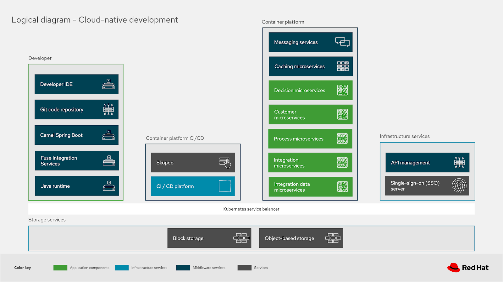
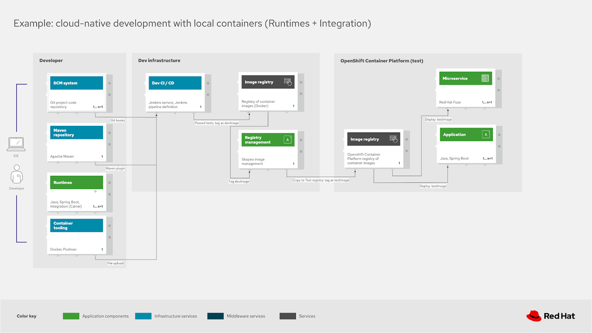
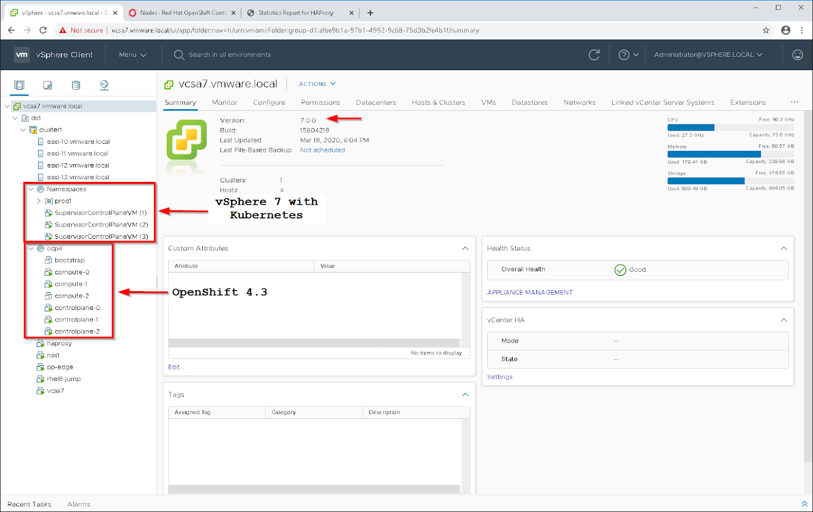
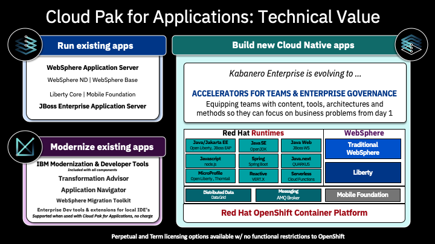

# OpenShift Container Platform
- [OpenShift](#openshift)
- [OpenShift Streaming & Training](#openshift-streaming--training)
- [OpenShift on Public Cloud](#openshift-on-public-cloud)
    - [Azure Red Hat OpenShift ARO](#azure-red-hat-openshift-aro)
- [Blogs](#blogs)
- [Meetings](#meetings)
- [Differences in developing on OpenShift as opposed to other Kubernetes distributions](#differences-in-developing-on-openshift-as-opposed-to-other-kubernetes-distributions)
- [Red Hat's approach to Kubernetes. Standardization](#red-hats-approach-to-kubernetes-standardization)
- [OpenShift.io online IDE](#openshiftio-online-ide)
- [OC CLI Auto Completion](#oc-cli-auto-completion)
- [Cluster Autoscaler in OpenShift](#cluster-autoscaler-in-openshift)
- [e-Books](#e-books)
    - [Kubernetes e-Books](#kubernetes-e-books)
- [Online Learning](#online-learning)
- [Local Installers](#local-installers)
- [Cloud Native Development Architecture. Architectural Diagrams](#cloud-native-development-architecture-architectural-diagrams)
- [Cluster Installers](#cluster-installers)
    - [OKD 3](#okd-3)
    - [OpenShift 3](#openshift-3)
    - [OpenShift 4](#openshift-4)
        - [OpenShift 4 deployment on VMWare vSphere](#openshift-4-deployment-on-vmware-vsphere)
            - [Deploying OpenShift 4.4 to VMware vSphere 7](#deploying-openshift-44-to-vmware-vsphere-7)
- [Networking (OCP 3 and OCP 4)](#networking-ocp-3-and-ocp-4)
- [Security](#security)
    - [How is OpenShift Container Platform Secured?](#how-is-openshift-container-platform-secured)
    - [Security Context Constraints](#security-context-constraints)
        - [Review Security Context Constraints](#review-security-context-constraints)
    - [OpenShift Network Model & Network Policy](#openshift-network-model--network-policy)
        - [Network Security Zones](#network-security-zones)
        - [OpenShift Route and OpenShift Ingress](#openshift-route-and-openshift-ingress)
        - [OpenShift Egress](#openshift-egress)
- [Openshift Compliant Docker Images](#openshift-compliant-docker-images)
    - [Gitlab](#gitlab)
    - [Atlassian Confluence6](#atlassian-confluence6)
    - [Sonatype Nexus 3](#sonatype-nexus-3)
    - [Rocket Chat](#rocket-chat)
- [IBM Cloud Paks and OpenShift](#ibm-cloud-paks-and-openshift)
- [OpenShift on AWS](#openshift-on-aws)
- [OpenShift Dedicated](#openshift-dedicated)
- [Other Awesome Lists](#other-awesome-lists)

## OpenShift  
* [Wikipedia.org: OpenShift](https://en.wikipedia.org/wiki/OpenShift)
* [OpenShift.com](https://www.openshift.com/)
* [OpenShift blog 🌟](https://www.openshift.com/blog)
* [docs.openshift.com 🌟](https://docs.openshift.com/)
* [developers.redhat.com 🌟](https://developers.redhat.com/)
* [github.com/openshift/origin 🌟](https://github.com/openshift/origin) Images for OpenShift 3 and 4 - see openshift/okd for more 
* [try.openshift.com 🌟](https://try.openshift.com/) Create an OCP (OpenShift Container Platform) Cluster or OSD (OpenShift Dedicated) Cluster.
* [okd.io](https://www.okd.io/) The Community Distribution of Kubernetes that powers Red Hat OpenShift.
* [OpenShift Commons](https://commons.openshift.org/) Where users, partners, customers, and contributors come together to collaborate and work together on OpenShift. Commons builds connections and collaboration across OpenShift communities, projects and stakeholders.
* [twitter.com/openshift](https://twitter.com/openshift) 
* [OpenShift in DockerHub](https://hub.docker.com/u/openshift/)
* [reddit.com/r/openshift](https://www.reddit.com/r/openshift)
* [reddit.com/r/redhat](https://www.reddit.com/r/redhat)

## OpenShift Streaming & Training
- [OpenShift.tv](https://openshift.tv) 
- [twitch.tv/redhatopenshift](https://www.twitch.tv/redhatopenshift)
## OpenShift on Public Cloud
- OCP4 on AWS: [ref1](https://github.com/openshift/installer/blob/master/docs/user/aws/README.md) , [ref2](https://aws.amazon.com/blogs/opensource/openshift-4-on-aws-quick-start/)
- [OpenShift Dedicated](https://www.openshift.com/products/dedicated/) - [Price lowered by 75% on average, SLA improved to 99.95% 🌟](https://www.redhat.com/en/blog/red-hat-openshift-dedicated-price-reduction)
- [Amazon Red Hat OpenShift](https://www.openshift.com/products/amazon-openshift/faq)
- [OpenShift on Google Cloud](https://cloud.google.com/solutions/partners/openshift-on-gcp)
- [Microsoft Azure Red Hat OpenShift](https://www.openshift.com/products/azure-openshift)
- [Red Hat OpenShift on IBM Cloud](https://www.ibm.com/cloud/openshift)
- [OpenShift Online](https://www.openshift.com/products/online/)
- [OpenShift.io](https://openshift.io/)
- [Developer Sandbox](https://developers.redhat.com/developer-sandbox)
- [Red Hat Marketplace](https://marketplace.redhat.com/) 

### Azure Red Hat OpenShift ARO
- [ARO](https://www.openshift.com/products/azure-openshift)
- [aroworkshop.io 🌟](http://aroworkshop.io/) 

## Blogs
- [Rcarrata's blog](https://rcarrata.com/)

## Meetings
- [openshift-ireland.com](https://openshift-ireland.com/)

## Differences in developing on OpenShift as opposed to other Kubernetes distributions
* [I’m So Sorry OpenShift, I’ve Taken You for Granted 🌟](https://medium.com/swlh/im-so-sorry-openshift-i-ve-taken-you-for-granted-f36fb47ea4d9)

## Red Hat's approach to Kubernetes. Standardization
* [Red Hat's approach to Kubernetes 🌟](https://www.redhat.com/en/topics/containers/kubernetes-approach)

Reference | Author | URL
:---------|:-------------|:-------------
"Given the difficulty of navigating the cloud-native ecosystem, especially the one around Kubernetes, **there is a high demand for easy-to-administer development platforms** that deliver applications in Kubernetes-managed containers."| OMDIA|[Red Hat's approach to Kubernetes](https://www.redhat.com/en/topics/containers/kubernetes-approach)
Industry momentum has aligned behind Kubernetes as the orchestration platform for Linux® containers. Choosing Kubernetes means you’ll be running the de facto standard regardless of which cloud environments and providers are in your future.|CNCF Survey 2019|[Red Hat's approach to Kubernetes](https://www.redhat.com/en/topics/containers/kubernetes-approach)
“It's not just enough to do Kubernetes. **You do need to do CI/CD.** You need to use alerting. You need to understand how the security model of the cloud and your applications interplay.”|Clayton Coleman,Senior Distinguished Engineer, Red Hat|[Red Hat's approach to Kubernetes](https://www.redhat.com/en/topics/containers/kubernetes-approach)
“Kubernetes is scalable. It helps develop applications faster. It does hybrid and multicloud. These are not just technology buzzwords, they're real, legitimate business problems.”|Brian Gracely,Director, Product Strategy, Red Hat OpenShift|[Red Hat's approach to Kubernetes](https://www.redhat.com/en/topics/containers/kubernetes-approach)
“Our job is to **make it easier and easier to use**, either from an ops point of view or a developer point of view—while acknowledging it is complex, because we're solving a complex problem.”|Chris Wright,Chief Technology Officer, Red Hat|[Red Hat's approach to Kubernetes](https://www.redhat.com/en/topics/containers/kubernetes-approach)

 

## OpenShift.io online IDE
* [openshift.io 🌟](https://openshift.io/) an online IDE for building container-based apps, built for team collaboration.

## OC CLI Auto Completion
- [docs.openshift.com: Enabling tab completion](https://docs.openshift.com/container-platform/4.4/cli_reference/openshift_cli/configuring-cli.html)
- [medium: How to enable OpenShift oc bash auto completion](https://medium.com/@ismailyenigul/how-to-enable-openshift-oc-bash-auto-completion-958b80e56e17)

## Cluster Autoscaler in OpenShift
* [OpenShift 3.11: Configuring the cluster auto-scaler in AWS](https://docs.openshift.com/container-platform/3.11/admin_guide/cluster-autoscaler.html)
* [OpenShift 4.4: Applying autoscaling to an OpenShift Container Platform cluster](https://docs.openshift.com/container-platform/4.4/machine_management/applying-autoscaling.html)

## e-Books
* [O'Reilly Free Book: **DevOps with OpenShift**](https://www.openshift.com/devops-with-openshift/)
* [O'Reilly Free Book: **Openshift for developers**](https://www.openshift.com/for-developers/)
* [O’Reilly: Free ebook: **Kubernetes Operators: Automating the Container Orchestration Platform**](https://www.redhat.com/en/resources/oreilly-kubernetes-operators-automation-ebook)
* [Manning: **Openshift in action**](https://www.manning.com/books/openshift-in-action)
* [Packt publishing: **Learn Openshift**](https://www.packtpub.com/application-development/learn-openshift)
* [O’Reilly: Free ebook: **Knative Cookbook**: Building Effective Serverless Applications with Kubernetes and OpenShift](https://developers.redhat.com/books/knative-cookbook/)
* [redhat.com Free ebook: **Container Storage for Dummies**](https://www.redhat.com/en/resources/container-storage-dummies)

### Kubernetes e-Books
* [Kubernetes e-Books](https://awesome-kubernetes.readthedocs.io/kubernetes/#e-books)

## Online Learning
* [learn.openshift.com 🌟](https://learn.openshift.com) Interactive Learning Portal
* [katacoda.com 🌟](https://www.katacoda.com/) Interactive Learning and Training Platform for Software Engineers 
* [redhatgov.io](http://redhatgov.io/)
* [udemy.com: Red Hat OpenShift With Jenkins: DevOps For Beginners](https://www.udemy.com/red-hat-openshift)
* [udemy.com: OpenShift Enterprise v3.2 Installation and Configuration](https://www.udemy.com/openshift-enterprise-installation-and-configuration/learn/v4/overview)
* [udemy.com: Ultimate Openshift (2018) Bootcamp by School of Devops 🌟](https://www.udemy.com/ultimate-openshift-bootcamp-by-school-of-devops/) With Openshift Origin 3.10 / OKD 2018, Kubernetes, Jenkins Pipelines, Prometheus, Istio, Micro Services, PaaS
* [Udemy: OpenShift 4 desde cero 🌟](https://www.udemy.com/course/openshift-4-desde-cero)

## Local Installers
* [developers.redhat.com: **Red Hat Container Development Kit**](https://developers.redhat.com/products/cdk/overview/)
* A few other options to use OKD locally include [oc cluster up](https://github.com/openshift/origin/blob/master/docs/cluster_up_down.md) and [minishift](https://www.okd.io/minishift/). These may be a better fit for your use case if you only need a quick throwaway environment.
* [github.com/redhatdemocentral: OpenShift Container Platform Install Demo 🌟](https://github.com/redhatdemocentral/ocp-install-demo)
    * [Dzone.com: Installing OpenShift Container Platform v3.5 in Minutes](https://dzone.com/articles/installing-openshift-container-platform-v35-in-min)
    * [Dzone.com: Install OpenShift Container Platform 3.6 in Minutes](https://dzone.com/articles/cloud-happiness-install-openshift-container-platfo)
    * [Dzone.com: How to Install New OpenShift Container Platform 3.7](https://dzone.com/articles/cloud-happiness-how-to-install-new-openshift-conta-2)
    * [Dzone.com: Install OpenShift Container Platform in Minutes [Video]](https://dzone.com/articles/install-openshift-container-platform-in-minutes-video)

## Cloud Native Development Architecture. Architectural Diagrams
* Cloud-native development is an approach to building and running applications to fully exploit the advantages of the cloud computing model (i.e. responsive, elastic and resilient applications).
* [Dzone: Cloud-native development - A blueprint 🌟](https://dzone.com/articles/cloud-native-development-a-blueprint) These architectural blueprints are providing you with a way to implement a solution using open source technologies focusing on the integrations, structures and interactions proven to work.
    * [schabell.org: Cloud-native development - A blueprint 🌟](https://www.schabell.org/2020/05/cloud-native-development-a-blueprint.html)
    * [schabell.org: Cloud-native development - On local containers 🌟](https://www.schabell.org/2020/06/cloud-native-development-on-local-containers.html)
    * etc
* [Dzone: Cloud-Native Development - Common Architectural Elements 🌟](https://dzone.com/articles/cloud-native-development-common-architectural-elem)
* [Dzone: Cloud-native development - An advanced deployment blueprint 🌟](https://dzone.com/articles/cloud-native-development-an-advanced-deployment-bl)
* [Portfolio Architecture WorkShops 🌟](https://redhatdemocentral.gitlab.io/portfolio-architecture-workshops/#/) Workshops for creating impactful architectural diagrams. This workshop will teach you how to use, design, and create architectural diagrams based on the **draw.io** tooling and Red Hat Portfolio Architecture design elelements. You'll leverage existing portfolio architecture diagrams as starting points.
* [Portfolio Architecture Tooling](https://redhatdemocentral.gitlab.io/portfolio-architecture-tooling/)
* [gitlab.com: Portfolio Architecture Examples](https://gitlab.com/redhatdemocentral/portfolio-architecture-examples)

 

## Cluster Installers
### OKD 3
* [OKD.io:](https://www.okd.io/) The Community Distribution of Kubernetes that powers Red Hat OpenShift.
* [blog.openshift.com: Installing OKD 3.10 on a Single Host 🌟](https://blog.openshift.com/installing-okd-3-10-on-a-single-host/)
* [youtube.com: OpenShift Origin is now OKD. Installation of OKD 3.10 from start to finish](https://www.youtube.com/watch?v=ZkFIozGY0IA)
* [Install RedHat OKD 3.10 on your development box:](https://github.com/gshipley/installcentos) This repository is a set of scripts that will allow you easily install the latest version (3.10) of OKD in a single node fashion. What that means is that all of the services required for OKD to function (master, node, etcd, etc.) will all be installed on a single host. The script supports a custom hostname which you can provide using the interactive mode.
* [docs.okd.io: Planning your installation](https://docs.okd.io/latest/install/)

### OpenShift 3
* [belgium.devoteam.com: Using Ansible Tower to deploy OpenShift 3 on Azure: a step-by-step guide](https://belgium.devoteam.com/blog/ansible-tower-openshift-azure-tower-installation-prerequisites/)
* [uncontained.io: Installing a Highly Available OpenShift Cluster 🌟](http://uncontained.io/articles/openshift-ha-installation/)

### OpenShift 4
* [github.com/openshift/installer openshift installer 🌟](https://github.com/openshift/installer)
* [CI/CD Pipeline to deploy OpenShift Container Platform 4.x to AWS 🌟](https://github.com/r3dact3d/rhocp4_aws)
* [blog.openshift.com: 9 steps to awesome with kubernetes openshift](https://blog.openshift.com/9-steps-to-awesome-with-kubernetes-openshift-presented-by-burr-sutter/)
    * [github: burrsutter/9stepsawesome](https://github.com/burrsutter/9stepsawesome) 

#### OpenShift 4 deployment on VMWare vSphere
* [reddit](https://www.reddit.com/r/openshift/comments/e1kw48/openshift_42_vsphere_install/)
* [blog.openshift.com: OpenShift 4.2 vSphere Install Quickstart](https://blog.openshift.com/openshift-4-2-vsphere-install-quickstart/) 
* [blog.openshift.com: OpenShift 4.2 vsphere install with static IPs 🌟](https://blog.openshift.com/openshift-4-2-vsphere-install-with-static-ips/)
* [youtube: Deploy OpenShift 4 to vSphere using OpenShift's UPI](https://www.youtube.com/watch?v=DLB9m17aGus)    

##### Deploying OpenShift 4.4 to VMware vSphere 7
- [Deploying OpenShift 4.4 to VMware vSphere 7 🌟](https://www.openshift.com/blog/deploying-openshift-4.4-to-vmware-vsphere-7)

 

## Networking (OCP 3 and OCP 4)
- [Using sidecars to analyze and debug network traffic in OpenShift and Kubernetes pods](https://developers.redhat.com/blog/2019/02/27/sidecars-analyze-debug-network-traffic-kubernetes-pod/)
* [developers.redhat.com: Skupper.io: Let your services communicate across Kubernetes clusters](https://developers.redhat.com/blog/2020/01/01/skupper-io-let-your-services-communicate-across-kubernetes-clusters/)
* [blog.openshift.com: Troubleshooting OpenShift network performance with a netperf DaemonSet](https://blog.openshift.com/troubleshooting-openshift-network-performance-with-a-netperf-daemonset/)
* [blog.openshift.com: Advanced Network customizations for OpenShift Install](https://blog.openshift.com/advanced-network-customizations-for-openshift-install/)

## Security
- [itnext.io: Adding security layers to your App on OpenShift — Part 1: Deployment and TLS Ingress 🌟](https://itnext.io/adding-security-layers-to-your-app-on-openshift-part-1-deployment-and-tls-ingress-9ef752835599)
  
### How is OpenShift Container Platform Secured?
- [docs.openshift.com: OpenShift 3 Overview](https://docs.openshift.com/container-platform/3.11/architecture/index.html)
- [docs.openshift.com: OpenShift 3 Securing the Container Platform](https://docs.openshift.com/container-platform/3.11/security/securing_container_platform.html)
- [ocs.openshift.com: OpenShift 4 Understanding Authentication](https://docs.openshift.com/container-platform/4.4/authentication/understanding-authentication.html)

### Security Context Constraints
- [docs.openshift.com: Managing Security Context Constraints](https://docs.openshift.com/container-platform/3.11/admin_guide/manage_scc.html)
- [docs.openshift.com: Managing Security Context Constraints. Security Context Constraints](https://docs.openshift.com/container-platform/3.11/architecture/additional_concepts/authorization.html#security-context-constraints)
- [Dzone: Understanding OpenShift Security Context Constraints](https://dzone.com/articles/understanding-openshift-security-context-constrain)

#### Review Security Context Constraints
* Security Context Constraints (SCCs) control what actions pods can perform and what resources they can access. 
* SCCs combine a set of security configurations into a single policy object that can be applied to pods. These security configurations include, but are not limited to, Linux Capabilities, Seccomp Profiles, User and Group ID Ranges, and types of mounts.
* OpenShift ships with several SCCs. The most constrained is the restricted SCC, and the least constrained in the privileged SCC. 
The other SCCs provide intermediate levels of constraint for various use cases. The restricted SCC is granted to all authenticated users by default.
* The default SCC for most pods should be the restricted SCC. If required, a cluster administrator may allow certain pods to run with different SCCs. Pods should be run with the most restrictive SCC possible.
* Pods inherit their SCC from the Service Account used to run the pod. With the default project template, new projects get a Service Account named default that is used to run pods. This default service account is only granted the ability to run the restricted SCC.
* **Recommendations:** 
    * Use OpenShift's Security Context Constraint feature, which has been contributed to Kubernetes as [Pod Security Policies](https://kubernetes.io/docs/concepts/policy/pod-security-policy/). PSPs are still beta in Kubernetes 1.10, 1.11, and 1.12.
    * Use the restricted SCC as the default 
    * For pods that require additional access, use the SCC that grants the least amount of additional privileges or create a custom SCC Audit
    * To show all available SCCs: `oc describe scc`
    * To audit a single pod: `oc describe pod <POD> | grep openshift.io\/scc`
    * Remediation: Apply the SCC with the least privilege required

### OpenShift Network Model & Network Policy 
* [docs.openshift.com: Understanding networking](https://docs.openshift.com/container-platform/4.4/networking/understanding-networking.html)
    * [docs.openshift.com: Configuring network policy with OpenShift SDN](https://docs.openshift.com/container-platform/4.4/networking/configuring-networkpolicy.html)
* [NetworkPolicies and Microsegmentation](https://www.openshift.com/blog/networkpolicies-and-microsegmentation)
* [Fully Automated Management of Egress IPs with the egressip-ipam-operator 🌟](https://blog.openshift.com/fully-automated-management-of-egress-ips-with-the-egressip-ipam-operator/)
* [GitHub: redhat-cop OpenShift Toolkit Network Policy 🌟](https://github.com/redhat-cop/openshift-toolkit/tree/master/networkpolicy)
- [redhat.com: Network traffic control for containers in Red Hat OpenShift 🌟](https://www.redhat.com/en/blog/network-traffic-control-containers-red-hat-openshift)

#### Network Security Zones
- [stackoverflow.com: Is that possible to deploy an openshift or kubernetes in DMZ zone? 🌟](https://stackoverflow.com/questions/59518363/is-that-possible-to-deploy-an-openshift-or-kubernetes-in-dmz-zone) 
- [OpenShift and Network Security Zones: Coexistence Approaches 🌟🌟🌟](https://www.openshift.com/blog/openshift-and-network-security-zones-coexistence-approaches)
    - **Introduction:** Kubernetes and consequently OpenShift adopt a [flat Software Defined Network (SDN) model](https://kubernetes.io/docs/concepts/cluster-administration/networking/), which means that all pods in the SDN are in the same logical network. Traditional network implementations adopt a zoning model in which different networks or zones are dedicated to specific purposes, with very strict communication rules between each zone. When implementing OpenShift in organizations that are using network security zones, the two models may clash. In this article, we will analyze a few options for coexistence. But first, let’s understand the two network models a bit more in depth.
    - Network Zones have been the widely accepted approach for building security into a network architecture. The general idea is to create separate networks, each with a specific purpose. Each network contains devices with similar security profiles. Communications between networks is highly scrutinized and controlled by firewall rules ([perimeter defense](https://en.wikipedia.org/wiki/All_round_defence)).
    - **Conclusion:** A company’s security organization must be involved when deciding how to deploy OpenShift with regard to traditional network zones. Depending on their level of comfort with new technologies you may have different options. If physical network separation is the only acceptable choice, you will have to build a cluster per network zone. If logical network type of separations can be considered, then there are ways to stretch a single OpenShift deployment across multiple network zones. This post presented a few technical approaches.

 

#### OpenShift Route and OpenShift Ingress
- [openshift.com: Kubernetes Ingress vs OpenShift Route](https://www.openshift.com/blog/kubernetes-ingress-vs-openshift-route)
- [Ingress Operator in OCP 4](https://docs.openshift.com/container-platform/4.4/networking/ingress-operator.html)
- [cloud.ibm.com: OpenShift Ingress](https://cloud.ibm.com/docs/openshift?topic=openshift-ingress)

#### OpenShift Egress
- [Accessing External Services Using Egress Router](https://www.openshift.com/blog/accessing-external-services-using-egress-router)
- [How to Enable Static Egress IP in OCP](https://www.openshift.com/blog/how-to-enable-static-egress-ip-in-ocp)
- [dzone: OpenShift Egress Options](https://dzone.com/articles/openshift-egress-options) Network security is a crucial part of any of Software as a Service type business. Read on to see how to implement OpenShift to create better network security.

## Openshift Compliant Docker Images
- [Red Hat Container Catalog - RedHat Registry (registry.redhat.io) 🌟](https://access.redhat.com/containers/) License required
- [DockerHub OpenShift](https://hub.docker.com/r/openshift/)
- [github.com/sclorg/](https://github.com/sclorg/)
- [github.com/sclorg/postgresql-container/](https://github.com/sclorg/)
- [github.com/sclorg/mariadb-container](https://github.com/sclorg/mariadb-container)

### Gitlab
- [Get started with OpenShift Origin 3 and GitLab](https://about.gitlab.com/2016/06/28/get-started-with-openshift-origin-3-and-gitlab/)

### Atlassian Confluence6 
- [Atlassian Confluence6](https://github.com/redhatspain/confluence6-atlassian)

### Sonatype Nexus 3
- [hub.docker.com/r/sonatype/nexus3/](https://hub.docker.com/r/sonatype/nexus3/)

### Rocket Chat
- [Deploying Rocket.Chat on OpenShift](https://rocket.chat/docs/installation/paas-deployments/openshift/)

## IBM Cloud Paks and OpenShift
* [cloudpak8s.io](https://cloudpak8s.io/) 
* **What are IBM Cloud Paks?** Beyond containers and Kubernetes, enterprises need to orchestrate their production topology, and to provide management, security and governance for their applications. They need to do this while improving efficiency and resiliency, reducing costs and maximizing ROI.
* IBM Cloud® Paks are enterprise-ready, containerized software solutions that give clients an open, faster and more secure way to move core business applications to any cloud. Each IBM Cloud Pak® includes containerized IBM middleware and common software services for development and management, on top of a common integration layer — designed to **reduce development time by up to 84 percent and operational expenses by up to 75 percent**. **IBM Cloud Paks run wherever Red Hat® OpenShift® runs** and are optimized for productivity and performance on [Red Hat OpenShift on IBM Cloud](https://www.ibm.com/cloud/openshift).
* [IBM Cloud Pak Playbook](https://cloudpak8s.io/apps/cp4a_overview/) The **Cloud Pak for Applications** provides product offerings to support **modernizing existing applications and building new cloud native applications**. The applications run within a **Kubernetes cluster** provided with the **Red Hat OpenShift Container Platform**. The focus provided here is on running application workloads as containers. The Cloud Pak for Applications is a bundle of multiple offerings.  This diagram provides an overview of what offerings are included and what they would be used for:

## OpenShift on AWS
* [blog.openshift.com: AWS and red hat quickstart workshop](https://blog.openshift.com/aws-and-red-hat-quickstart-workshop/)
* [aws.amazon.com: AWS Quick Start (OpenShift 3.11 on AWS)](https://aws.amazon.com/quickstart/architecture/openshift/) View deployment guide
* [openshift.com: Introducing Red Hat OpenShift Service on AWS](https://www.openshift.com/blog/introducing-red-hat-openshift-service-on-aws)

## OpenShift Dedicated
- [OpenShift Dedicated 🌟](https://www.openshift.com/products/dedicated/)
- [Bringing OpenShift Dedicated to Life at Red Hat](https://www.openshift.com/blog/bringing-openshift-dedicated-to-life-at-red-hat)
- [Red Hat OpenShift Dedicated price reduction: Price lowered by 75% on average, SLA improved to 99.95% 🌟](https://www.redhat.com/en/blog/red-hat-openshift-dedicated-price-reduction)

## Other Awesome Lists
* [Awesome Openshift](https://github.com/dudash/openshift-is-awesome)
* [Awesome Openshift 2](https://github.com/oscp/awesome-openshift3)

